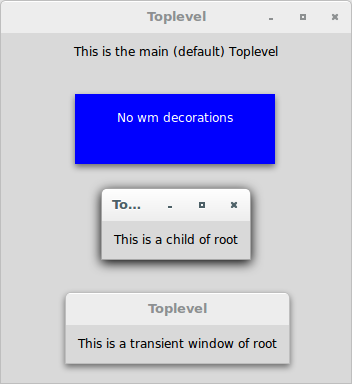
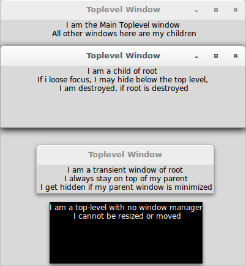

# Tkinter

## Simple Tkinter applications showing the use of Toplevel widgets

### Toplevel

**Description**

Work pretty much like the 'Frame' widget, but it is displayed in a 
separate, top-level window. Such windows usually have title bars, 
borders, and other "window decorations".

Tkinter supports the following four (04) types of Toplevel windows:

* **The main Toplevel window:** These are the ones that we have 
constructed so far (root = Tk()).
* **The child Toplevel window:** These are the ones that are independent 
of the root. The Toplevel child behaves independent of its root, but it 
gets destroyed if its parent is destroyed.
* **The transient Toplevel window:** This always appears at the top of 
its parent, but it does not entirely grab the focus. Clicking again on 
the parent window allows you to interact with it. The transient window 
is hidden when the parent is minimized, and it is destroyed if the 
parent is destroyed. Compare this to what is called a **modal window**. 
A modal window grabs all the focus from the parent window and asks a 
user to first close the modal window before getting access back to the 
parent window.
* **The undecorated Toplevel window:** A Toplevel window is undecorated 
if it does not have a window manager decoration around it. It is created 
by setting the `overrideredirect` flag to `1`. An undecorated window 
cannot be resized or moved.

**When to Use**

It is used to display extra application windows, dialogs, and other 
"pop-up" windows.

Let's see how to use them:

```python
from tkinter import *

# Main Toplevel window
root = Tk()
root.title('Toplevel')
root.geometry('350x350')

Label(root, 
      text = 'This is the main (default) Toplevel')\
      .pack(pady=10)

# Child Toplevel window
t1 = Toplevel(root)
Label(t1, 
      text = 'This is a child of root')\
      .pack(padx=10, pady=10)

# Transient Toplevel window
t2 = Toplevel(root)
Label(t2, 
      text = 'This is a transient window of root')\
      .pack(padx=10, pady=10)
t2.transient(root)

# Undecorated Toplevel window
t3 = Toplevel(root, borderwidth=5, bg='blue')
Label(t3, 
      text = 'No wm decorations', 
      bg = 'blue', fg = 'white')\
      .pack(padx=10, pady=10)
t3.overrideredirect(1)
t3.geometry('200x70+150+150')


root.mainloop()
```



Let's see an improved version:

```python
from tkinter import *

# Main Toplevel window
root = Tk()
root.title('Toplevel Window')
root.geometry('400x400')

Label(root, 
      text = 'I am the Main Toplevel window\n All other windows here '
             'are my children')\
      .pack()

# Child Toplevel window
t1 = Toplevel(root)
t1.geometry('400x100+300+300')
Label(t1, 
      text = 'I am a child of root\n If i loose focus, I may hide '
             'below the top level, \n I am destroyed, if root is '
             'destroyed')\
      .pack()

# Transient Toplevel window
t2 = Toplevel(root)
t2.transient(root)
Label(t2, 
      text = 'I am a transient window of root\n I always stay on top '
             'of my parent\n I get hidden if my parent window is '
             'minimized')\
      .pack()

# Undecorated Toplevel window
t3 = Toplevel(root, bg='black')
t3.geometry('250x100+700+500')
t3.overrideredirect(1)
Label(t3, 
      text = 'I am a top-level with no window manager\n I cannot be '
             'resized or moved', 
      bg = 'black', fg = 'white')\
      .pack()


root.mainloop()
```


