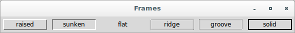
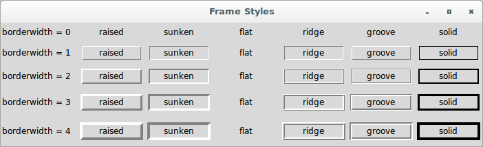
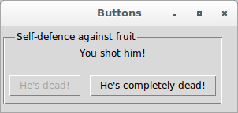

# Tkinter

## Simple Tkinter applications showing the use of Frame widgets

### Frame

**Description**

It is a rectangular region on the screen. The 'Frame' widget is mainly 
used as a geometry master for other widgets, or to provide padding 
between other widgets.

**When to Use**

Frame widgets are used to group other widgets into complex layouts. They 
are also used for padding, and as a base class when implementing 
compound widgets.

To check how to use them, let's see the first application:

```python
from tkinter import *

root = Tk()
root.title('Frames')

for relief in [RAISED, SUNKEN, FLAT, RIDGE, GROOVE, SOLID]:
    f = Frame(root, borderwidth=2, relief=relief)
    Label(f, text=relief, width=10).pack(side=LEFT)
    f.pack(side=LEFT, padx=5, pady=5)


root.mainloop()
```



Let's see a second application (Frame Styles):

```python
from tkinter import *

class GUI:
    def __init__(self):
        self.root = Tk()
        self.root.title('Frame Styles')
        for bdw in range(5):
            setattr(self, 'of%d' % bdw, Frame(self.root, borderwidth=0))
            Label(getattr(self, 'of%d' % bdw), 
                  text='borderwidth = %d  ' % bdw).pack(side=LEFT)
            ifx = 0
            for relief in [RAISED, SUNKEN, FLAT, RIDGE, GROOVE, SOLID]:
                setattr(self, 'f%d' % ifx, 
                        Frame(getattr(self, 'of%d' % bdw), 
                              borderwidth=bdw, relief=relief))
                Label(getattr(self, 'f%d' % ifx), 
                      text=relief, width=10).pack(side=LEFT)
                getattr(self, 'f%d' % ifx)\
                .pack(side=LEFT, padx=7-bdw, pady=5+bdw)
                ifx = ifx+1
            getattr(self, 'of%d' % bdw).pack()


myGUI = GUI()
myGUI.root.mainloop()
```



A third application is this (Basic Labeled Frame with Two Buttons):

```python
from tkinter import *

root = Tk()
root.title('Buttons')

f = Frame(root, width=300, height=110)     # outer frame
xf = Frame(f, relief=GROOVE, borderwidth=2)     # inner frame
Label(xf, text="You shot him!").pack(pady=10)
Button(xf, text="He's dead!", state=DISABLED)\
.pack(side=LEFT, padx=5, pady=8)
Button(xf, text="He's completely dead!", command=root.quit)\
.pack(side=RIGHT, padx=5, pady=8)
xf.place(relx=0.01, rely=0.125, anchor=NW)
Label(f, text='Self-defence against fruit')\
.place(relx=.06, rely=0.125, anchor=W)
f.pack()
root.mainloop()
```


