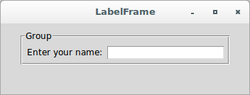
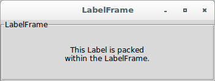

# Tkinter

## Simple Tkinter applications showing the use of LabelFrame widgets

### LabelFrame

**Description**

The 'LabelFrame' widget is a variant of the Tkinter 'Frame' widget. By 
default, it draws a border around its child widgets, and it can also 
display a title.

**When to Use**

LabelFrame widgets can be used when you want to group a number of 
related widgets, such as a number of radiobuttons.

To check how to use them, let's see the first application:

```python
from tkinter import *

root = Tk()
root.title('LabelFrame')
root.geometry('350x100')

group = LabelFrame(root, text="Group", padx=5, pady=5)
group.pack(padx=10, pady=10)

label = Label(group, text = 'Enter your name: ')
label.pack(side='left')

w = Entry(group)
w.pack()

root.mainloop()
```



Let's see the second application:

```python
import tkinter

class LabelFrame(tkinter.Tk):
    def __init__(self):
        tkinter.Tk.__init__(self)
        self.title('LabelFrame')
        self.geometry('350x100')
        labelframe = tkinter.LabelFrame(text = "LabelFrame", 
                                        padx = 10, 
                                        pady = 10)
        labelframe.pack(fill=tkinter.BOTH, expand=1)
        label = tkinter.Label(labelframe, 
                              text = "This Label is packed\nwithin the "
                                      "LabelFrame.")
        label.pack(fill=tkinter.BOTH, expand=1)

  
if __name__ == "__main__":
    application = LabelFrame()
    application.mainloop()
```


