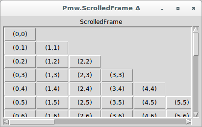
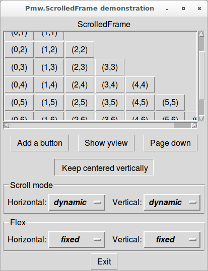

# Pmw

## Simple Pmw applications showing the use of ScrolledFrame widgets

### ScrolledFrame

**Description**

Consists of a scrollable interior frame within a clipping frame. The 
programmer can create other widgets within the interior frame. If the 
frame becomes larger than the surrounding clipping frame, the user can 
position the frame using the horizontal and vertical scrollbars.

The scrollbars can be 'dynamic', which means that a scrollbar will only 
be displayed if it is necessary. That is, if the frame is smaller than 
the surrounding clipping frame, the scrollbar will be hidden.

**When to Use**

When a frame with optional scrollbars is needed.

To check how to use them, let's see the first application, which shows 
groups of frame widgets that can be scrolled both vertically and 
horizontally:

```python
from tkinter import *
import Pmw

root = Tk()
root.title('Pmw.ScrolledFrame A')
Pmw.initialise()

global row, col
row = col = 0
sf = frame = None

def addButton():
    global row, col
    button = Button(frame, text='({},{})'.format(col, row))
    button.grid(row=row, column=col, sticky='nsew')

    frame.grid_rowconfigure(row, weight=1)
    frame.grid_columnconfigure(col, weight=1)
    sf.reposition()

    if col == row:
        col = 0
        row += 1
    else:
        col += 1

sf = Pmw.ScrolledFrame(root, 
                       labelpos = N, 
                       label_text = 'ScrolledFrame', 
                       usehullsize = 1, 
                       hull_width = 400, 
                       hull_height = 220)

sf.pack(padx=5, pady=3, fill='both', expand=1)
frame = sf.interior()

for i in range(250):
    addButton()

root.mainloop()
```



Let's see a more complete second application:

```python
title = 'Pmw.ScrolledFrame demonstration'

# Import Pmw from this directory tree.
import sys
sys.path[:0] = ['../../..']

import tkinter
import Pmw

class Demo:
    def __init__(self, parent):
        # Create the ScrolledFrame.
        self.sf = Pmw.ScrolledFrame(parent, 
                                    labelpos = 'n', 
                                    label_text = 'ScrolledFrame', 
                                    usehullsize = 1, 
                                    hull_width = 400, 
                                    hull_height = 220)

        # Create a group widget to contain the flex options.
        w = Pmw.Group(parent, tag_text='Flex')
        w.pack(side='bottom', padx=5, pady=3)

        hflex = Pmw.OptionMenu(w.interior(), 
                               labelpos = 'w', 
                               label_text = 'Horizontal:', 
                               items = ['fixed', 
                                        'expand', 
                                        'shrink', 
                                        'elastic'], 
                               command = self.sethflex, 
                               menubutton_width = 8)
        hflex.pack(side='left', padx=5, pady=3)
        hflex.invoke('fixed')

        vflex = Pmw.OptionMenu(w.interior(), 
                               labelpos = 'w', 
                               label_text = 'Vertical:', 
                               items = ['fixed', 
                                        'expand', 
                                        'shrink', 
                                        'elastic'], 
                               command = self.setvflex, 
                               menubutton_width = 8)
        vflex.pack(side='left', padx=5, pady=3)
        vflex.invoke('fixed')

        # Create a group widget to contain the scrollmode options.
        w = Pmw.Group(parent, tag_text='Scroll mode')
        w.pack(side='bottom', padx=5, pady=0)

        hmode = Pmw.OptionMenu(w.interior(), 
                               labelpos = 'w', 
                               label_text = 'Horizontal:', 
                               items = ['none', 
                                        'static', 
                                        'dynamic'], 
                               command = self.sethscrollmode, 
                               menubutton_width = 8)
        hmode.pack(side='left', padx=5, pady=3)
        hmode.invoke('dynamic')

        vmode = Pmw.OptionMenu(w.interior(), 
                               labelpos = 'w', 
                               label_text = 'Vertical:', 
                               items = ['none', 
                                        'static', 
                                        'dynamic'], 
                               command = self.setvscrollmode, 
                               menubutton_width = 8)
        vmode.pack(side='left', padx=5, pady=3)
        vmode.invoke('dynamic')

        self.radio = Pmw.RadioSelect(parent, 
                                     selectmode = 'multiple', 
                                     command = self.radioSelected)
        self.radio.add('center', text='Keep centered vertically')
        self.radio.pack(side='bottom')

        buttonBox = Pmw.ButtonBox(parent)
        buttonBox.pack(side='bottom')
        buttonBox.add('add', 
                      text = 'Add a button', 
                      command = self.addButton)
        buttonBox.add('yview', 
                      text = 'Show yview', 
                      command = self.showYView)
        buttonBox.add('scroll', 
                      text = 'Page down', 
                      command = self.pageDown)

        # Pack this last so that the buttons do not get shrunk when
        # the window is resized.
        self.sf.pack(padx=5, pady=3, fill='both', expand=1)

        self.frame = self.sf.interior()

        self.row = 0
        self.col = 0

        for count in range(15):
            self.addButton()

    def sethscrollmode(self, tag):
        self.sf.configure(hscrollmode=tag)

    def setvscrollmode(self, tag):
        self.sf.configure(vscrollmode=tag)

    def sethflex(self, tag):
        self.sf.configure(horizflex=tag)

    def setvflex(self, tag):
        self.sf.configure(vertflex=tag)

    def addButton(self):
        button = tkinter.Button(self.frame, 
                                text = '({},{})'.format(self.col, 
                                                        self.row))
        button.grid(row=self.row, column=self.col, sticky='nsew')

        self.frame.grid_rowconfigure(self.row, weight=1)
        self.frame.grid_columnconfigure(self.col, weight=1)
        if self.sf.cget('horizflex') == 'expand' or\
           self.sf.cget('vertflex') == 'expand':
               self.sf.reposition()

        if 'center' in self.radio.getcurselection():
            self.sf.update_idletasks()
            self.centerPage()

        if self.col == self.row:
            self.col = 0
            self.row += 1
        else:
            self.col += 1

    def showYView(self):
        print((self.sf.yview()))

    def pageDown(self):
        self.sf.yview('scroll', 1, 'page')

    def radioSelected(self, name, state):
        if state:
            self.centerPage()

    def centerPage(self):
        # Example of how to use the yview() method of Pmw.ScrolledFrame.
        top, bottom = self.sf.yview()
        size = bottom - top
        middle = 0.5 - size / 2
        self.sf.yview('moveto', middle)

######################################################################

# Create demo in root window for testing.
if __name__ == '__main__':
    import os
    if os.name == 'nt':
        size = 16
    else:
        size = 12
    root = tkinter.Tk()
    Pmw.initialise(root, size=size, fontScheme='pmw2')
    root.title(title)

    exitButton = tkinter.Button(root, text='Exit', command=root.destroy)
    exitButton.pack(side='bottom')
    widget = Demo(root)
    root.mainloop()
```


