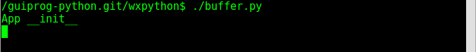
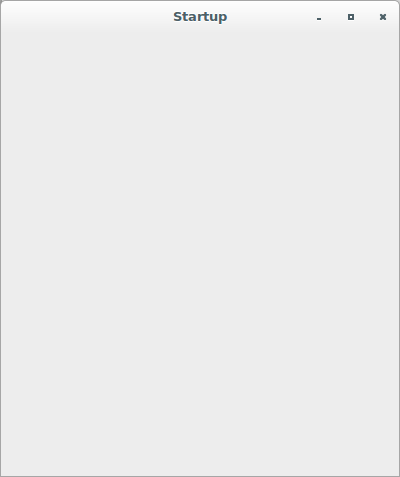
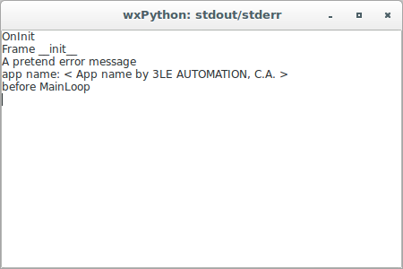
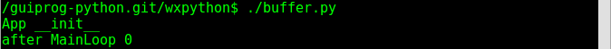
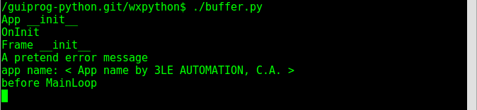
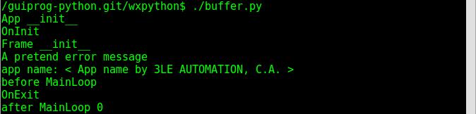

# wxPython

## Application that shows output stream redirection

The version that demonstrates both the application lifecycle and 
the `stdout/stderr` redirection is:

```python
#!/usr/bin/env python
import wx
import sys

class Frame(wx.Frame):
    def __init__(self, parent, id, title):
        print("Frame __init__")
        wx.Frame.__init__(self, parent, id, title)


class App(wx.App):
    def __init__(self, redirect=True, filename=None):
        print("App __init__")
        wx.App.__init__(self, redirect, filename)

    def OnInit(self):
        print("OnInit")
        self.SetVendorName("App name by 3LE AUTOMATION, C.A.")
        self.frame = Frame(parent=None, id=-1, title='Startup')
        self.frame.Show()
        self.SetTopWindow(self.frame)
        print("A pretend error message", file=sys.stderr)
        print("app name: < {0} >".format(self.GetVendorName()))
        return True

    def OnExit(self):
        print("OnExit")

if __name__ == '__main__':
    app = App(redirect=True)
    print("before MainLoop")
    fred = app.MainLoop()
    print("after MainLoop {0}".format(fred))
```









The version that shows where to modify the default redirect behavior is:

```python
#!/usr/bin/env python
import wx
import sys

class Frame(wx.Frame):
    def __init__(self, parent, id, title):
        print("Frame __init__")
        wx.Frame.__init__(self, parent, id, title)


class App(wx.App):
    def __init__(self, redirect=True, filename=None):
        print("App __init__")
        wx.App.__init__(self, redirect, filename)

    def OnInit(self):
        print("OnInit")
        self.SetVendorName("App name by 3LE AUTOMATION, C.A.")
        self.frame = Frame(parent=None, id=-1, title='Startup')
        self.frame.Show()
        self.SetTopWindow(self.frame)
        print("A pretend error message", file=sys.stderr)
        print("app name: < {0} >".format(self.GetVendorName()))
        return True

    def OnExit(self):
        print("OnExit")
        return True

if __name__ == '__main__':
    app = App(False)    # CHANGE HERE!
    print("before MainLoop")
    fred = app.MainLoop()
    print("after MainLoop {0}".format(fred))
```






The version that shows how to print the output to a file is:

```python
#!/usr/bin/env python
import wx
import sys

class Frame(wx.Frame):
    def __init__(self, parent, id, title):
        print("Frame __init__")
        wx.Frame.__init__(self, parent, id, title)


class App(wx.App):
    def __init__(self, redirect=True, filename=None):
        print("App __init__")
        wx.App.__init__(self, redirect, filename)

    def OnInit(self):
        print("OnInit")
        self.SetVendorName("App name by 3LE AUTOMATION, C.A.")
        self.frame = Frame(parent=None, id=-1, title='Startup')
        self.frame.Show()
        self.SetTopWindow(self.frame)
        print("A pretend error message", file=sys.stderr)
        print("app name: < {0} >".format(self.GetVendorName()))
        return True

    def OnExit(self):
        print("OnExit")
        return True

if __name__ == '__main__':
    app = App(True, 'files/output')
    print("before MainLoop")
    fred = app.MainLoop()
    print("after MainLoop {0}".format(fred))
```

If you check the *output* file within the *files* folder, you'll see:

```
OnInit
Frame __init__
A pretend error message
app name: < App name by 3LE AUTOMATION, C.A. >
before MainLoop
OnExit
```
