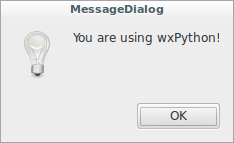
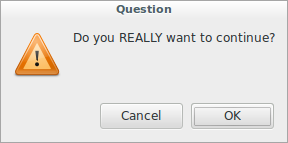
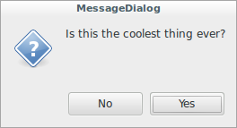
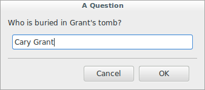
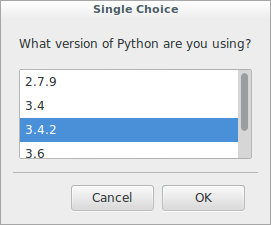
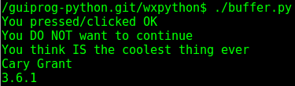

# wxPython

## Using common dialogs

This version shows basic mechanisms for communicating with the user 
using message dialogs:

* Simple alert OK box
* Simple alert OK/CANCEL box
* Simple alert YES/NO dialog
* Text entry in a single line
* Single choice from a list

```python
#!/usr/bin/env python
import wx
from files import images

class App(wx.App):
    def __init__(self, redirect=True, filename=None):
        wx.App.__init__(self, redirect, filename)

    def OnInit(self):
        dlg = wx.MessageDialog(None, 
                               'You are using wxPython!', 
                               'MessageDialog', 
                               wx.OK | wx.ICON_INFORMATION)
        result = dlg.ShowModal()
        dlg.Destroy()

        dlg = wx.MessageDialog(None, 
                               'Do you REALLY want to continue?', 
                               'Question', 
                               wx.OK | wx.CANCEL | wx.ICON_EXCLAMATION)
        result = dlg.ShowModal()
        dlg.Destroy()

        dlg = wx.MessageDialog(None, 
                               'Is this the coolest thing ever?', 
                               'MessageDialog', 
                               wx.YES_NO | wx.ICON_QUESTION)
        result = dlg.ShowModal()
        dlg.Destroy()

        dlg = wx.TextEntryDialog(None, 
                                 "Who is buried in Grant's tomb?", 
                                 'A Question', 
                                 'Cary Grant')

        if dlg.ShowModal() == wx.ID_OK:
            response = dlg.GetValue()
        dlg.Destroy()

        dlg = wx.SingleChoiceDialog(None, 
                                    'What version of Python are you using?', 
                                    'Single Choice', 
                                    ['2.7.9', 
                                     '3.4', 
                                     '3.4.2', 
                                     '3.6', 
                                     '3.6.1'])
        if dlg.ShowModal() == wx.ID_OK:
            response = dlg.GetStringSelection()
        dlg.Destroy()

        return True


if __name__ == '__main__':
    app = App(False, "files/output")
    fred = app.MainLoop()
```











Let's play a little on how to process the user's responses:

```python
#!/usr/bin/env python
import wx
from files import images

class App(wx.App):
    def __init__(self, redirect=True, filename=None):
        wx.App.__init__(self, redirect, filename)

    def OnInit(self):
        dlg = wx.MessageDialog(None, 
                               'You are using wxPython!', 
                               'MessageDialog', 
                               wx.OK | wx.ICON_INFORMATION)
        if dlg.ShowModal() == wx.ID_OK:
            print('You pressed/clicked OK')
        dlg.Destroy()

        dlg = wx.MessageDialog(None, 
                               'Do you REALLY want to continue?', 
                               'Question', 
                               wx.OK | wx.CANCEL | wx.ICON_EXCLAMATION)
        if dlg.ShowModal() == wx.ID_OK:
            print('You REALLY want to continue')
        else:
            print('You DO NOT want to continue')
        dlg.Destroy()

        dlg = wx.MessageDialog(None, 
                               'Is this the coolest thing ever?', 
                               'MessageDialog', 
                               wx.YES_NO | wx.ICON_QUESTION)
        if dlg.ShowModal() == wx.ID_YES:
            print('You think IS the coolest thing ever')
        else:
            print('You think IS NOT the coolest thing ever')
        dlg.Destroy()

        dlg = wx.TextEntryDialog(None, 
                                 "Who is buried in Grant's tomb?", 
                                 'A Question', 
                                 'Cary Grant')

        if dlg.ShowModal() == wx.ID_OK:
            response = dlg.GetValue()
            print(response)
        dlg.Destroy()

        dlg = wx.SingleChoiceDialog(None, 
                                    'What version of Python are you using?', 
                                    'Single Choice', 
                                    ['2.7.9', 
                                     '3.4', 
                                     '3.4.2', 
                                     '3.6', 
                                     '3.6.1'])
        if dlg.ShowModal() == wx.ID_OK:
            response = dlg.GetStringSelection()
            print(response)
        dlg.Destroy()

        return True


if __name__ == '__main__':
    app = App(False, "files/output")
    fred = app.MainLoop()
```


