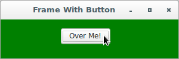

# wxPython

## Working in an event-driven environment

### Basic event binding both with and without source objects

```python
#!/usr/bin/env python
import wx

class BasicEventFrame(wx.Frame):

    def __init__(self, parent, id):
        wx.Frame.__init__(self, 
                          parent, 
                          id, 
                          'Frame with Button', 
                          size = (300, 100))
        panel = wx.Panel(self, -1)
        button = wx.Button(panel, 
                           -1, 
                           "Close", 
                           pos = (130, 15), 
                           size = (50, 40))
        self.Bind(wx.EVT_CLOSE, self.OnCloseWindow)
        self.Bind(wx.EVT_BUTTON, self.OnCloseMe, button)

    def OnCloseMe(self, event):
        self.Close(True)

    def OnCloseWindow(self, event):
        self.Destroy()


if __name__ == '__main__':
    app = wx.App()
    frame = BasicEventFrame(parent=None, id=-1)
    frame.Show()
    app.MainLoop()
```


### Sample menu event binding

```python
#!/usr/bin/env python
import wx

class MenuEventFrame(wx.Frame):

    def __init__(self, parent, id):
        wx.Frame.__init__(self, parent, id, 'Menus', size=(300, 200))
        menuBar = wx.MenuBar()
        menu1 = wx.Menu()
        menuBar.Append(menu1, "&File")
        menuItem = menu1.Append(-1, "&Exit...")
        self.SetMenuBar(menuBar)
        self.Bind(wx.EVT_MENU, self.OnCloseMe, menuItem)

    def OnCloseMe(self, event):
        self.Close(True)


if __name__ == '__main__':
    app = wx.App()
    frame = MenuEventFrame(parent=None, id=-1)
    frame.Show()
    app.MainLoop()
```


### Sample mouse event binding

```python
#!/usr/bin/env python
import wx

class MouseEventFrame(wx.Frame):

    def __init__(self, parent, id):
        wx.Frame.__init__(self, 
                          parent, 
                          id, 
                          'Frame With Button', 
                          size = (300, 100))
        self.panel = wx.Panel(self)
        self.button = wx.Button(self.panel, 
                                label = "Not Over", 
                                pos = (100, 15))
        self.Bind(wx.EVT_BUTTON, self.OnButtonClick, self.button)
        self.button.Bind(wx.EVT_ENTER_WINDOW, self.OnEnterWindow)
        self.button.Bind(wx.EVT_LEAVE_WINDOW, self.OnLeaveWindow)

    def OnButtonClick(self, event):
        self.panel.SetBackgroundColour('Green')
        self.panel.Refresh()

    def OnEnterWindow(self, event):
        self.button.SetLabel("Over Me!")
        event.Skip()

    def OnLeaveWindow(self, event):
        self.button.SetLabel("Not Over")
        event.Skip()


if __name__ == '__main__':
    app = wx.App()
    frame = MouseEventFrame(parent=None, id=-1)
    frame.Show()
    app.MainLoop()
```




### Response to a mouse down and button click at the same time

```python
#!/usr/bin/env python
import wx

class DoubleEventFrame(wx.Frame):

    def __init__(self, parent, id):
        wx.Frame.__init__(self, 
                          parent, 
                          id, 
                          'Frame With Button', 
                          size = (300, 100))
        self.panel = wx.Panel(self, -1)
        self.button = wx.Button(self.panel, 
                                -1, 
                                "Click Me", 
                                pos = (100, 15))
        self.Bind(wx.EVT_BUTTON, self.OnButtonClick, self.button)
        self.button.Bind(wx.EVT_LEFT_DOWN, self.OnMouseDown)

    def OnButtonClick(self, event):
        self.panel.SetBackgroundColour('Green')
        self.panel.Refresh()

    def OnMouseDown(self, event):
        self.button.SetLabel("Again!")
        event.Skip()


if __name__ == '__main__':
    app = wx.App()
    frame = DoubleEventFrame(parent=None, id=-1)
    frame.Show()
    app.MainLoop()
```


### Building a custom two-button event widget

```python
#!/usr/bin/env python
import wx

class TwoButtonEvent(wx.PyCommandEvent):

    def __init__(self, evtType, id):
        wx.PyCommandEvent.__init__(self, evtType, id)
        self.clickCount = 0

    def GetClickCount(self):
        return self.clickCount

    def SetClickCount(self, count):
        self.clickCount = count

myEVT_TWO_BUTTON = wx.NewEventType()
EVT_TWO_BUTTON = wx.PyEventBinder(myEVT_TWO_BUTTON, 1)

class TwoButtonPanel(wx.Panel):

    def __init__(self, 
                 parent, 
                 id = -1, 
                 leftText = "Left", 
                 rightText = "Right"):
        wx.Panel.__init__(self, parent, id)
        self.leftButton = wx.Button(self, 
                                    label = leftText)
        self.rightButton = wx.Button(self, 
                                     label = rightText, 
                                     pos = (100,0))
        self.leftClick = False
        self.rightClick = False
        self.clickCount = 0
        self.leftButton.Bind(wx.EVT_LEFT_DOWN, self.OnLeftClick)
        self.rightButton.Bind(wx.EVT_LEFT_DOWN, self.OnRightClick)

    def OnLeftClick(self, event):
        self.leftClick = True
        self.OnClick()
        event.Skip()

    def OnRightClick(self, event):
        self.rightClick = True
        self.OnClick()
        event.Skip()

    def OnClick(self):
        self.clickCount += 1
        if self.leftClick and self.rightClick:
            self.leftClick = False
            self.rightClick = False
            evt = TwoButtonEvent(myEVT_TWO_BUTTON, self.GetId())
            evt.SetClickCount(self.clickCount)
            self.GetEventHandler().ProcessEvent(evt)


class CustomEventFrame(wx.Frame):

    def __init__(self, parent, id):
        wx.Frame.__init__(self, 
                          parent, 
                          id, 
                          'Click Count: 0', 
                          size = (300, 100))
        panel = TwoButtonPanel(self)
        self.Bind(EVT_TWO_BUTTON, self.OnTwoClick, panel)

    def OnTwoClick(self, event):
        self.SetTitle("Click Count: {}".format(event.GetClickCount()))


if __name__ == '__main__':
    app = wx.App()
    frame = CustomEventFrame(parent=None, id=-1)
    frame.Show()
    app.MainLoop()
```


