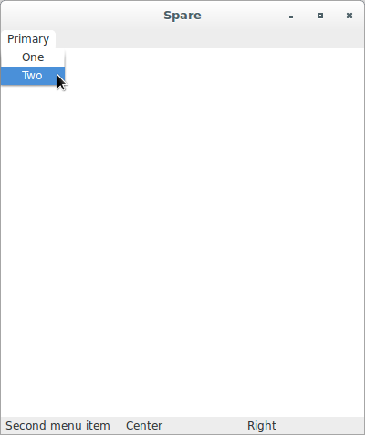

# wxPython

## Wrapping PyCrust around my wxPython application

### Introduction

Let's assume that you've used wxPython to create a program, and your 
program is working, and now you'd like a better understanding of exactly 
how it works. You've seen the PyCrust features, and they look like they 
could be very useful in gaining insights into the functioning of your 
program. But you'd rather not change your program just to be able to use 
PyCrust. What do you do?

By passing the name of your program to the PyWrap utility, you can start 
your program with a PyCrust shell wrapped around it, without changing 
any of your program.

Let's see this program, that we are preparing to wrap with PyCrust:

```python
#!/usr/bin/env python

"""spare.py is a starting point for simple wxPython programs."""

import wx

class Frame(wx.Frame):
    pass

class App(wx.App):

    def OnInit(self):
        self.frame = Frame(parent=None, id=-1, title='Spare')
        self.frame.Show()
        self.SetTopWindow(self.frame)
        return True

if __name__ == '__main__':
    app = App()
    app.MainLoop()
```

To run this program with PyCrust wrapped around it, pass the name of the 
program to PyWrap from the directory where `spare.py` resides. The 
command line looks like this:

```
(py34wxpy4) $ pywrap34 spare.py
```

Where the script `pywrap34` contains the following code:

```python
#!/usr/bin/env python

from wx.py.PyWrap import main

if __name__ == '__main__':
    main()
```

When started, PyWrap attempts to import the module included in the 
command line. PyWrap then looks inside that module for a `wx.App` 
subclass, and creates an instance of that class. After that, PyWrap 
creates a `wx.py.crust.CrustFrame` window with a shell, exposes the 
application object to the PyCrust namespace tree, and starts the 
wxPython event loop.

The complete source code for PyWrap is provided below. This is an 
example of how a great deal of functionality can be added to your 
program with just a small amount of additional code. Let's see:

```python
#!/usr/bin/env python
#----------------------------------------------------------------------
# Name:        PyWrap.py
# Purpose:     PyWrap is a command line utility that runs a wxPython 
#              program with additional runtime-tools, such as PyCrust.
# Tags:        phoenix-port
#----------------------------------------------------------------------
"""PyWrap is a command line utility that runs a wxPython program with
additional runtime-tools, such as PyCrust."""

__author__ = "Patrick K. O'Brien <pobrien@orbtech.com>"

import wx
from wx import py

import os
import sys

def wrap(app):
    frame = py.crust.CrustFrame()
    frame.SetSize((750, 525))
    frame.Show(True)
    frame.shell.interp.locals['app'] = app
    app.MainLoop()

def main(modulename=None):
    sys.path.insert(0, os.curdir)
    if not modulename:
        if len(sys.argv) < 2:
            print("Please specify a module name.")
            raise SystemExit
        modulename = sys.argv[1]
        if modulename.endswith('.py'):
            modulename = modulename[:-3]
    module = __import__(modulename)
    # Find the App class.
    App = None
    d = module.__dict__
    for item in d.keys():
        try:
            if issubclass(d[item], wx.App):
                App = d[item]
        except (NameError, TypeError):
            pass
    if App is None:
        print("No App class was found.")
        raise SystemExit
    app = App()
    wrap(app)

if __name__ == '__main__':
    main()
```

After running the PyWrap command, both the simple frame from `spare.py` 
and a PyCrust frame are displayed.


**PyCrust in action**

Now, let's see what we can do with the `spare.py` application frame from 
within the PyCrust shell. We'll start by importing `wx` and adding a 
panel to our frame:

```python
>>> import wx
>>> app.frame.panel = wx.Panel(parent=app.frame)
>>> app.frame.panel.SetBackgroundColour('White')
True
```


The panel that was added to the frame began with a default silver color, 
then it was changed to white. However, setting the panel background 
color doesn't immediately change its appearance. Instead, something 
needs to trigger an event that causes the panel to repaint itself, using 
its new background color property. One way to trigger such an event is 
to ask the panel to refresh itself:

```python
>>> app.frame.panel.Refresh()
```

Now a white panel is displayed, and we're one step closer to 
understanding the details of how wxPython actually works.


Next, let's add a status bar:

```python
>>> app.frame.statusbar = app.frame.CreateStatusBar(number=3)
>>> app.frame.statusbar.SetStatusText("Left", 0)
>>> app.frame.statusbar.SetStatusText("Center", 1)
>>> app.frame.statusbar.SetStatusText("Right", 2)
```

Notice how the status bar appears within the frame, without changing the 
outermost dimensions of the frame. Also notice that the text added to 
each of the three status bar sections appears immediately, and doesn't 
require a refresh.


Next, let's add a menu and a menubar:

```python
>>> app.frame.menubar = wx.MenuBar()
>>> menu = wx.Menu()
>>> app.frame.menubar.Append(menu, "Primary")
True
>>> app.frame.SetMenuBar(app.frame.menubar)
>>> menu.Append(wx.NewId(), "One", "First menu item")
<wx._core.MenuItem object at 0x7f62a154f5e8>
>>> menu.Append(wx.NewId(), "Two", "Second menu item")
<wx._core.MenuItem object at 0x7f62a154f678>
```



As you manipulate your own wxPython objects in the PyCrust shell, be 
aware of the impact that the changes have on your running program. Try 
to answer the following questions:

* When does the menu actually appear within the frame?
* What menu attributes can you change while the program is running?
* Can you add more menu items?
* Can you remove them?
* Can you disable them?

Exploring all your options interactively should help you better 
understand wxPython, and provide you more confidence when it comes to 
writing your actual program code.
