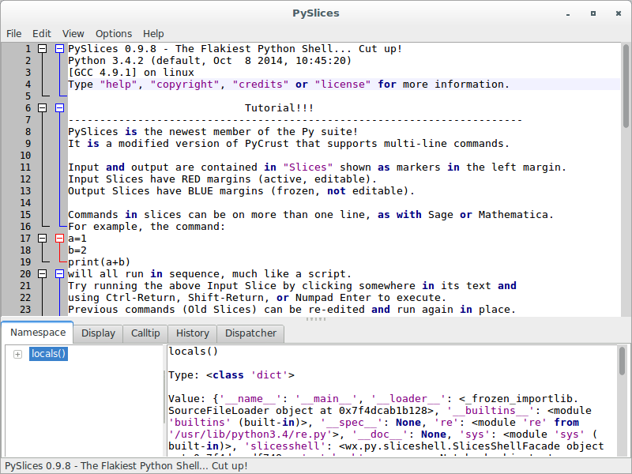

# wxPython

## GUI programs within Py package

### Introduction

Under the covers, all of the PyCrust programs simply make use of the 
Python modules included in the Py package, such as `shell.py`
, `crust.py`, `introspect.py`, and `interpreter.py`. These programs are 
the building blocks that are used to make PyCrust, which you can use 
separately or together.

Think of PyCrust as representing one way of assembling the bits and 
pieces of functionality contained within the Py package. PyShell is 
another way, and PyAlaMode is a third. In each of these cases, the 
majority of the underlying code is common to all of them, with only the 
outermost containers varying. So think of the Py package as a library of 
modules that you can assemble as you like, wherever you want to display 
a wxPython shell, a code editor, or runtime introspection information 
within your program.

Within the Py package, there is a clear separation between modules that 
provide user interface functionality and those that do not. That 
separation makes it much easier to use these modules in your own 
programs. The modules that begin with Py are all end-user GUI programs, 
such as PyCrust, PyShell, PyAlaMode, and PyAlaCarte. You won't want to 
import any of these in your programs.

### Working with the GUI programs

**PyAlaCarte**

Simple source code editor. Edits one file at a time.

To run this program, type this:

```
(py34wxpy4) $ pyalacarte34
```

Where the script `pyalacarte34` contains the following code:

```python
#!/usr/bin/env python

from wx.py.PyAlaCarte import main

if __name__ == '__main__':
    main()
```

The end-user module `PyAlaCarte.py` is written here:

```python
#!/usr/bin/env python
"""PyAlaCarte is a simple programmer's editor."""

__author__ = "Patrick K. O'Brien <pobrien@orbtech.com>"

import wx
from wx import py

import os
import sys

class App(wx.App):
    """PyAlaCarte standalone application."""

    def __init__(self, filename=None):
        self.filename = filename
        wx.App.__init__(self, redirect=False)

    def OnInit(self):
        self.frame = py.editor.EditorFrame(filename=self.filename)
        self.frame.Show()
        self.SetTopWindow(self.frame)
        return True

def main(filename=None):
    if not filename and len(sys.argv) > 1:
        filename = sys.argv[1]
    if filename:
        filename = os.path.realpath(filename)
    app = App(filename)
    app.MainLoop()

if __name__ == '__main__':
    main()
```


**PyAlaMode**

Multi-file source code editor. Each file is displayed in a separate 
notebook tab. The first tab contains a PyCrust splitter window.

To run this program, type this:

```
(py34wxpy4) $ pyalamode34
```

Where the script `pyalamode34` contains the following code:

```python
#!/usr/bin/env python

from wx.py.PyAlaMode import main

if __name__ == '__main__':
    main()
```

The end-user module `PyAlaMode.py` is written here:

```python
#!/usr/bin/env python
"""PyAlaMode is a programmer's editor."""

__author__ = "Patrick K. O'Brien <pobrien@orbtech.com>"

import wx
from wx import py

import os
import sys

class App(wx.App):
    """PyAlaMode standalone application."""

    def __init__(self, filename=None):
        self.filename = filename
        wx.App.__init__(self, redirect=False)

    def OnInit(self):
        self.frame = py.editor.EditorNotebookFrame(filename=self.filename)
        self.frame.Show()
        self.SetTopWindow(self.frame)
        return True

def main(filename=None):
    if not filename and len(sys.argv) > 1:
        filename = sys.argv[1]
    if filename:
        filename = os.path.realpath(filename)
    app = App(filename)
    app.MainLoop()

if __name__ == '__main__':
    main()
```


**PyAlaModeTest**

Variant for testing of PyAlaMode.

To run this program, type this:

```
(py34wxpy4) $ pyalamodetest34
```

Where the script `pyalamodetest34` contains the following code:

```python
#!/usr/bin/env python

from wx.py.PyAlaModeTest import main

if __name__ == '__main__':
    main()
```

The end-user module `PyAlaModeTest.py` is written here:

```python
#!/usr/bin/env python
"""PyAlaModeTest is a programmer's editor."""

__author__ = "Patrick K. O'Brien <pobrien@orbtech.com>"

import wx
from wx import py

import os
import sys

class App(wx.App):
    """PyAlaModeTest standalone application."""

    def __init__(self, filename=None):
        self.filename = filename
        wx.App.__init__(self, redirect=False)

    def OnInit(self):
        self.frame = py.editor.EditorShellNotebookFrame(filename=self.filename)
        self.frame.Show()
        self.SetTopWindow(self.frame)
        return True

def main(filename=None):
    app = App(filename)
    app.MainLoop()

if __name__ == '__main__':
    filename = None
    if len(sys.argv) > 1:
        filename = os.path.realpath(sys.argv[1])
    main(filename)
```


**PyCrust**

Combination of a wxPython shell with a notebook of tabs displaying a 
variety of runtime information, including a namespace tree viewer.

To run this program, type this:

```
(py34wxpy4) $ pycrust
```

Where the script `pycrust` contains the following code:

```python
#!/usr/bin/env python

# -*- coding: utf-8 -*-
import re
import sys

from wx.py.PyCrust import main

if __name__ == '__main__':
    sys.argv[0] = re.sub(r'(-script\.pyw?|\.exe)?$', '', sys.argv[0])
    sys.exit(main())
```

The end-user module `PyCrust.py` is written here:

```python
#!/usr/bin/env python
"""PyCrust is a python shell and namespace browser application."""

# The next two lines, and the other code below that makes use of
# __main__ and original, serve the purpose of cleaning up the
# main namespace to look as much as possible like the regular Python
# shell environment.
import __main__
original = list(__main__.__dict__.keys())

__author__ = "Patrick K. O'Brien <pobrien@orbtech.com>"

import wx

class App(wx.App):
    """PyCrust standalone application."""

    def OnInit(self):
        import os
        import wx
        from wx import py

        self.SetAppName("pycrust")
        confDir = wx.StandardPaths.Get().GetUserDataDir()
        if not os.path.exists(confDir):
            os.mkdir(confDir)
        fileName = os.path.join(confDir, 'config')
        self.config = wx.FileConfig(localFilename=fileName)
        self.config.SetRecordDefaults(True)

        self.frame = py.crust.CrustFrame(config=self.config, dataDir=confDir)
        self.frame.Show()
        self.SetTopWindow(self.frame)
        return True


'''
The main() function needs to handle being imported, such as with the
pycrust script that wxPython installs:

    #!/usr/bin/env python

    from wx.py.PyCrust import main
    main()
'''

def main():
    """The main function for the PyCrust program."""
    # Cleanup the main namespace, leaving the App class.
    import __main__
    md = __main__.__dict__
    keepers = original
    keepers.append('App')
    for key in list(md.keys()):
        if key not in keepers:
            del md[key]
    # Create an application instance.
    app = App(0)
    # Mimic the contents of the standard Python shell's sys.path.
    import sys
    if sys.path[0]:
        sys.path[0] = ''
    # Add the application object to the sys module's namespace.
    # This allows a shell user to do:
    # >>> import sys
    # >>> sys.app.whatever
    sys.app = app
    del sys
    # Cleanup the main namespace some more.
    if 'App' in md and md['App'] is App:
        del md['App']
    if '__main__' in md and md['__main__'] is __main__:
        del md['__main__']
    # Start the wxPython event loop.
    app.MainLoop()

if __name__ == '__main__':
    main()
```


**PyFilling**

Simple namespace tree viewer. This program isn't terribly useful on its 
own. It exists simply as another example of how to use the underlying 
library.

To run this program, type this:

```
(py34wxpy4) $ pyfilling
```

Where the script `pyfilling` contains the following code:

```python
#!/usr/bin/env python

from wx.py.PyFilling import main

if __name__ == '__main__':
    main()
```

The end-user module `PyFilling.py` is written here:

```python
#!/usr/bin/env python
"""PyFilling is a python namespace inspection application."""

__author__ = "Patrick K. O'Brien <pobrien@orbtech.com>"

# We use this object to get more introspection when run standalone.
app = None

from . import filling

# These are imported just to have something interesting to inspect.
from . import crust
from . import interpreter
from . import introspect
from . import pseudo
from . import shell

import sys
import wx

class App(filling.App):
    def OnInit(self):
        filling.App.OnInit(self)
        self.root = self.fillingFrame.filling.tree.root
        return True

def main():
    """Create and run the application."""
    global app
    app = App(0)
    app.fillingFrame.filling.tree.Expand(app.root)
    app.MainLoop()

if __name__ == '__main__':
    main()
```


**PyShell**

Simple wxPython shell interface, without the additional notebook that 
appears in PyCrust. Functionally, the wxPython shells in PyShell and 
PyCrust are identical.

To run this program, type this:

```
(py34wxpy4) $ pyshell
```

Where the script `pyshell` contains the following code:

```python
#!/usr/bin/env python

# -*- coding: utf-8 -*-
import re
import sys

from wx.py.PyShell import main

if __name__ == '__main__':
    sys.argv[0] = re.sub(r'(-script\.pyw?|\.exe)?$', '', sys.argv[0])
    sys.exit(main())
```

The end-user module `PyShell.py` is written here:

```python
#!/usr/bin/env python
"""PyShell is a python shell application."""

# The next two lines, and the other code below that makes use of
# __main__ and original, serve the purpose of cleaning up the
# main namespace to look as much as possible like the regular Python
# shell environment.
import __main__
original = list(__main__.__dict__.keys())

__author__ = "Patrick K. O'Brien <pobrien@orbtech.com>"

import wx
import os

class App(wx.App):
    """PyShell standalone application."""

    def OnInit(self):
        import os
        import wx
        from wx import py

        self.SetAppName("pyshell")
        confDir = wx.StandardPaths.Get().GetUserDataDir()
        if not os.path.exists(confDir):
            os.mkdir(confDir)
        fileName = os.path.join(confDir, 'config')
        self.config = wx.FileConfig(localFilename=fileName)
        self.config.SetRecordDefaults(True)

        self.frame = py.shell.ShellFrame(config=self.config, dataDir=confDir)
        self.frame.Show()
        self.SetTopWindow(self.frame)
        return True

'''
The main() function needs to handle being imported, such as with the
pyshell script that wxPython installs:

    #!/usr/bin/env python

    from wx.py.PyShell import main
    main()
'''

def main():
    """The main function for the PyShell program."""
    # Cleanup the main namespace, leaving the App class.
    import __main__
    md = __main__.__dict__
    keepers = original
    keepers.append('App')
    for key in list(md.keys()):
        if key not in keepers:
            del md[key]
    # Create an application instance.
    app = App(0)
    # Cleanup the main namespace some more.
    if 'App' in md and md['App'] is App:
        del md['App']
    if '__main__' in md and md['__main__'] is __main__:
        del md['__main__']
    # Mimic the contents of the standard Python shell's sys.path.
    import sys
    if sys.path[0]:
        sys.path[0] = ''
    # Add the application object to the sys module's namespace.
    # This allows a shell user to do:
    # >>> import sys
    # >>> sys.app.whatever
    sys.app = app
    del sys
    # Start the wxPython event loop.
    app.MainLoop()

if __name__ == '__main__':
    main()
```


**PySlices**

It is the newest member of the Py suite. It is a modified version of 
PyCrust that supports multi-line commands.

To run this program, type this:

```
(py34wxpy4) $ pyslices
```

Where the script `pyslices` contains the following code:

```python
#!/usr/bin/env python

# -*- coding: utf-8 -*-
import re
import sys

from wx.py.PySlices import main

if __name__ == '__main__':
    sys.argv[0] = re.sub(r'(-script\.pyw?|\.exe)?$', '', sys.argv[0])
    sys.exit(main())
```

The end-user module `PySlices.py` is written here:

```python
#!/usr/bin/env python
"""PySlices is a python block code editor / shell and namespace browser application."""

# The next two lines, and the other code below that makes use of
# __main__ and original, serve the purpose of cleaning up the
# main namespace to look as much as possible like the regular Python
# shell environment.
import __main__
original = list(__main__.__dict__.keys())

__author__ = "Patrick K. O'Brien <pobrien@orbtech.com> / "
__author__ += "David N. Mashburn <david.n.mashburn@gmail.com>"

import wx
import os

class App(wx.App):
    """PySlices standalone application."""

    def __init__(self, filename=None):
        self.filename = filename
        import wx
        wx.App.__init__(self, redirect=False)


    def OnInit(self):
        import os
        import wx
        from wx import py

        self.SetAppName("pyslices")
        confDir = wx.StandardPaths.Get().GetUserDataDir()
        if not os.path.exists(confDir):
            os.mkdir(confDir)
        fileName = os.path.join(confDir, 'config')
        self.config = wx.FileConfig(localFilename=fileName)
        self.config.SetRecordDefaults(True)

        self.frame = py.crustslices.CrustSlicesFrame(config=self.config, dataDir=confDir,
                                                     filename=self.filename)
##        self.frame.startupFileName = os.path.join(confDir,'pycrust_startup')
##        self.frame.historyFileName = os.path.join(confDir,'pycrust_history')
        self.frame.Show()
        self.SetTopWindow(self.frame)
        return True


'''
The main() function needs to handle being imported, such as with the
pycrust script that wxPython installs:

    #!/usr/bin/env python

    from wx.py.PySlices import main
    main()
'''

def main(filename=None):
    """The main function for the PySlices program."""
    # Cleanup the main namespace, leaving the App class.
    import sys
    if not filename and len(sys.argv) > 1:
        filename = sys.argv[1]
    if filename:
        filename = os.path.realpath(filename)

    import __main__
    md = __main__.__dict__
    keepers = original
    keepers.append('App')
    keepers.append('filename')
    for key in list(md.keys()):
        if key not in keepers:
            del md[key]
    # Create an application instance.
    app = App(filename=filename)
    # Mimic the contents of the standard Python shell's sys.path.
    import sys
    if sys.path[0]:
        sys.path[0] = ''
    # Add the application object to the sys module's namespace.
    # This allows a shell user to do:
    # >>> import sys
    # >>> sys.app.whatever
    sys.app = app
    del sys
    # Cleanup the main namespace some more.
    if 'App' in md and md['App'] is App:
        del md['App']
    if 'filename' in md and md['filename'] is filename:
        del md['filename']
    if '__main__' in md and md['__main__'] is __main__:
        del md['__main__']
    # Start the wxPython event loop.
    app.MainLoop()

if __name__ == '__main__':
    main()
```



**PySlicesShell**

Simple PySlices shell interface, without the additional notebook that 
appears in PySlices.

To run this program, type this:

```
(py34wxpy4) $ pyslicesshell
```

Where the script `pyslicesshell` contains the following code:

```python
#!/usr/bin/env python

# -*- coding: utf-8 -*-
import re
import sys

from wx.py.PySlicesShell import main

if __name__ == '__main__':
    sys.argv[0] = re.sub(r'(-script\.pyw?|\.exe)?$', '', sys.argv[0])
    sys.exit(main())
```

The end-user module `PySlicesShell.py` is written here:

```python
#!/usr/bin/env python
"""PySlicesShell is a python shell application."""

# The next two lines, and the other code below that makes use of
# __main__ and original, serve the purpose of cleaning up the
# main namespace to look as much as possible like the regular Python
# shell environment.
import __main__
original = list(__main__.__dict__.keys())

__author__ = "Patrick K. O'Brien <pobrien@orbtech.com>"

import wx
import os

class App(wx.App):
    """PySlicesShell standalone application."""

    def __init__(self, filename=None):
        self.filename = filename
        import wx
        wx.App.__init__(self, redirect=False)

    def OnInit(self):
        import os
        import wx
        from wx import py

        self.SetAppName("pysliceshell")
        confDir = wx.StandardPaths.Get().GetUserDataDir()
        if not os.path.exists(confDir):
            os.mkdir(confDir)
        fileName = os.path.join(confDir, 'config')
        self.config = wx.FileConfig(localFilename=fileName)
        self.config.SetRecordDefaults(True)

        self.frame = py.sliceshell.SlicesShellFrame(config=self.config,
                                                    dataDir=confDir,
                                                    filename=self.filename)
        self.frame.Show()
        self.SetTopWindow(self.frame)
        return True

'''
The main() function needs to handle being imported, such as with the
pyshell script that wxPython installs:

    #!/usr/bin/env python

    from wx.py.PySlicesShell import main
    main()
'''

def main(filename=None):
    """The main function for the PySlicesShell program."""
    # Cleanup the main namespace, leaving the App class.
    import sys
    if not filename and len(sys.argv) > 1:
        filename = sys.argv[1]
    if filename:
        filename = os.path.realpath(filename)

    import __main__
    md = __main__.__dict__
    keepers = original
    keepers.append('App')
    keepers.append('filename')
    for key in list(md.keys()):
        if key not in keepers:
            del md[key]
    # Create an application instance.
    app = App(filename=filename)
    # Cleanup the main namespace some more.
    if 'App' in md and md['App'] is App:
        del md['App']
    if 'filename' in md and md['filename'] is filename:
        del md['filename']
    if '__main__' in md and md['__main__'] is __main__:
        del md['__main__']
    # Mimic the contents of the standard Python shell's sys.path.
    import sys
    if sys.path[0]:
        sys.path[0] = ''
    # Add the application object to the sys module's namespace.
    # This allows a shell user to do:
    # >>> import sys
    # >>> sys.app.whatever
    sys.app = app
    del sys
    # Start the wxPython event loop.
    app.MainLoop()

if __name__ == '__main__':
    main()
```


**PyWrap**

Command-line utility that runs an existing wxPython program alongside a 
PyCrust frame, allowing you to manipulate the application within the 
PyCrust shell.

In other words, by passing the name of your program to the PyWrap 
utility, you can start your program with a PyCrust shell wrapped around 
it, without changing any of your program.

Let's see this program, that we are preparing to wrap with PyCrust:

```python
#!/usr/bin/env python

"""spare.py is a starting point for simple wxPython programs."""

import wx

class Frame(wx.Frame):
    pass

class App(wx.App):

    def OnInit(self):
        self.frame = Frame(parent=None, id=-1, title='Spare')
        self.frame.Show()
        self.SetTopWindow(self.frame)
        return True

if __name__ == '__main__':
    app = App()
    app.MainLoop()
```

To run this program with PyCrust, type this:

```
(py34wxpy4) $ pywrap34 spare.py
```

Where the script `pywrap34` contains the following code:

```python
#!/usr/bin/env python

from wx.py.PyWrap import main

if __name__ == '__main__':
    main()
```

The end-user module `PyWrap.py` is written here:

```python
#!/usr/bin/env python
#----------------------------------------------------------------------
# Name:        PyWrap.py
# Purpose:     PyWrap is a command line utility that runs a wxPython 
#              program with additional runtime-tools, such as PyCrust.
# Tags:        phoenix-port
#----------------------------------------------------------------------
"""PyWrap is a command line utility that runs a wxPython program with
additional runtime-tools, such as PyCrust."""

__author__ = "Patrick K. O'Brien <pobrien@orbtech.com>"

import wx
from wx import py

import os
import sys

def wrap(app):
    frame = py.crust.CrustFrame()
    frame.SetSize((750, 525))
    frame.Show(True)
    frame.shell.interp.locals['app'] = app
    app.MainLoop()

def main(modulename=None):
    sys.path.insert(0, os.curdir)
    if not modulename:
        if len(sys.argv) < 2:
            print("Please specify a module name.")
            raise SystemExit
        modulename = sys.argv[1]
        if modulename.endswith('.py'):
            modulename = modulename[:-3]
    module = __import__(modulename)
    # Find the App class.
    App = None
    d = module.__dict__
    for item in d.keys():
        try:
            if issubclass(d[item], wx.App):
                App = d[item]
        except (NameError, TypeError):
            pass
    if App is None:
        print("No App class was found.")
        raise SystemExit
    app = App()
    wrap(app)

if __name__ == '__main__':
    main()
```


