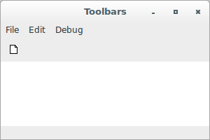
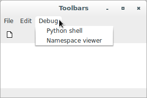
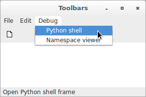
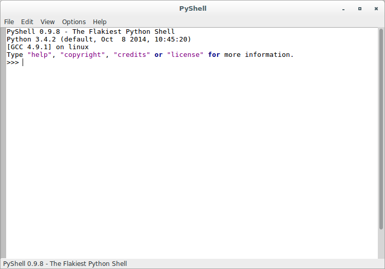
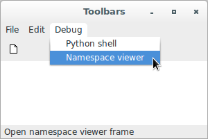
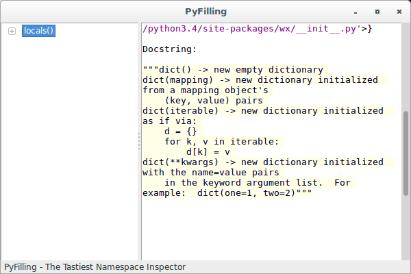

# wxPython

## Using modules from the Py package

### Introduction

What do you do if you don't want an entire PyCrust frame in your 
application? What if you just want the shell interface in one frame, and 
perhaps a namespace viewer in another? And what if you want them to be 
permanent additions to your program? These alternatives are not only 
possible, they're also fairly easy.

### Applications that display a shell frame and a filling frame

Several versions that add a menubar, toolbar, or status bar to a frame 
are presented (make sure to have the *images* module within the *files* 
folder). This is the first one:

```python
#!/usr/bin/env python
# this version uses deprecated method "AddSimpleTool"
import wx
from wx.py.shell import ShellFrame
from wx.py.filling import FillingFrame
from files import images

class ToolbarFrame(wx.Frame):
    
    def __init__(self, parent, id):
        wx.Frame.__init__(self, 
                          parent, 
                          id, 
                          'Toolbars', 
                          size=(300, 200))
        panel = wx.Panel(self, -1)
        panel.SetBackgroundColour('White')
        statusBar = self.CreateStatusBar()
        toolbar = self.CreateToolBar()
        toolbar.AddSimpleTool(wx.NewId(), 
                              images.getNewBitmap(), 
                              "New", 
                              "Long help for 'New'")
        toolbar.Realize()
        menuBar = wx.MenuBar()
        menu1 = wx.Menu()
        menuBar.Append(menu1, "&File")
        menu2 = wx.Menu()
        menuBar.Append(menu2, "&Edit")
        menu2.Append(wx.NewId(), "&Copy", "Copy in status bar")
        menu2.Append(wx.NewId(), "C&ut", "")
        menu2.Append(wx.NewId(), "Paste", "")
        menu2.AppendSeparator()
        menu2.Append(wx.NewId(), "&Options...", "Display Options")
        menu3 = wx.Menu()
        menuBar.Append(menu3, "&Debug")
        shell = menu3.Append(wx.NewId(), 
                             "&Python shell", 
                             "Open Python shell frame")
        filling = menu3.Append(wx.NewId(), 
                             "&Namespace viewer", 
                             "Open namespace viewer frame")
        self.Bind(wx.EVT_MENU, self.OnShell, shell)
        self.Bind(wx.EVT_MENU, self.OnFilling, filling)
        self.SetMenuBar(menuBar)

    def OnCloseMe(self, event):
        self.Close(True)

    def OnCloseWindow(self, event):
        self.Destroy()

    def OnShell(self, event):
        frame = ShellFrame(parent=self)
        frame.Show()

    def OnFilling(self, event):
        frame = FillingFrame(parent=self)
        frame.Show()

if __name__ == '__main__':
    app = wx.App()
    app.frame = ToolbarFrame(parent=None, id=-1)
    app.frame.Show()
    app.MainLoop()
```

A newer version:

```python
#!/usr/bin/env python
# this version uses newer method "AddTool"
import wx
from wx.py.shell import ShellFrame
from wx.py.filling import FillingFrame
from files import images

class ToolbarFrame(wx.Frame):
    def __init__(self, parent, id):
        wx.Frame.__init__(self, 
                          parent, 
                          id, 
                          'Toolbars', 
                          size=(300, 200))
        panel = wx.Panel(self, -1)
        panel.SetBackgroundColour('White')
        statusBar = self.CreateStatusBar()
        toolbar = self.CreateToolBar()
        toolbar.AddTool(wx.NewId(), 
                        "New", 
                        images.getNewBitmap(), 
                        wx.NullBitmap, 
                        wx.ITEM_NORMAL, 
                        "New", 
                        "Long help for 'New'", 
                        None)
        toolbar.Realize()
        menuBar = wx.MenuBar()
        menu1 = wx.Menu()
        menuBar.Append(menu1, "&File")
        menu2 = wx.Menu()
        menuBar.Append(menu2, "&Edit")
        menu2.Append(wx.NewId(), "&Copy", "Copy in status bar")
        menu2.Append(wx.NewId(), "C&ut", "")
        menu2.Append(wx.NewId(), "Paste", "")
        menu2.AppendSeparator()
        menu2.Append(wx.NewId(), "&Options...", "Display Options")
        menu3 = wx.Menu()
        menuBar.Append(menu3, "&Debug")
        shell = menu3.Append(wx.NewId(), 
                             "&Python shell", 
                             "Open Python shell frame")
        filling = menu3.Append(wx.NewId(), 
                             "&Namespace viewer", 
                             "Open namespace viewer frame")
        self.Bind(wx.EVT_MENU, self.OnShell, shell)
        self.Bind(wx.EVT_MENU, self.OnFilling, filling)
        self.SetMenuBar(menuBar)

    def OnCloseMe(self, event):
        self.Close(True)

    def OnCloseWindow(self, event):
        self.Destroy()

    def OnShell(self, event):
        frame = ShellFrame(parent=self)
        frame.Show()

    def OnFilling(self, event):
        frame = FillingFrame(parent=self)
        frame.Show()

if __name__ == '__main__':
    app = wx.App()
    app.frame = ToolbarFrame(parent=None, id=-1)
    app.frame.Show()
    app.MainLoop()
```

A different but also newer version (with keyword arguments):

```python
#!/usr/bin/env python
# this version uses newer method "AddTool" with keyword arguments
import wx
from wx.py.shell import ShellFrame
from wx.py.filling import FillingFrame
from files import images

class ToolbarFrame(wx.Frame):
    def __init__(self, parent, id):
        wx.Frame.__init__(self, 
                          parent, 
                          id, 
                          'Toolbars', 
                          size=(300, 200))
        panel = wx.Panel(self, -1)
        panel.SetBackgroundColour('White')
        statusBar = self.CreateStatusBar()
        toolbar = self.CreateToolBar()
        toolbar.AddTool(wx.NewId(), 
                        "New", 
                        images.getNewBitmap(), 
                        wx.NullBitmap, 
                        kind = wx.ITEM_NORMAL, 
                        shortHelpString = "New", 
                        longHelpString = "Long help for 'New'", 
                        clientData = None)
        toolbar.Realize()
        menuBar = wx.MenuBar()
        menu1 = wx.Menu()
        menuBar.Append(menu1, "&File")
        menu2 = wx.Menu()
        menuBar.Append(menu2, "&Edit")
        menu2.Append(wx.NewId(), "&Copy", "Copy in status bar")
        menu2.Append(wx.NewId(), "C&ut", "")
        menu2.Append(wx.NewId(), "Paste", "")
        menu2.AppendSeparator()
        menu2.Append(wx.NewId(), "&Options...", "Display Options")
        menu3 = wx.Menu()
        menuBar.Append(menu3, "&Debug")
        shell = menu3.Append(wx.NewId(), 
                             "&Python shell", 
                             "Open Python shell frame")
        filling = menu3.Append(wx.NewId(), 
                             "&Namespace viewer", 
                             "Open namespace viewer frame")
        self.Bind(wx.EVT_MENU, self.OnShell, shell)
        self.Bind(wx.EVT_MENU, self.OnFilling, filling)
        self.SetMenuBar(menuBar)

    def OnCloseMe(self, event):
        self.Close(True)

    def OnCloseWindow(self, event):
        self.Destroy()

    def OnShell(self, event):
        frame = ShellFrame(parent=self)
        frame.Show()

    def OnFilling(self, event):
        frame = FillingFrame(parent=self)
        frame.Show()

if __name__ == '__main__':
    app = wx.App()
    app.frame = ToolbarFrame(parent=None, id=-1)
    app.frame.Show()
    app.MainLoop()
```

The *images* module is:

```python
# images.py
from wx import Image, Bitmap
from wx import EmptyIcon
import io

def getNewData():
    return \
b'\x89PNG\r\n\x1a\n\x00\x00\x00\rIHDR\x00\x00\x00\x10\x00\x00\x00\x0f\x08\x06\
\x00\x00\x00\xedsO/\x00\x00\x00\x04sBIT\x08\x08\x08\x08|\x08d\x88\x00\x00\
\x00YIDATx\x9c\xed\xd31\n@!\x0c\x03\xd0\xa4\xfe\xfb\xdfX\xe3\xf0\x97R\xa5(.\
\x0ef\x13\xe45\xa2\x92Vp\x92\xcf/\xd4\xaa\xb2\xcd\xb4\xc2\x14\x00\x00in\x90\
\x84ZUDl\xa9\xa7\xc3c\xcb-\x80\xfc\x87{d8B6=B\xdb\rfy\xc0\r\xc0\xf0\x0e\xfc\
\x1d\xaf\x84\xa7\xbf\xb1\x03\xe1,\x19&\x93\x9a\xd2\x97\x00\x00\x00\x00IEND\
\xaeB`\x82' 

def getNewBitmap():
    return Bitmap(getNewImage())

def getNewImage():
    stream = io.BytesIO(getNewData())
    return Image(stream)
```












