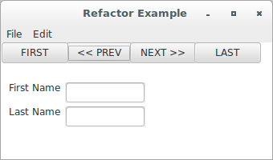
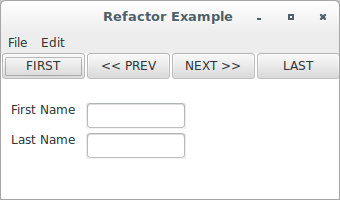
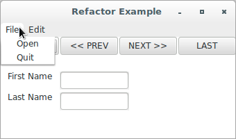
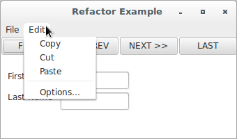

# wxPython

## Refactoring

### Introduction

There are many reasons why bad interface or layout code happens to good 
programmers. Even a simple UI can require many lines to show all of its 
elements on the screen. Programmers often try to accomplish this using a 
single method, and the method quickly becomes long and hard to control. 
Furthermore, interface code is susceptible to being tweaked and changed 
constantly, which can wreak havoc unless you are disciplined about 
managing the changes. Because writing all the layout code can be 
tedious, an interface programmer will often use a design toolkit that 
generates code. The machine-generated code is notorious for being 
awkward and hard to make sense of without using the generation tool.

In principle, it's not hard to keep UI code under control. The key 
is *refactoring*, or continually improving the design and structure of 
existing code. The goal in refactoring is to keep the code in a state 
where it can be easily read and maintained in the future.

### Principles to consider when refactoring

Let's see a table with a brief description of some of the principles to 
keep in mind when refactoring:

Principle | Description
--------- | -----------
No duplication | You should avoid having multiple segments of code with the same functionality. This can become a maintenance headache when the functionality needs to change.
One thing at a time | A method should do one thing, and one thing only. Separate things should be moved into separate methods. Methods should be kept short.
Build shallow nests | Try to keep from nesting code more than two or three levels deep. Deeply nested code is also a good candidate for a separate method.
Avoid magic literals | String and numeric literals should be kept to a minimum. A good way to manage this is to separate literal data from the main portion of your code, and store it in a list or dictionary.

The most basic goal is to remember that somebody is going to have to 
read and understand your code in the future. Try to make that person's 
life easier. After all, it might be you.

### A refactoring example

To show you how these principles work in action, let's see a refactoring 
example. A window that might be used as the front end to a Microsoft 
Access-like database is shown here:



The following code shows a poorly structured way to produce the UI shown 
above:

```python
#!/usr/bin/env python
# badExample.py
import wx

class RefactorExample(wx.Frame):

    def __init__(self, parent, id):
        wx.Frame.__init__(self, parent, id, 'Refactor Example',
                size=(340, 200))
        panel = wx.Panel(self, -1)
        panel.SetBackgroundColour("White")
        prevButton = wx.Button(panel, -1, "<< PREV", pos=(80, 0))
        self.Bind(wx.EVT_BUTTON, self.OnPrev, prevButton)
        nextButton = wx.Button(panel, -1, "NEXT >>", pos=(160, 0))
        self.Bind(wx.EVT_BUTTON, self.OnNext, nextButton)
        self.Bind(wx.EVT_CLOSE, self.OnCloseWindow)

        menuBar = wx.MenuBar()
        menu1 = wx.Menu()
        openMenuItem = menu1.Append(-1, "&Open", "Copy in status bar")
        self.Bind(wx.EVT_MENU, self.OnOpen, openMenuItem)
        quitMenuItem = menu1.Append(-1, "&Quit", "Quit")
        self.Bind(wx.EVT_MENU, self.OnCloseWindow, quitMenuItem)
        menuBar.Append(menu1, "&File")
        menu2 = wx.Menu()
        copyItem = menu2.Append(-1, "&Copy", "Copy")
        self.Bind(wx.EVT_MENU, self.OnCopy, copyItem)
        cutItem = menu2.Append(-1, "C&ut", "Cut")
        self.Bind(wx.EVT_MENU, self.OnCut, cutItem)
        pasteItem = menu2.Append(-1, "Paste", "Paste")
        self.Bind(wx.EVT_MENU, self.OnPaste, pasteItem)
        menuBar.Append(menu2, "&Edit")
        self.SetMenuBar(menuBar)

        static = wx.StaticText(panel, wx.NewId(), "First Name",
                pos=(10, 50))
        static.SetBackgroundColour("White")
        text = wx.TextCtrl(panel, wx.NewId(), "", size=(100, -1),
                pos=(80, 50))

        static2 = wx.StaticText(panel, wx.NewId(), "Last Name",
                pos=(10, 80))
        static2.SetBackgroundColour("White")
        text2 = wx.TextCtrl(panel, wx.NewId(), "", size=(100, -1),
                pos=(80, 80))

        firstButton = wx.Button(panel, -1, "FIRST")
        self.Bind(wx.EVT_BUTTON, self.OnFirst, firstButton)

        menu2.AppendSeparator()
        optItem = menu2.Append(-1, "&Options...", "Display Options")
        self.Bind(wx.EVT_MENU, self.OnOptions, optItem)

        lastButton = wx.Button(panel, -1, "LAST", pos=(240, 0))
        self.Bind(wx.EVT_BUTTON, self.OnLast, lastButton)


    # Just grouping the empty event handlers together
    def OnPrev(self, event): pass
    def OnNext(self, event): pass
    def OnLast(self, event): pass
    def OnFirst(self, event): pass
    def OnOpen(self, event): pass
    def OnCopy(self, event): pass
    def OnCut(self, event): pass
    def OnPaste(self, event): pass
    def OnOptions(self, event): pass

    def OnCloseWindow(self, event):
        self.Destroy()

if __name__ == '__main__':
    app = wx.App()
    frame = RefactorExample(parent=None, id=-1)
    frame.Show()
    app.MainLoop()
```

Let's categorize how this code example works against the principles 
stated above. On the positive side, there's no deep nesting. On the 
negative side, the other three ideas listed aren't followed at all.  
Let's see a table that summarizes the ways in which refactoring might 
improve this code:

Principle | Problem in code
--------- | ---------------
No duplication | Several patterns are duplicated repeatedly, including "add a button, and give it an action," "add a menu item and give it an action," and "create a caption/text entry pair".
One thing at a time | This code does several things. In addition to basic frame setup, it creates the menu bar, adds the buttons, and adds the text fields. Worse, the three functions are mixed up through the code, as if late changes were just added at the bottom of the method.
Avoid magic literals | Every button, menu item, and text box has a literal string and a literal point in the constructor.

To give you a general idea of how to fix this code, we'll pull all the 
button code into a separate method.

### Starting to refactor

The following contains the code used to create just the button bar in 
the example. As a first step in refactoring, we've extracted the code to 
its own method. Let's see:

```python
def createButtonBar(self):
    firstButton = wx.Button(panel, -1, "FIRST")
    self.Bind(wx.EVT_BUTTON, self.OnFirst, firstButton)
    prevButton = wx.Button(panel, -1, "<< PREV", pos=(80, 0))
    self.Bind(wx.EVT_BUTTON, self.OnPrev, prevButton)
    nextButton = wx.Button(panel, -1, "NEXT >>", pos=(160, 0))
    self.Bind(wx.EVT_BUTTON, self.OnNext, nextButton)
    lastButton = wx.Button(panel, -1, "LAST", pos=(240, 0))
    self.Bind(wx.EVT_BUTTON, self.OnLast, lastButton)
```

With the code separated out like this, it's easy to see what the 
commonality is between all the button additions. We can factor that 
portion out into a generic method, and just call the method repeatedly, 
as shown here:

```python
def createButtonBar(self, panel):
    self.buildOneButton(panel, "FIRST", self.OnFirst)
    self.buildOneButton(panel, "<< PREV", self.OnPrev, (80, 0))
    self.buildOneButton(panel, "NEXT >>", self.OnNext, (160, 0))
    self.buildOneButton(panel, "LAST", self.OnLast, (240, 0))

def buildOneButton(self, parent, label, handler, pos=(0, 0)):
    button = wx.Button(parent, -1, label, pos)
    self.Bind(wx.EVT_BUTTON, handler, button)
    return button
```

There are a couple of advantages in following the second example instead 
of the first. For one thing, the intent of the code is clearer just from 
reading it. Having short methods with meaningful names goes a long way 
toward signaling intent. The second example also gets rid of all the 
local variables that are needed just to hold on to IDs (admittedly, you 
could also get rid of the local variables by hardwiring the IDs, but 
that can cause duplicate ID problems). This is helpful because it makes 
the code less complicated, and also because it almost eliminates the 
common error of cutting and pasting a couple of lines of code and 
forgetting to change all the variable names (in a real application, you 
might need to store the buttons as instance variables to be able to 
access them later, but for this example, you do not). In addition, 
the `buildOneButton()` method is easily moved to a utility module and 
could be reused in other frames or other projects. A toolkit of common 
utilities is a useful thing to have.

Let's see the application's source code with the first proposed change:

```python
#!/usr/bin/env python
import wx

class RefactorExample(wx.Frame):

    def __init__(self, parent, id):
        wx.Frame.__init__(self, parent, id, 'Refactor Example',
                size=(340, 200))
        global panel
        panel = wx.Panel(self, -1)
        panel.SetBackgroundColour("White")
        self.Bind(wx.EVT_CLOSE, self.OnCloseWindow)

        menuBar = wx.MenuBar()
        menu1 = wx.Menu()
        openMenuItem = menu1.Append(-1, "&Open", "Copy in status bar")
        self.Bind(wx.EVT_MENU, self.OnOpen, openMenuItem)
        quitMenuItem = menu1.Append(-1, "&Quit", "Quit")
        self.Bind(wx.EVT_MENU, self.OnCloseWindow, quitMenuItem)
        menuBar.Append(menu1, "&File")
        menu2 = wx.Menu()
        copyItem = menu2.Append(-1, "&Copy", "Copy")
        self.Bind(wx.EVT_MENU, self.OnCopy, copyItem)
        cutItem = menu2.Append(-1, "C&ut", "Cut")
        self.Bind(wx.EVT_MENU, self.OnCut, cutItem)
        pasteItem = menu2.Append(-1, "Paste", "Paste")
        self.Bind(wx.EVT_MENU, self.OnPaste, pasteItem)
        menuBar.Append(menu2, "&Edit")
        self.SetMenuBar(menuBar)

        static = wx.StaticText(panel, wx.NewId(), "First Name",
                pos=(10, 50))
        static.SetBackgroundColour("White")
        text = wx.TextCtrl(panel, wx.NewId(), "", size=(100, -1),
                pos=(80, 50))

        static2 = wx.StaticText(panel, wx.NewId(), "Last Name",
                pos=(10, 80))
        static2.SetBackgroundColour("White")
        text2 = wx.TextCtrl(panel, wx.NewId(), "", size=(100, -1),
                pos=(80, 80))

        menu2.AppendSeparator()
        optItem = menu2.Append(-1, "&Options...", "Display Options")
        self.Bind(wx.EVT_MENU, self.OnOptions, optItem)
        self.createButtonBar()

    def createButtonBar(self):
        firstButton = wx.Button(panel, -1, "FIRST")
        self.Bind(wx.EVT_BUTTON, self.OnFirst, firstButton)
        prevButton = wx.Button(panel, -1, "<< PREV", pos=(80, 0))
        self.Bind(wx.EVT_BUTTON, self.OnPrev, prevButton)
        nextButton = wx.Button(panel, -1, "NEXT >>", pos=(160, 0))
        self.Bind(wx.EVT_BUTTON, self.OnNext, nextButton)
        lastButton = wx.Button(panel, -1, "LAST", pos=(240, 0))
        self.Bind(wx.EVT_BUTTON, self.OnLast, lastButton)

    # Just grouping the empty event handlers together
    def OnPrev(self, event): pass
    def OnNext(self, event): pass
    def OnLast(self, event): pass
    def OnFirst(self, event): pass
    def OnOpen(self, event): pass
    def OnCopy(self, event): pass
    def OnCut(self, event): pass
    def OnPaste(self, event): pass
    def OnOptions(self, event): pass

    def OnCloseWindow(self, event):
        self.Destroy()

if __name__ == '__main__':
    app = wx.App()
    frame = RefactorExample(parent=None, id=-1)
    frame.Show()
    app.MainLoop()
```

Now, let's see the application's source code with the second proposed 
change:

```python
#!/usr/bin/env python
import wx

class RefactorExample(wx.Frame):

    def __init__(self, parent, id):
        wx.Frame.__init__(self, parent, id, 'Refactor Example',
                size=(340, 200))
        panel = wx.Panel(self, -1)
        panel.SetBackgroundColour("White")
        self.Bind(wx.EVT_CLOSE, self.OnCloseWindow)

        menuBar = wx.MenuBar()
        menu1 = wx.Menu()
        openMenuItem = menu1.Append(-1, "&Open", "Copy in status bar")
        self.Bind(wx.EVT_MENU, self.OnOpen, openMenuItem)
        quitMenuItem = menu1.Append(-1, "&Quit", "Quit")
        self.Bind(wx.EVT_MENU, self.OnCloseWindow, quitMenuItem)
        menuBar.Append(menu1, "&File")
        menu2 = wx.Menu()
        copyItem = menu2.Append(-1, "&Copy", "Copy")
        self.Bind(wx.EVT_MENU, self.OnCopy, copyItem)
        cutItem = menu2.Append(-1, "C&ut", "Cut")
        self.Bind(wx.EVT_MENU, self.OnCut, cutItem)
        pasteItem = menu2.Append(-1, "Paste", "Paste")
        self.Bind(wx.EVT_MENU, self.OnPaste, pasteItem)
        menuBar.Append(menu2, "&Edit")
        self.SetMenuBar(menuBar)

        static = wx.StaticText(panel, wx.NewId(), "First Name",
                pos=(10, 50))
        static.SetBackgroundColour("White")
        text = wx.TextCtrl(panel, wx.NewId(), "", size=(100, -1),
                pos=(80, 50))

        static2 = wx.StaticText(panel, wx.NewId(), "Last Name",
                pos=(10, 80))
        static2.SetBackgroundColour("White")
        text2 = wx.TextCtrl(panel, wx.NewId(), "", size=(100, -1),
                pos=(80, 80))

        menu2.AppendSeparator()
        optItem = menu2.Append(-1, "&Options...", "Display Options")
        self.Bind(wx.EVT_MENU, self.OnOptions, optItem)
        self.createButtonBar(panel)

    def createButtonBar(self, panel):
        self.buildOneButton(panel, "FIRST", self.OnFirst)
        self.buildOneButton(panel, "<< PREV", self.OnPrev, (80, 0))
        self.buildOneButton(panel, "NEXT >>", self.OnNext, (160, 0))
        self.buildOneButton(panel, "LAST", self.OnLast, (240, 0))

    def buildOneButton(self, parent, label, handler, pos=(0, 0)):
        button = wx.Button(parent, -1, label, pos)
        self.Bind(wx.EVT_BUTTON, handler, button)
        return button

    # Just grouping the empty event handlers together
    def OnPrev(self, event): pass
    def OnNext(self, event): pass
    def OnLast(self, event): pass
    def OnFirst(self, event): pass
    def OnOpen(self, event): pass
    def OnCopy(self, event): pass
    def OnCut(self, event): pass
    def OnPaste(self, event): pass
    def OnOptions(self, event): pass

    def OnCloseWindow(self, event):
        self.Destroy()

if __name__ == '__main__':
    app = wx.App()
    frame = RefactorExample(parent=None, id=-1)
    frame.Show()
    app.MainLoop()
```

### More refactoring

Having made a significant improvement, we could stop here. But there are 
still a lot of *magic literals*, which are hardcoded constants used in 
multiple locations, in the code. For one thing, the literal points used 
for positioning could make the code prone to errors when another button 
is being added to the bar, especially if the new button is placed in the 
middle of the bar. So let's go one step farther and separate the literal 
data from the processing. The following code shows a more data-driven 
mechanism for creating buttons:

```python
def buttonData(self):
    return (("FIRST", self.OnFirst), 
            ("<< PREV", self.OnPrev), 
            ("NEXT >>", self.OnNext), 
            ("LAST", self.OnLast))

def createButtonBar(self, panel, yPos=0):
    xPos = 0
    for eachLabel, eachHandler in self.buttonData():
        pos = (xPos, yPos)
        button = self.buildOneButton(panel, eachLabel, eachHandler, pos)
        xPos += button.GetSize().width

def buildOneButton(self, parent, label, handler, pos=(0, 0)):
    button = wx.Button(parent, -1, label, pos)
    self.Bind(wx.EVT_BUTTON, handler, button)
    return button
```

Notice in the example that the data for the individual buttons is stored 
in a nested tuple in the `buttonData()` method. The choice of data 
structure and use of a constant method is not inevitable. The data could 
be stored as a class-level or module-level variable, rather than the 
result of a method, or it could be stored in an external file. One 
advantage to using a method is being able to make a relatively simple 
transition if you wish to store the button data in another location, 
just change the method so that instead of returning a constant, it 
returns the external data.

The `createButtonBar()` method iterates over the list returned 
by `buttonData()` and creates each button from that data. The method now 
calculates the x-axis position of the buttons automatically as it 
traverses the list. This is helpful because it ensures that the order of 
the buttons in the code will be identical to the order on the screen, 
making the code clearer and less error-prone. If you need to add a 
button in the middle of the bar now, you can just add the data to the 
middle of the list and the code guarantees that it will be placed 
correctly.

The separation of the data has other benefits. In a more elaborate 
example, the data could be stored externally in a resource or XML file. 
This would allow interface changes to be made without even looking at 
the code, and also makes internationalization easier, by making it 
easier to change text. We're currently still hard-wiring the button 
width, but that could easily be added to the data method as well (in 
reality, we'd probably use a wxPython `Sizer` object). Also, with the 
specifics of the data removed, `createButtonBar` is now well on its way 
to being a utility method itself, and could easily be reused in another 
frame or project.

After performing the same steps of consolidating, factoring the common 
process, and separating data for the menu and text field code, the 
result is shown here:

```python
#!/usr/bin/env python
import wx

class RefactorExample(wx.Frame):

    def __init__(self, parent, id):
        wx.Frame.__init__(self, 
                          parent, 
                          id, 
                          'Refactor Example', 
                          size = (340, 200))
        panel = wx.Panel(self, -1)
        panel.SetBackgroundColour("White")
        self.Bind(wx.EVT_CLOSE, self.OnCloseWindow)
        self.createMenuBar()    # Simplified init method
        self.createButtonBar(panel)
        self.createTextFields(panel)

    def menuData(self):    # Data for menus
        return (("&File", 
                    ("&Open", "Open in status bar", self.OnOpen), 
                    ("&Quit", "Quit", self.OnCloseWindow)), 
                ("&Edit", 
                    ("&Copy", "Copy", self.OnCopy), 
                    ("C&ut", "Cut", self.OnCut), 
                    ("&Paste", "Paste", self.OnPaste), 
                    ("", "", ""), 
                    ("&Options...", "DisplayOptions", self.OnOptions)))

    def createMenuBar(self):    # MenuBar creation here
        menuBar = wx.MenuBar()
        for eachMenuData in self.menuData():
            menuLabel = eachMenuData[0]
            menuItems = eachMenuData[1:]
            menuBar.Append(self.createMenu(menuItems), menuLabel)
        self.SetMenuBar(menuBar)

    def createMenu(self, menuData):    # Menu creation here
        menu = wx.Menu()
        for eachLabel, eachStatus, eachHandler in menuData:
            if not eachLabel:
                menu.AppendSeparator()
                continue
            menuItem = menu.Append(-1, eachLabel, eachStatus)
            self.Bind(wx.EVT_MENU, eachHandler, menuItem)
        return menu

    def buttonData(self):    # Button bar data
        return (("FIRST", self.OnFirst), 
                ("<< PREV", self.OnPrev), 
                ("NEXT >>", self.OnNext), 
                ("LAST", self.OnLast))

    def createButtonBar(self, panel, yPos=0):    # Create buttons
        xPos = 0
        for eachLabel, eachHandler in self.buttonData():
            pos = (xPos, yPos)
            button = self.buildOneButton(panel, 
                                         eachLabel, 
                                         eachHandler, 
                                         pos)
            xPos += button.GetSize().width

    def buildOneButton(self, parent, label, handler, pos=(0, 0)):
        button = wx.Button(parent, -1, label, pos)
        self.Bind(wx.EVT_BUTTON, handler, button)
        return button

    def textFieldData(self):    # Text data
        return (("First Name", (10, 50)), 
                ("Last Name", (10, 80)))

    def createTextFields(self, panel):    # Create text
        for eachLabel, eachPos in self.textFieldData():
            self.createCaptionedText(panel, eachLabel, eachPos)

    def createCaptionedText(self, panel, label, pos):
        static = wx.StaticText(panel, wx.NewId(), label, pos)
        static.SetBackgroundColour("White")
        textPos = (pos[0] + 75, pos[1])
        wx.TextCtrl(panel, wx.NewId(), "", size=(100, -1), pos=textPos)

    # Just grouping the empty event handlers together
    def OnPrev(self, event): pass
    def OnNext(self, event): pass
    def OnLast(self, event): pass
    def OnFirst(self, event): pass
    def OnOpen(self, event): pass
    def OnCopy(self, event): pass
    def OnCut(self, event): pass
    def OnPaste(self, event): pass
    def OnOptions(self, event): pass
    def OnCloseWindow(self, event):
        self.Destroy()

if __name__ == '__main__':
    app = wx.App()
    frame = RefactorExample(parent=None, id=-1)
    frame.Show()
    app.MainLoop()
```







The amount of effort involved in moving from basic code to advanced was 
minimal, but the reward is tremendous, a code base that is much clearer 
and less error-prone. The layout of the code logically matches the 
layout of the data. Several common ways that poorly structured code can 
lead to errors, such as requiring a lot of copying and pasting to create 
new objects, have been removed. Much of the functionality can now be 
easily moved to a superclass or utility module, making the code savings 
continue to pay off in the future. As an added bonus, the data 
separation makes it easy to use the layout as a template with different 
data, including international data.

The key to successfully refactoring is to keep doing it in small 
increments as you write your code. Like dirty dishes, poor code can pile 
up to an overwhelming mess quickly unless you make an effort to clean it 
up regularly. If you can acquire the mindset that working code is only 
an intermediate step toward the final goal of well-factored working 
code, then you can make refactoring part of your regular developing 
process.

However, even with the refactoring that has been done, the last code 
presented is still missing something important: the actual user data. 
Most of what your application will do depends on manipulating data in 
response to user requests. The structure of your program can go a long 
way toward making your program flexible and stable. The MVC pattern is 
the accepted standard for managing the interaction between interface and 
data.
