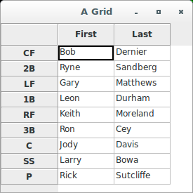

# wxPython

## Grid without models

### Introduction

The class `wx.grid.Grid` is the wxPython control for a spreadsheet-style 
layout of rows and columns. You're probably familiar with the basic 
concept, but let's show you how the wxPython version looks:



The grid control has a lot of interesting features, including the 
ability to create custom renderers and editors on a cell-by-cell basis, 
as well as dragable rows and columns. Here, we'll show you how to use a 
model to populate a grid. The following code shows the simple non-model 
way of setting the cell values in a grid. In this case, the grid values 
are the lineup for the 1984 Chicago Cubs:

```python
#!/usr/bin/env python
# gridNoModel.py
import wx
import wx.grid

class SimpleGrid(wx.grid.Grid):
    def __init__(self, parent):
        wx.grid.Grid.__init__(self, parent, -1)
        self.CreateGrid(9, 2)
        self.SetColLabelValue(0, "First")
        self.SetColLabelValue(1, "Last")
        self.SetRowLabelValue(0, "CF")
        self.SetCellValue(0, 0, "Bob")
        self.SetCellValue(0, 1, "Dernier")
        self.SetRowLabelValue(1, "2B")
        self.SetCellValue(1, 0, "Ryne")
        self.SetCellValue(1, 1, "Sandberg")
        self.SetRowLabelValue(2, "LF")
        self.SetCellValue(2, 0, "Gary")
        self.SetCellValue(2, 1, "Matthews")
        self.SetRowLabelValue(3, "1B")
        self.SetCellValue(3, 0, "Leon")
        self.SetCellValue(3, 1, "Durham")
        self.SetRowLabelValue(4, "RF")
        self.SetCellValue(4, 0, "Keith")
        self.SetCellValue(4, 1, "Moreland")
        self.SetRowLabelValue(5, "3B")
        self.SetCellValue(5, 0, "Ron")
        self.SetCellValue(5, 1, "Cey")
        self.SetRowLabelValue(6, "C")
        self.SetCellValue(6, 0, "Jody")
        self.SetCellValue(6, 1, "Davis")
        self.SetRowLabelValue(7, "SS")
        self.SetCellValue(7, 0, "Larry")
        self.SetCellValue(7, 1, "Bowa")
        self.SetRowLabelValue(8, "P")
        self.SetCellValue(8, 0, "Rick")
        self.SetCellValue(8, 1, "Sutcliffe")

class TestFrame(wx.Frame):
    def __init__(self, parent):
        wx.Frame.__init__(self, parent, -1, "A Grid", size=(275, 275))
        grid = SimpleGrid(self)


if __name__ == '__main__':
    app = wx.App()
    frame = TestFrame(None)
    frame.Show(True)
    app.MainLoop()
```

In the above code, we have the class `SimpleGrid`, a subclass of the 
wxPython class `wx.grid.Grid`. As mentioned earlier, `wx.grid.Grid` has 
oodles of methods. For now, we'll focus on the `SetRowLabelValue()`
, `SetColLabelValue()`, and `SetCellValue()` methods which are actually 
setting the values displayed in the grid. As you can see by comparing 
the image and the code, the `SetCellValue()` method takes a row index, a 
column index, and a value, while the other two methods take an index and 
a value. The row and column labels are *not* considered part of the grid 
for the purposes of assigning indexes to the cells.

This code directly assigns values to the grid using the setter methods. 
While this method has an admirable directness, it can become tedious and 
error-prone on larger grids. And even if we were to create utility 
methods to ease the burden, the code would still have the problem we saw 
in the refactoring section. The data would be intertwined with the 
display in a way that would make future modifications to the code, such 
as adding a column or swapping the data out completely, difficult.

The answer is `wx.grid.GridTableBase`, a Python-specific wrapper around 
a C++ class. Like the `PyEvent` class, the `GridTableBase` class is 
implemented as a simple Python wrapper around a wxWidgets C++ class 
specifically for the purpose of allowing Python subclasses to be 
declared. A `GridTableBase` is a model class for a grid. That is, it 
contains methods that the grid object can use to draw itself, without 
having to know about the internal structure of that data.
