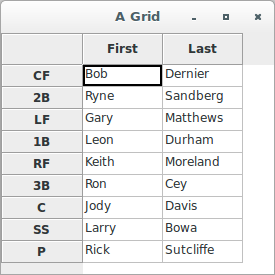

# wxPython

## GridTableBase

### Introduction

The `GridTableBase` class is implemented as a simple Python wrapper 
around a wxWidgets C++ class specifically for the purpose of allowing 
Python subclasses to be declared. A `GridTableBase` is a model class for 
a grid. That is, it contains methods that the grid object can use to 
draw itself, without having to know about the internal structure of that 
data.

### Methods

The `wx.grid.GridTableBase` class has several methods, many of which you 
will not have to deal with. The class is abstract and cannot be 
instantiated directly. You will have to provide an implementation of 
five (05) required methods every time you create a `GridTableBase`. The 
following table describes the methods:

Method | Description
------ | -----------
`GetNumberRows()` | Returns an integer indicating the number of rows in the grid.
`GetNumberCols()` | Returns an integer indicating the number of columns in the grid.
`IsEmptyCell(row, col)` | Returns `True` if the cell at index (row, col) is empty.
`GetValue(row, col)` | Returns the value that should be displayed at the cell (row, col).
`SetValue(row, col, value)` | Sets the value associated with (row, col). If you want a read-only model, you still must include this method, but you can have it `pass`.

The table is attached to the grid by using the `SetTable()` method of 
the grid. After that property is set, the grid object will call the 
methods of the table to get the information it needs to draw the grid. 
The grid will no longer expect to have the values explicitly set with 
grid methods.

### Implementation

In general, there are two ways to use a `GridTableBase` class. You can 
explicitly have your model class be a subclass of `GridTableBase`, or 
you can create a separate `GridTableBase` subclass that connects to your 
actual model class. The first option is easier and makes sense when your 
data is not very complex. The second option enforces a stronger 
separation between the Model and the View, which is preferable if your 
data is complex. The second option is also preferred if you have a 
pre-existing data class that you want to adapt into wxPython, because 
you can create a table without changing the existing code.

### An application-specific subclass using GridTableBase

A first example will use an application-specific subclass 
of `GridTableBase` as our model. This works because our lineup example 
is relatively straightforward, so we can directly incorporate the data 
into a class derived from `GridTableBase`. We'll set up the actual data 
in a two-dimensional Python list, and set up the other methods to read 
from that list. The following code shows the Cubs lineup generated from 
a Model class:

```python
#!/usr/bin/env python
# gridModel.py
import wx
import wx.grid

class LineupTable(wx.grid.GridTableBase):

    data = (("CF", "Bob", "Dernier"), 
            ("2B", "Ryne", "Sandberg"), 
            ("LF", "Gary", "Matthews"), 
            ("1B", "Leon", "Durham"), 
            ("RF", "Keith", "Moreland"), 
            ("3B", "Ron", "Cey"), 
            ("C", "Jody", "Davis"), 
            ("SS", "Larry", "Bowa"), 
            ("P", "Rick", "Sutcliffe"))

    colLabels = ("First", "Last")

    def __init__(self):
        wx.grid.GridTableBase.__init__(self)

    def GetNumberRows(self):
        return len(self.data)

    def GetNumberCols(self):
        return len(self.data[0]) - 1

    def GetColLabelValue(self, col):
        return self.colLabels[col]

    def GetRowLabelValue(self, row):
        return self.data[row][0]

    def IsEmptyCell(self, row, col):
        return False

    def GetValue(self, row, col):
        return self.data[row][col + 1]

    def SetValue(self, row, col, value):
        pass

class SimpleGrid(wx.grid.Grid):
    def __init__(self, parent):
        wx.grid.Grid.__init__(self, parent, -1)
        self.SetTable(LineupTable(), True)

class TestFrame(wx.Frame):
    def __init__(self, parent):
        wx.Frame.__init__(self, parent, -1, "A Grid", size=(275, 275))
        grid = SimpleGrid(self)

if __name__ == '__main__':
    app = wx.App()
    frame = TestFrame(None)
    frame.Show(True)
    app.MainLoop()
```



In the code, we've defined all the required `GridTableBase` methods, 
plus the additional methods `GetColLabelValue()` 
and `GetRowLabelValue()`. Hopefully you will not be too surprised to 
learn that these methods allow the table to specify the column and row 
labels, respectively. As in the refactoring section, the effect of using 
the model class is to separate the data from the display. In this case, 
we've also moved the data into a more structured format, which could 
easily be separated to an external file or resource (a database would be 
particularly easy to add here).

### A generic example using GridTableBase

Next, the idea would be to have a generic table that can read any 
two-dimensional Python list. The following code shows what the generic 
model would look like (make sure to have it within the *files* folder):

```python
# generictable.py
import wx
import wx.grid

class GenericTable(wx.grid.GridTableBase):

    def __init__(self, data, rowLabels=None, colLabels=None):
        wx.grid.GridTableBase.__init__(self)
        self.data = data
        self.rowLabels = rowLabels
        self.colLabels = colLabels

    def GetNumberRows(self):
        return len(self.data)

    def GetNumberCols(self):
        return len(self.data[0])

    def GetColLabelValue(self, col):
        if self.colLabels:
            return self.colLabels[col]

    def GetRowLabelValue(self, row):
        if self.rowLabels:
            return self.rowLabels[row]

    def IsEmptyCell(self, row, col):
        return False

    def GetValue(self, row, col):
        return self.data[row][col]

    def SetValue(self, row, col, value):
        pass
```

The `GenericTable` class takes a two-dimensional list of data and an 
optional list of row and/or column headers. It's suitable to be imported 
into any wxPython program. With a slight change in the data format, we 
can now use the generic table to display the lineup, as shown here:

```python
#!/usr/bin/env python
# gridGeneric.py
import wx
import wx.grid
from files import generictable


data = (("Bob", "Dernier"), 
        ("Ryne", "Sandberg"), 
        ("Gary", "Matthews"), 
        ("Leon", "Durham"), 
        ("Keith", "Moreland"), 
        ("Ron", "Cey"), 
        ("Jody", "Davis"), 
        ("Larry", "Bowa"), 
        ("Rick", "Sutcliffe"))

colLabels = ("First", "Last")
rowLabels = ("CF", 
             "2B", 
             "LF", 
             "1B", 
             "RF", 
             "3B", 
             "C", 
             "SS", 
             "P")


class SimpleGrid(wx.grid.Grid):
    def __init__(self, parent):
        wx.grid.Grid.__init__(self, parent, -1)
        tableBase = generictable.GenericTable(data, 
                                              rowLabels, 
                                              colLabels)
        self.SetTable(tableBase, True)

class TestFrame(wx.Frame):
    def __init__(self, parent):
        wx.Frame.__init__(self, parent, -1, "A Grid", size=(275, 275))
        grid = SimpleGrid(self)

if __name__ == '__main__':
    app = wx.App()
    frame = TestFrame(None)
    frame.Show(True)
    app.MainLoop()
```

### A standalone Model class with GridTableBase

There is one more way to use the `GridTableBase` that is worth showing 
here. This is the second option alluded to earlier, where the data is 
kept in a separate model class which is accessed by the `GridTableBase`. 
Python's self-inspection capabilities are very useful here, allowing you 
to make a list of the attributes that are displayed in each column and 
then use the built-in function `getattr()` to retrieve the actual value. 
In this case, the model takes a list of elements. Structuring your 
program with separate model objects has one big advantage in wxPython. 
Under normal circumstances, you can only call `SetTable()` once for a 
grid, if you want to change the table, you need to create a new grid, 
and that can be annoying. However, if, as in the next example, 
your `GridTableBase` only stores references to instances of your real 
data class, then you can update the table to new data by just changing 
the underlying data object in the table.

The following code shows the `GridTableBase` using a separate data class 
for the lineup entries we've been displaying. Let's see:

```python
# lineuptable.py
import wx
import wx.grid

class LineupEntry:

    def __init__(self, pos, first, last):
        self.pos = pos
        self.first = first
        self.last = last

class LineupTable(wx.grid.GridTableBase):

    colLabels = ("First", "Last")
    colAttrs = ("first", "last")

    def __init__(self, entries):
        wx.grid.GridTableBase.__init__(self)
        self.entries = entries

    def GetNumberRows(self):
        return len(self.entries)

    def GetNumberCols(self):
        return len(self.colLabels)

    def GetColLabelValue(self, col):
        if self.colLabels:
            return self.colLabels[col]

    def GetRowLabelValue(self, row):
        if self.entries:
            return self.entries[row].pos

    def IsEmptyCell(self, row, col):
        return False

    def GetValue(self, row, col):
        entry = self.entries[row]
        return getattr(entry, self.colAttrs[col])

    def SetValue(self, row, col, value):
        pass
```

Then, the application's source code is:

```python
#!/usr/bin/env python
# gridLineup.py
import wx
import wx.grid
from files.lineuptable import LineupTable, LineupEntry


data = (LineupEntry("CF", "Bob", "Dernier"), 
        LineupEntry("2B", "Ryne", "Sandberg"), 
        LineupEntry("LF", "Gary", "Matthews"), 
        LineupEntry("1B", "Leon", "Durham"), 
        LineupEntry("RF", "Keith", "Moreland"), 
        LineupEntry("3B", "Ron", "Cey"), 
        LineupEntry("C", "Jody", "Davis"), 
        LineupEntry("SS", "Larry", "Bowa"), 
        LineupEntry("P", "Rick", "Sutcliffe"))


class SimpleGrid(wx.grid.Grid):
    def __init__(self, parent):
        wx.grid.Grid.__init__(self, parent, -1)
        tableBase = LineupTable(data)
        self.SetTable(tableBase, True)

class TestFrame(wx.Frame):
    def __init__(self, parent):
        wx.Frame.__init__(self, parent, -1, "A Grid", size=(275, 275))
        grid = SimpleGrid(self)

if __name__ == '__main__':
    app = wx.App()
    frame = TestFrame(None)
    frame.Show(True)
    app.MainLoop()
```
