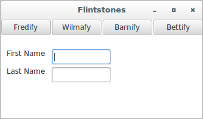
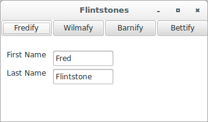

# wxPython

## A custom model

### Introduction

The basic idea behind creating your model objects is simple. Construct 
your data classes without worrying about how they will be displayed. 
Then document a public interface for that class which will be accessible 
to the display objects. Obviously, the size and complexity of the 
project will determine how formal this public declaration needs to be. 
In a small project, with simple objects, it's probably enough to do the 
simple thing and allow the View objects direct access to the attributes 
of the model. In a more complex object, you may want to define specific 
methods for this use, or create a separate model class that is the only 
thing that the view sees.

You also need some kind of mechanism for allowing the view to be 
notified of changes in the model. The following code shows a simple one, 
an abstract base class that you can use as the parent for any of your 
model classes. You can think of this as an analogue to `GridTableBase` 
for use when the display is not a grid.

Let's see a custom model for updating a view:

```python
# abstractmodel.py
class AbstractModel(object):

    def __init__(self):
        self.listeners = []

    def addListener(self, listenerFunc):
        self.listeners.append(listenerFunc)

    def removeListener(self, listenerFunc):
        self.listeners.remove(listenerFunc)

    def update(self):
        for eachFunc in self.listeners:
            eachFunc(self)
```

The listeners in this case are expected to be callable objects which can 
take `self` as an argument, obviously the actual class of `self` can 
vary, so your listener might have to flexible. Also, we've set 
up `AbstractModel` as a Python new-style class, as evidenced by the fact 
that it is a subclass of `object`.

How can we use the abstract model class? The following figures show a 
new window, similar to the window we used for the refactoring section. 
The window is simple. The text boxes are read-only. Clicking one of the 
buttons sets the text boxes to display the name of the relevant 
character.






The program that runs this window uses a simple MVC structure. The 
button-handler methods change the model, and the model-update structure 
causes the text fields to change. The following code shows this in 
detail:

```python
#!/usr/bin/env python
# modelExample.py
import wx
from files import abstractmodel

class SimpleName(abstractmodel.AbstractModel):

    def __init__(self, first="", last=""):
        abstractmodel.AbstractModel.__init__(self)
        self.set(first, last)

    def set(self, first, last):
        self.first = first
        self.last = last
        self.update()


class ModelExample(wx.Frame):

    def __init__(self, parent, id):
        wx.Frame.__init__(self, 
                          parent, 
                          id, 
                          'Flintstones', 
                          size = (340, 200))
        panel = wx.Panel(self)
        panel.SetBackgroundColour("White")
        self.Bind(wx.EVT_CLOSE, self.OnCloseWindow)
        self.textFields = {}
        self.createTextFields(panel)
        self.model = SimpleName()
        self.model.addListener(self.OnUpdate)
        self.createButtonBar(panel)

    def buttonData(self):
        return (("Fredify", self.OnFred), 
                ("Wilmafy", self.OnWilma), 
                ("Barnify", self.OnBarney), 
                ("Bettify", self.OnBetty)) 

    def createButtonBar(self, panel, yPos=0):
        xPos = 0
        for eachLabel, eachHandler in self.buttonData():
            pos = (xPos, yPos)
            button = self.buildOneButton(panel, 
                                         eachLabel, 
                                         eachHandler, 
                                         pos)
            xPos += button.GetSize().width

    def buildOneButton(self, parent, label, handler, pos=(0, 0)):
        button = wx.Button(parent, -1, label, pos)
        self.Bind(wx.EVT_BUTTON, handler, button)
        return button

    def textFieldData(self):
        return (("First Name", (10, 50)), 
                ("Last Name", (10, 80)))

    def createTextFields(self, panel):
        for eachLabel, eachPos in self.textFieldData():
            self.createCaptionedText(panel, eachLabel, eachPos)

    def createCaptionedText(self, panel, label, pos):
        static = wx.StaticText(panel, wx.NewId(), label, pos)
        static.SetBackgroundColour("White")
        textPos = (pos[0] + 75, pos[1])
        self.textFields[label] = wx.TextCtrl(panel, 
                                             wx.NewId(), 
                                             "", 
                                             size = (100, -1), 
                                             pos = textPos, 
                                             style = wx.TE_READONLY)

    def OnUpdate(self, model):
        self.textFields["First Name"].SetValue(model.first)
        self.textFields["Last Name"].SetValue(model.last)

    def OnFred(self, event):
        self.model.set("Fred", "Flintstone")

    def OnBarney(self, event):
        self.model.set("Barney", "Rubble")

    def OnWilma(self, event):
        self.model.set("Wilma", "Flintstone")

    def OnBetty(self, event):
        self.model.set("Betty", "Rubble")

    def OnCloseWindow(self, event):
        self.Destroy()

if __name__ == '__main__':
    app = wx.App()
    frame = ModelExample(parent=None, id=-1)
    frame.Show()
    app.MainLoop()
```

In an example this small, the model update mechanism may seem overly 
baroque. There's no reason why the button handlers couldn't directly set 
the text field values. The model mechanism becomes more valuable, 
however, when the model class has a more complex internal state and 
processing. You would be able, for example, to change the internal 
representation from a Python dictionary to an external database without 
making any changes in the view.

If you are dealing with an existing class that you cannot or do not want 
to change, then `AbstractModel` can be used as a proxy for the existing 
class in much the same way as the `LineupTable` is presented in the 
previous section.

In addition, wxPython contains two separate implementations of similar 
MVC update mechanisms that have more features than the one described 
here. The first is the module `wx.lib.pubsub`, which is quite similar in 
structure to the `AbstractModel` class given previously. The model 
class, called `Publisher`, allows objects to listen for only specific 
kinds of messages. The other update system
, `wx.lib.evtmgr.eventManager`, is built on top of `pubsub`, and has 
some additional features, including a more elaborate object-oriented 
design and easy connection and removal of event relationships.
