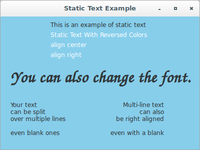
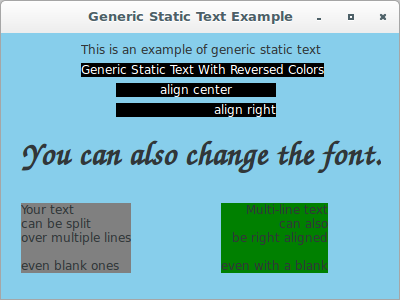
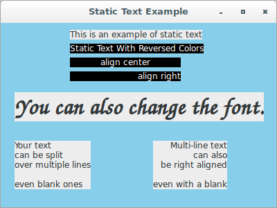

# wxPython

## Working with the basic controls

### How do I display static text?

Perhaps the most basic task for any UI toolkit is drawing plain text on 
the screen. In wxPython, this is accomplished in several ways:

* The use of the `wx.StaticText` class (control that displays one or 
more lines of read-only text).
* The use of the `wx.lib.stattext.GenStaticText` class (generic 
implementation of wx.StaticText).
* The `DrawText` and `DrawRotatedText` methods to device contexts.

In a `wx.StaticText`, you can change the alignment, font, and color of 
the text. A single static text widget can contain multiple lines of 
text, however, it cannot handle multiple fonts or styles. For multiple 
fonts or styles, use a more elaborate text control, such 
as `wx.html.HtmlWindow`, including font, alignment, and color changes. 
To display multiple lines within a static text control, include a string 
with newline characters inside it, and make the control big enough to 
display all the text. One feature that you cannot see is that 
the `wx.StaticText` window never receives or responds to mouse events, 
and never takes the user focus.

Let's see an application (not cross-platform compatible) that displays 
static text using `wx.StaticText`:

```python
#!/usr/bin/env python3
import wx

class StaticTextFrame(wx.Frame):
    def __init__(self, parent):
        self.title = "Static Text Example"
        wx.Frame.__init__(self, 
                          parent, 
                          -1, 
                          self.title, 
                          size = (400, 300))
        panel = wx.Panel(self, -1)
        panel.SetBackgroundColour('sky blue')
        panel.Refresh()
        wx.StaticText(panel, 
                      -1, 
                      "This is an example of static text", 
                      (100, 10))
        rev = wx.StaticText(panel, 
                            -1, 
                            "Static Text With Reversed Colors", 
                            (100, 30))
        rev.SetForegroundColour('White')
        rev.SetBackgroundColour('Black')
        center = wx.StaticText(panel, 
                               -1, 
                               "align center", 
                               (100, 50), 
                               (160, -1), 
                               wx.ALIGN_CENTER)
        center.SetForegroundColour('White')
        center.SetBackgroundColour('Black')
        right = wx.StaticText(panel, 
                              -1, 
                              "align right", 
                              (100, 70), 
                              (160, -1), 
                              wx.ALIGN_RIGHT)
        right.SetForegroundColour('White')
        right.SetBackgroundColour('Black')
        str = "You can also change the font."
        text = wx.StaticText(panel, 
                             -1, 
                             str, 
                             (20, 100))
        font = wx.Font(24, 
                       wx.FONTFAMILY_SCRIPT, 
                       wx.FONTSTYLE_ITALIC, 
                       wx.FONTWEIGHT_BOLD)
        text.SetFont(font)
        wx.StaticText(panel, 
                      -1, 
                      "Your text\ncan be split\n"
                      "over multiple lines\n\neven blank ones", 
                      (20, 170))
        wx.StaticText(panel, 
                      -1, 
                      "Multi-line text\ncan also\n"
                      "be right aligned\n\neven with a blank", 
                      (220, 170), 
                      style = wx.ALIGN_RIGHT)

class App(wx.App):
    def OnInit(self):
        frame = StaticTextFrame(None)
        frame.Show(True)
        self.SetTopWindow(frame)
        return True

def main():
    app = App(False)
    app.MainLoop()


if __name__ == '__main__':
    main()
```



Notice that some instructions (some alignments and background colours) 
are not working in Linux.

Some of the platforms supported by wxPython (most notably GTK), do not 
consider `wx.StaticText` as a separate widget; instead, the label is 
just drawn directly on its parent window. This essentially bars the use 
of almost all mouse events (such as detection of mouse motions, mouse 
clicks and so on) on that widget.

Moreover, these platforms do not allow the developer to change the 
widget's background colour.

The `GenStaticText` class is a Python-only reimplementation 
of `wx.StaticText`. It's more consistent cross-platform than the 
standard C++ version, and it receives mouse events. It's also preferable 
when you want to subclass and create your own static text control. 
Using `GenStaticText` will overcome all the problems described above, as 
it is a generic widget and a real window on its own.

Let's see an application that displays static text 
using `wx.lib.stattext.GenStaticText`:

```python
#!/usr/bin/env python3
import wx
import wx.lib.stattext as ST

class GenStaticTextFrame(wx.Frame):
    def __init__(self, parent):
        self.title = "Generic Static Text Example"
        wx.Frame.__init__(self, 
                          parent, 
                          -1, 
                          self.title, 
                          size = (400, 300))
        panel = wx.Panel(self, -1)
        panel.SetBackgroundColour('sky blue')
        panel.Refresh()
        exa = ST.GenStaticText(panel, 
                               -1, 
                               "This is an example of generic static "
                               "text", 
                               (80, 10))
        exa.SetBackgroundColour('sky blue')
        rev = ST.GenStaticText(panel, 
                               -1, 
                               "Generic Static Text With Reversed "
                               "Colors", 
                               (80, 30))
        rev.SetForegroundColour('White')
        rev.SetBackgroundColour('Black')
        center = ST.GenStaticText(panel, 
                                  -1, 
                                  "align center", 
                                  (115, 50), 
                                  (160, -1), 
                                  wx.ALIGN_CENTER)
        center.SetForegroundColour('White')
        center.SetBackgroundColour('Black')
        right = ST.GenStaticText(panel, 
                                 -1, 
                                 "align right", 
                                 (115, 70), 
                                 (160, -1), 
                                 wx.ALIGN_RIGHT)
        right.SetForegroundColour('White')
        right.SetBackgroundColour('Black')
        str = "You can also change the font."
        text = ST.GenStaticText(panel, 
                                -1, 
                                str, 
                                (20, 100))
        font = wx.Font(24, 
                       wx.FONTFAMILY_SCRIPT, 
                       wx.FONTSTYLE_ITALIC, 
                       wx.FONTWEIGHT_BOLD)
        text.SetFont(font)
        text.SetBackgroundColour('sky blue')
        mul1 = ST.GenStaticText(panel, 
                                -1, 
                                "Your text\ncan be split\n"
                                "over multiple lines\n\neven blank "
                                "ones", 
                                (20, 170))
        mul1.SetBackgroundColour('Gray')
        mul2 = ST.GenStaticText(panel, 
                                -1, 
                                "Multi-line text\ncan also\n"
                                "be right aligned\n\neven with a blank", 
                                (220, 170), 
                                style = wx.ALIGN_RIGHT)
        mul2.SetBackgroundColour('Green')

class App(wx.App):
    def OnInit(self):
        frame = GenStaticTextFrame(None)
        frame.Show(True)
        self.SetTopWindow(frame)
        return True

def main():
    app = App(False)
    app.MainLoop()


if __name__ == '__main__':
    main()
```



Next, let's see an application that mixes both solutions a little bit 
and implements the `USE_GENERIC` switch:

```python
#!/usr/bin/env python3
import wx

USE_GENERIC = 1

if USE_GENERIC:
    from wx.lib.stattext import GenStaticText as StaticText
else:
    StaticText = wx.StaticText

class StaticTextFrame(wx.Frame):
    def __init__(self, parent):
        self.title = "Static Text Example"
        wx.Frame.__init__(self, 
                          parent, 
                          -1, 
                          self.title, 
                          size = (400, 300))
        panel = wx.Panel(self, -1)
        panel.SetBackgroundColour('sky blue')
        panel.Refresh()
        StaticText(panel, 
                   -1, 
                   "This is an example of static text", 
                   (100, 10))
        rev = StaticText(panel, 
                         -1, 
                         "Static Text With Reversed Colors", 
                         (100, 30))
        rev.SetForegroundColour('White')
        rev.SetBackgroundColour('Black')
        center = StaticText(panel, 
                            -1, 
                            "align center", 
                            (100, 50), 
                            (160, -1), 
                            wx.ALIGN_CENTER)
        center.SetForegroundColour('White')
        center.SetBackgroundColour('Black')
        right = StaticText(panel, 
                           -1, 
                           "align right", 
                           (100, 70), 
                           (160, -1), 
                           wx.ALIGN_RIGHT)
        right.SetForegroundColour('White')
        right.SetBackgroundColour('Black')
        str = "You can also change the font."
        text = StaticText(panel, 
                          -1, 
                          str, 
                          (20, 100))
        font = wx.Font(24, 
                       wx.FONTFAMILY_SCRIPT, 
                       wx.FONTSTYLE_ITALIC, 
                       wx.FONTWEIGHT_BOLD)
        text.SetFont(font)
        StaticText(panel, 
                   -1, 
                   "Your text\ncan be split\n"
                   "over multiple lines\n\neven blank ones", 
                   (20, 170))
        StaticText(panel, 
                   -1, 
                   "Multi-line text\ncan also\n"
                   "be right aligned\n\neven with a blank", 
                   (220, 170), 
                   style = wx.ALIGN_RIGHT)

class App(wx.App):
    def OnInit(self):
        frame = StaticTextFrame(None)
        frame.Show(True)
        self.SetTopWindow(frame)
        return True

def main():
    app = App(False)
    app.MainLoop()


if __name__ == '__main__':
    main()
```


