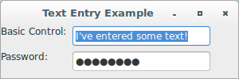
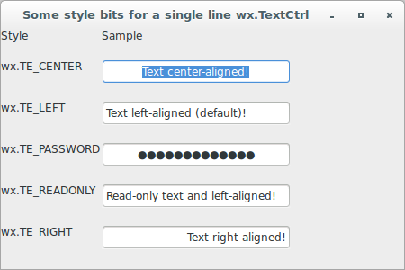

# wxPython

## Working with the basic controls

### How can I get the user to enter text?

The wxPython class for the text entry widget is `wx.TextCtrl`, which 
allows both single-line and multi-line text entry. It can also act as a 
password control, masking the keys pressed. If supported by the 
platform, the `wx.TextCtrl` also provides rich text display, with 
multiple text styles defined and displayed.

Let's see an application that displays a sample of `wx.TextCtrl` as a 
single-line control, both with and without password masking:

```python
#!/usr/bin/env python3
import wx

class TextCtrlFrame(wx.Frame):

    def __init__(self, parent):
        self.title = "Text Entry Example"
        wx.Frame.__init__(self, 
                          parent, 
                          -1, 
                          self.title, 
                          size = (300, 100))
        panel = wx.Panel(self, -1)
        basicLabel = wx.StaticText(panel, 
                                   -1, 
                                   "Basic Control:")
        basicText = wx.TextCtrl(panel, 
                                -1, 
                                "I've entered some text!", 
                                size = (175, -1))
        basicText.SetInsertionPoint(0)
        pwdLabel = wx.StaticText(panel, 
                                 -1, 
                                 "Password:")
        pwdText = wx.TextCtrl(panel, 
                              -1, 
                              "password", 
                              size = (175, -1), 
                              style = wx.TE_PASSWORD)
        sizer = wx.FlexGridSizer(cols=2, hgap=6, vgap=6)
        sizer.AddMany([basicLabel, 
                       basicText, 
                       pwdLabel, 
                       pwdText])
        panel.SetSizer(sizer)

class App(wx.App):
    def OnInit(self):
        frame = TextCtrlFrame(None)
        frame.Show(True)
        self.SetTopWindow(frame)
        return True

def main():
    app = App(False)
    app.MainLoop()


if __name__ == '__main__':
    main()
```



Let's see a different application that displays samples of single 
line `wx.TextCtrl` using some of the unique text control style bits:

```python
#!/usr/bin/env python3
import wx

class StylesTextCtrlFrame(wx.Frame):

    def __init__(self, parent):
        self.title = "Some style bits for a single line wx.TextCtrl"
        wx.Frame.__init__(self, 
                          parent, 
                          -1, 
                          self.title, 
                          size = (450, 300))
        panel = wx.Panel(self, -1)
        styleLabel = wx.StaticText(panel, 
                                   -1, 
                                   "Style")
        sampleLabel = wx.StaticText(panel, 
                                    -1, 
                                    "Sample")
        styleLabel1 = wx.StaticText(panel, 
                                    -1, 
                                    "wx.TE_CENTER")
        styleText1 = wx.TextCtrl(panel, 
                                 -1, 
                                 "Text center-aligned!", 
                                 size = (210, -1), 
                                 style = wx.TE_CENTER)
        styleLabel2 = wx.StaticText(panel, 
                                    -1, 
                                    "wx.TE_LEFT")
        styleText2 = wx.TextCtrl(panel, 
                                 -1, 
                                 "Text left-aligned (default)!", 
                                 size = (210, -1), 
                                 style = wx.TE_LEFT)
        styleLabel3 = wx.StaticText(panel, 
                                    -1, 
                                    "wx.TE_PASSWORD")
        styleText3 = wx.TextCtrl(panel, 
                                 -1, 
                                 "Password Here", 
                                 size = (210, -1), 
                                 style = wx.TE_PASSWORD | wx.TE_CENTER)
        styleLabel4 = wx.StaticText(panel, 
                                    -1, 
                                    "wx.TE_READONLY")
        styleText4 = wx.TextCtrl(panel, 
                                 -1, 
                                 "Read-only text and left-aligned!", 
                                 size = (210, -1), 
                                 style = wx.TE_READONLY)
        styleLabel5 = wx.StaticText(panel, 
                                    -1, 
                                    "wx.TE_RIGHT")
        styleText5 = wx.TextCtrl(panel, 
                                 -1, 
                                 "Text right-aligned!", 
                                 size = (210, -1), 
                                 style = wx.TE_RIGHT)
        sizer = wx.FlexGridSizer(cols=2, hgap=1, vgap=20)
        sizer.AddMany([styleLabel, sampleLabel, 
                       styleLabel1, styleText1, 
                       styleLabel2, styleText2, 
                       styleLabel3, styleText3, 
                       styleLabel4, styleText4, 
                       styleLabel5, styleText5])
        panel.SetSizer(sizer)

class App(wx.App):
    def OnInit(self):
        frame = StylesTextCtrlFrame(None)
        frame.Show(True)
        self.SetTopWindow(frame)
        return True

def main():
    app = App(False)
    app.MainLoop()


if __name__ == '__main__':
    main()
```


