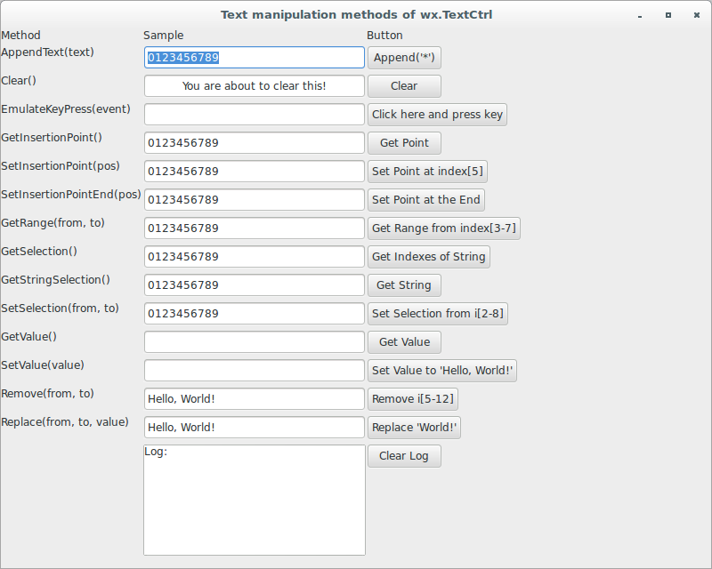
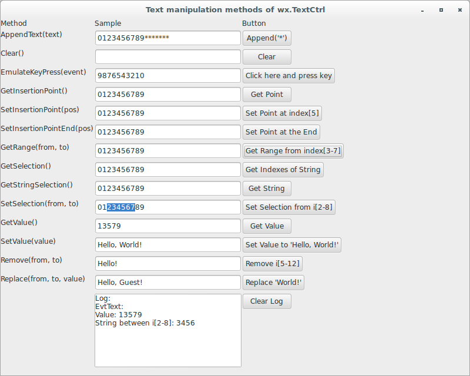

# wxPython

## Working with the basic controls

### How do I change the text without user input?

In addition to changing the text of the display based on user input
, `wx.TextCtrl` provides a number of methods that change the text in the 
display from within your program. You can change the text outright, or 
just move the insertion point to a different place in the text.

Let's see an application that displays the text manipulation methods 
of `wx.TextCtrl`:

```python
#!/usr/bin/env python3
import wx

class WithoutUserTextCtrlFrame(wx.Frame):

    def __init__(self, parent):
        self.title = "Text manipulation methods of wx.TextCtrl"
        wx.Frame.__init__(self, 
                          parent, 
                          -1, 
                          self.title, 
                          size = (800, 640))
        panel = wx.Panel(self, -1)
        methodLabel = wx.StaticText(panel, 
                                    -1, 
                                    "Method")
        sampleLabel = wx.StaticText(panel, 
                                    -1, 
                                    "Sample")
        buttonLabel = wx.StaticText(panel, 
                                    -1, 
                                    "Button")

        methodLabel1 = wx.StaticText(panel, 
                                     -1, 
                                     "AppendText(text)")
        self.sampleText1 = wx.TextCtrl(panel, 
                                       -1, 
                                       "0123456789", 
                                       size = (250, -1), 
                                       style = wx.TE_LEFT)
        button1 = wx.Button(panel, 
                            -1, 
                            "Append('*')")
        methodLabel2 = wx.StaticText(panel, 
                                     -1, 
                                     "Clear()")
        self.sampleText2 = wx.TextCtrl(panel, 
                                       -1, 
                                       "You are about to clear this!", 
                                       size = (250, -1), 
                                       style = wx.TE_CENTER)
        button2 = wx.Button(panel, 
                            -1, 
                            "Clear")
        methodLabel3 = wx.StaticText(panel, 
                                     -1, 
                                     "EmulateKeyPress(event)")
        self.sampleText3 = wx.TextCtrl(panel, 
                                       -1, 
                                       "", 
                                       size = (250, -1), 
                                       style = wx.TE_LEFT)
        button3 = wx.Button(panel, 
                            -1, 
                            "Click here and press key")
        methodLabel4 = wx.StaticText(panel, 
                                     -1, 
                                     "GetInsertionPoint()")
        self.sampleText4 = wx.TextCtrl(panel, 
                                       -1, 
                                       "0123456789", 
                                       size = (250, -1), 
                                       style = wx.TE_LEFT)
        button4 = wx.Button(panel, 
                            -1, 
                            "Get Point")
        methodLabel5 = wx.StaticText(panel, 
                                     -1, 
                                     "SetInsertionPoint(pos)")
        self.sampleText5 = wx.TextCtrl(panel, 
                                       -1, 
                                       "0123456789", 
                                       size = (250, -1), 
                                       style = wx.TE_LEFT)
        button5 = wx.Button(panel, 
                            -1, 
                            "Set Point at index[5]")
        methodLabel6 = wx.StaticText(panel, 
                                     -1, 
                                     "SetInsertionPointEnd(pos)")
        self.sampleText6 = wx.TextCtrl(panel, 
                                       -1, 
                                       "0123456789", 
                                       size = (250, -1), 
                                       style = wx.TE_LEFT)
        button6 = wx.Button(panel, 
                            -1, 
                            "Set Point at the End")
        methodLabel7 = wx.StaticText(panel, 
                                     -1, 
                                     "GetRange(from, to)")
        self.sampleText7 = wx.TextCtrl(panel, 
                                       -1, 
                                       "0123456789", 
                                       size = (250, -1), 
                                       style = wx.TE_LEFT)
        button7 = wx.Button(panel, 
                            -1, 
                            "Get Range from index[3-7]")
        methodLabel8 = wx.StaticText(panel, 
                                     -1, 
                                     "GetSelection()")
        self.sampleText8 = wx.TextCtrl(panel, 
                                       -1, 
                                       "0123456789", 
                                       size = (250, -1), 
                                       style = wx.TE_LEFT)
        button8 = wx.Button(panel, 
                            -1, 
                            "Get Indexes of String")
        methodLabel9 = wx.StaticText(panel, 
                                     -1, 
                                     "GetStringSelection()")
        self.sampleText9 = wx.TextCtrl(panel, 
                                       -1, 
                                       "0123456789", 
                                       size = (250, -1), 
                                       style = wx.TE_LEFT)
        button9 = wx.Button(panel, 
                            -1, 
                            "Get String")
        methodLabel10 = wx.StaticText(panel, 
                                      -1, 
                                      "SetSelection(from, to)")
        self.sampleText10 = wx.TextCtrl(panel, 
                                        -1, 
                                        "0123456789", 
                                        size = (250, -1), 
                                        style = wx.TE_LEFT)
        button10 = wx.Button(panel, 
                             -1, 
                             "Set Selection from i[2-8]")
        methodLabel11 = wx.StaticText(panel, 
                                      -1, 
                                      "GetValue()")
        self.sampleText11 = wx.TextCtrl(panel, 
                                       -1, 
                                       "", 
                                       size = (250, -1), 
                                       style = wx.TE_LEFT)
        button11 = wx.Button(panel, 
                            -1, 
                            "Get Value")
        methodLabel12 = wx.StaticText(panel, 
                                      -1, 
                                      "SetValue(value)")
        self.sampleText12 = wx.TextCtrl(panel, 
                                        -1, 
                                        "", 
                                        size = (250, -1), 
                                        style = wx.TE_LEFT)
        button12 = wx.Button(panel, 
                             -1, 
                             "Set Value to 'Hello, World!'")
        methodLabel13 = wx.StaticText(panel, 
                                      -1, 
                                      "Remove(from, to)")
        self.sampleText13 = wx.TextCtrl(panel, 
                                        -1, 
                                        "Hello, World!", 
                                        size = (250, -1), 
                                        style = wx.TE_LEFT | 
                                                wx.TE_READONLY)
        button13 = wx.Button(panel, 
                             -1, 
                             "Remove i[5-12]")
        methodLabel14 = wx.StaticText(panel, 
                                      -1, 
                                      "Replace(from, to, value)")
        self.sampleText14 = wx.TextCtrl(panel, 
                                        -1, 
                                        "Hello, World!", 
                                        size = (250, -1), 
                                        style = wx.TE_LEFT | 
                                                wx.TE_READONLY)
        button14 = wx.Button(panel, 
                             -1, 
                             "Replace 'World!'")
        logLabel = wx.StaticText(panel, 
                                 -1, 
                                 "")
        self.log = wx.TextCtrl(panel, 
                               -1, 
                               "Log: \n", 
                               size = (250, 125), 
                               style = wx.TE_MULTILINE | wx.TE_RICH2)
        button = wx.Button(panel, 
                           -1, 
                           "Clear Log")

        sizer = wx.FlexGridSizer(cols=3, hgap=1, vgap=5)
        sizer.AddMany([methodLabel, sampleLabel, buttonLabel, 
                       methodLabel1, self.sampleText1, button1, 
                       methodLabel2, self.sampleText2, button2, 
                       methodLabel3, self.sampleText3, button3, 
                       methodLabel4, self.sampleText4, button4, 
                       methodLabel5, self.sampleText5, button5, 
                       methodLabel6, self.sampleText6, button6, 
                       methodLabel7, self.sampleText7, button7, 
                       methodLabel8, self.sampleText8, button8, 
                       methodLabel9, self.sampleText9, button9, 
                       methodLabel10, self.sampleText10, button10, 
                       methodLabel11, self.sampleText11, button11, 
                       methodLabel12, self.sampleText12, button12, 
                       methodLabel13, self.sampleText13, button13, 
                       methodLabel14, self.sampleText14, button14, 
                       logLabel, self.log, button])
        panel.SetSizer(sizer)

        self.Bind(wx.EVT_BUTTON, self.OnButton1, button1)
        self.Bind(wx.EVT_BUTTON, self.OnButton2, button2)
        self.Bind(wx.EVT_TEXT, self.EvtText, self.sampleText2)
        button3.Bind(wx.EVT_KEY_DOWN, self.OnKeyPress3)
        self.Bind(wx.EVT_BUTTON, self.OnButton4, button4)
        self.Bind(wx.EVT_BUTTON, self.OnButton5, button5)
        self.Bind(wx.EVT_BUTTON, self.OnButton6, button6)
        self.Bind(wx.EVT_BUTTON, self.OnButton7, button7)
        self.Bind(wx.EVT_BUTTON, self.OnButton8, button8)
        self.Bind(wx.EVT_BUTTON, self.OnButton9, button9)
        self.Bind(wx.EVT_BUTTON, self.OnButton10, button10)
        self.Bind(wx.EVT_BUTTON, self.OnButton11, button11)
        self.Bind(wx.EVT_BUTTON, self.OnButton12, button12)
        self.Bind(wx.EVT_BUTTON, self.OnButton13, button13)
        self.Bind(wx.EVT_BUTTON, self.OnButton14, button14)
        self.Bind(wx.EVT_BUTTON, self.OnClearLog, button)

    def OnButton1(self, event):
        self.sampleText1.AppendText('*')

    def OnButton2(self, event):
        self.sampleText2.Clear()

    def OnKeyPress3(self, event):
        keycode = event.GetKeyCode()
        self.sampleText3.EmulateKeyPress(event)
        event.Skip()

    def OnButton4(self, event):
        pos = self.sampleText4.GetInsertionPoint()
        self.log.WriteText('Insertion Point: {} \n'.format(pos))

    def OnButton5(self, event):
        pos = 5
        self.sampleText5.SetInsertionPoint(pos)
        self.sampleText5.WriteText("*")
        self.log.WriteText('Insertion Point: {} \n'.format(pos))

    def OnButton6(self, event):
        self.sampleText6.SetInsertionPointEnd()
        self.sampleText6.WriteText("*")
        self.log.WriteText('Insertion Point at the End \n')

    def OnButton7(self, event):
        str7 = self.sampleText7.GetRange(3, 7)
        self.log.WriteText('String between i[2-8]: {} \n'.format(str7))

    def OnButton8(self, event):
        i, j = self.sampleText8.GetSelection()
        self.log.WriteText('String between: {} - {} \n'.format(i, j))

    def OnButton9(self, event):
        str9 = self.sampleText9.GetStringSelection()
        self.log.WriteText('String: {} \n'.format(str9))

    def OnButton10(self, event):
        self.sampleText10.SetSelection(2, 8)

    def OnButton11(self, event):
        str11 = self.sampleText11.GetValue()
        self.log.WriteText('Value: {} \n'.format(str11))

    def OnButton12(self, event):
        self.sampleText12.SetValue("Hello, World!")

    def OnButton13(self, event):
        self.sampleText13.Remove(5, 12)

    def OnButton14(self, event):
        self.sampleText14.Replace(7, 12, "Guest")

    def OnClearLog(self, event):
        self.log.Clear()

    def EvtText(self, event):
        self.log.WriteText('EvtText: {} \n'.format(event.GetString()))

class App(wx.App):
    def OnInit(self):
        frame = WithoutUserTextCtrlFrame(None)
        frame.Show(True)
        self.SetTopWindow(frame)
        return True

def main():
    app = App(False)
    app.MainLoop()


if __name__ == '__main__':
    main()
```





These methods are particularly useful when you have a read-only control, 
or if you want the text in the control to change based on events other 
than a user key press.
