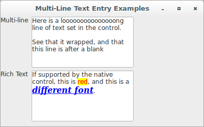
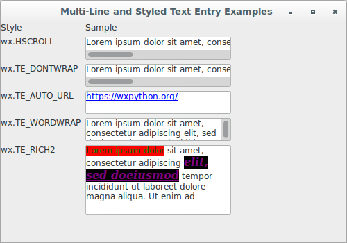

# wxPython

## Working with the basic controls

### How do I create a multi-line or styled text control?

You can create a multi-line text control using the `wx.TE_MULTILINE` 
style flag. If the native widget has support for styles, you can change 
font and color styles within the text managed by the control, which is 
sometimes called rich text. For other platforms, the calls to set styles 
are simply ignored.

Let's see an application that displays samples of multi-line text 
controls, both with and without rich text:

```python
#!/usr/bin/env python3
import wx

class MultiLineTextCtrlFrame(wx.Frame):

    def __init__(self, parent):
        self.title = "Multi-Line Text Entry Examples"
        wx.Frame.__init__(self, 
                          parent, 
                          -1, 
                          self.title, 
                          size = (400, 250))
        panel = wx.Panel(self, -1)
        multiLabel = wx.StaticText(panel, 
                                   -1, 
                                   "Multi-line")
        multiText = wx.TextCtrl(panel, 
                                -1, 
                                "Here is a looooooooooooooong line of "
                                "text set in the control.\n\n"
                                "See that it wrapped, and that this "
                                "line is after a blank", 
                                size = (200, 100), 
                                style = wx.TE_MULTILINE)
        multiText.SetInsertionPoint(0)

        richLabel = wx.StaticText(panel, 
                                  -1, 
                                  "Rich Text")
        richText = wx.TextCtrl(panel, 
                               -1,
                               "If supported by the native control, "
                               "this is red, and this is a "
                               "different font.", 
                               size = (200, 100), 
                               style = wx.TE_MULTILINE | wx.TE_RICH2)
        richText.SetInsertionPoint(0)
        richText.SetStyle(44, 47, wx.TextAttr("red", "yellow"))
        points = richText.GetFont().GetPointSize()
        f = wx.Font(points + 3, 
                    wx.FONTFAMILY_ROMAN, 
                    wx.FONTSTYLE_ITALIC, 
                    wx.FONTWEIGHT_BOLD, 
                    True)
        richText.SetStyle(63, 77, wx.TextAttr("blue", wx.NullColour, f))

        sizer = wx.FlexGridSizer(cols=2, hgap=6, vgap=6)
        sizer.AddMany([multiLabel, multiText, 
                       richLabel, richText])
        panel.SetSizer(sizer)

class App(wx.App):
    def OnInit(self):
        frame = MultiLineTextCtrlFrame(None)
        frame.Show(True)
        self.SetTopWindow(frame)
        return True

def main():
    app = App(False)
    app.MainLoop()


if __name__ == '__main__':
    main()
```



In addition to `wx.TE_MULTILINE`, there are other style flags that are 
only meaningful in the context of a multi-line or rich text control. 
Let's see an application that shows those window styles:

```python
#!/usr/bin/env python3
import wx

class MultiLineStyledTextCtrlFrame(wx.Frame):

    def __init__(self, parent):
        self.title = "Multi-Line and Styled Text Entry Examples"
        wx.Frame.__init__(self, 
                          parent, 
                          -1, 
                          self.title, 
                          size = (500, 350))
        panel = wx.Panel(self, -1)
        styleLabel = wx.StaticText(panel, 
                                   -1, 
                                   "Style")
        sampleLabel = wx.StaticText(panel, 
                                    -1, 
                                    "Sample")
        styleLabel1 = wx.StaticText(panel, 
                                    -1, 
                                    "wx.HSCROLL")
        styleText1 = wx.TextCtrl(panel, 
                                 -1, 
                                 "Lorem ipsum dolor sit amet, "
                                 "consectetur adipiscing elit, sed do"
                                 "eiusmod tempor incididunt ut labore", 
                                 size = (210, -1), 
                                 style = wx.TE_MULTILINE | 
                                         wx.HSCROLL)
        styleLabel2 = wx.StaticText(panel, 
                                    -1, 
                                    "wx.TE_DONTWRAP")
        styleText2 = wx.TextCtrl(panel, 
                                 -1, 
                                 "Lorem ipsum dolor sit amet, "
                                 "consectetur adipiscing elit, sed do"
                                 "eiusmod tempor incididunt ut labore", 
                                 size = (210, -1), 
                                 style = wx.TE_MULTILINE | 
                                         wx.TE_DONTWRAP)
        styleLabel3 = wx.StaticText(panel, 
                                    -1, 
                                    "wx.TE_AUTO_URL")
        styleText3 = wx.TextCtrl(panel, 
                                 -1, 
                                 "https://wxpython.org/", 
                                 size = (210, -1), 
                                 style = wx.TE_MULTILINE | 
                                         wx.TE_RICH2 | 
                                         wx.TE_AUTO_URL)
        styleLabel4 = wx.StaticText(panel, 
                                    -1, 
                                    "wx.TE_WORDWRAP")
        styleText4 = wx.TextCtrl(panel, 
                                 -1, 
                                 "Lorem ipsum dolor sit amet, "
                                 "consectetur adipiscing elit, sed do"
                                 "eiusmod tempor incididunt ut labore"
                                 "et dolore magna aliqua. Ut enim ad", 
                                 size = (210, -1), 
                                 style = wx.TE_MULTILINE | 
                                         wx.TE_WORDWRAP)
        styleLabel5 = wx.StaticText(panel, 
                                    -1, 
                                    "wx.TE_RICH2")
        styleText5 = wx.TextCtrl(panel, 
                                 -1, 
                                 "Lorem ipsum dolor sit amet, "
                                 "consectetur adipiscing elit, sed do"
                                 "eiusmod tempor incididunt ut labore"
                                 "et dolore magna aliqua. Ut enim ad", 
                                 size = (210, 100), 
                                 style = wx.TE_MULTILINE | 
                                         wx.TE_RICH2)
        styleText5.SetInsertionPoint(0)
        styleText5.SetStyle(0, 17, wx.TextAttr("green", "red"))
        points = styleText5.GetFont().GetPointSize()
        f = wx.Font(points + 3, wx.ROMAN, wx.ITALIC, wx.BOLD, True)
        styleText5.SetStyle(51, 70, wx.TextAttr("purple", 
                                                "black", 
                                                f))
        sizer = wx.FlexGridSizer(cols=2, hgap=6, vgap=6)
        sizer.AddMany([styleLabel, sampleLabel, 
                       styleLabel1, styleText1, 
                       styleLabel2, styleText2, 
                       styleLabel3, styleText3, 
                       styleLabel4, styleText4, 
                       styleLabel5, styleText5])
        panel.SetSizer(sizer)

class App(wx.App):
    def OnInit(self):
        frame = MultiLineStyledTextCtrlFrame(None)
        frame.Show(True)
        self.SetTopWindow(frame)
        return True

def main():
    app = App(False)
    app.MainLoop()


if __name__ == '__main__':
    main()
```



Creating styles is much more flexible if you can use arbitrary fonts in 
the system. Next, we'll show you how to create and use font instances.
