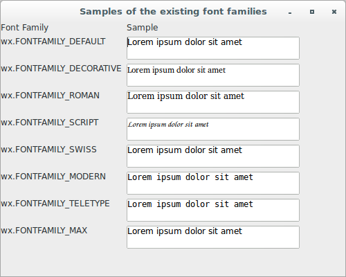
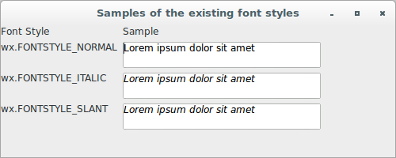
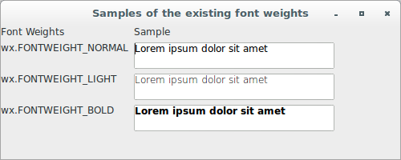
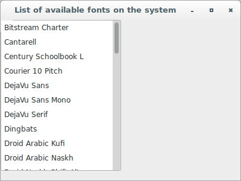

# wxPython

## Working with the basic controls

### How do I create a font?

Fonts are specified as instances of the class `wx.Font`. You have access 
to any font that has been installed and is accessible to the underlying 
system.

Let's see an application that displays instances of `wx.Font` with 
samples of the existing font families:

```python
#!/usr/bin/env python3
import wx

class FontFamilyTextCtrlFrame(wx.Frame):

    def __init__(self, parent):
        self.title = "Samples of the existing font families"
        wx.Frame.__init__(self, 
                          parent, 
                          -1, 
                          self.title, 
                          size = (500, 400))
        self.panel = wx.Panel(self, -1)
        panel = self.panel
        self.initHeaders()
        self.initCols()
        sizer = wx.FlexGridSizer(cols=2, hgap=6, vgap=6)
        sizer.AddMany([self.header1, self.header2, 
                       self.col11, self.col21, 
                       self.col12, self.col22, 
                       self.col13, self.col23, 
                       self.col14, self.col24, 
                       self.col15, self.col25, 
                       self.col16, self.col26, 
                       self.col17, self.col27, 
                       self.col18, self.col28])
        panel.SetSizer(sizer)

    def initHeaders(self):
        self.header1 = self.createTag("Font Family")
        self.header2 = self.createTag("Sample")

    def initCols(self):
        self.col11 = self.createTag("wx.FONTFAMILY_DEFAULT")
        self.col21 = self.createSample("Lorem ipsum dolor sit amet")
        self.fillCol(self.col21, wx.FONTFAMILY_DEFAULT)
        self.col12 = self.createTag("wx.FONTFAMILY_DECORATIVE")
        self.col22 = self.createSample("Lorem ipsum dolor sit amet")
        self.fillCol(self.col22, wx.FONTFAMILY_DECORATIVE)
        self.col13 = self.createTag("wx.FONTFAMILY_ROMAN")
        self.col23 = self.createSample("Lorem ipsum dolor sit amet")
        self.fillCol(self.col23, wx.FONTFAMILY_ROMAN)
        self.col14 = self.createTag("wx.FONTFAMILY_SCRIPT")
        self.col24 = self.createSample("Lorem ipsum dolor sit amet")
        self.fillCol(self.col24, wx.FONTFAMILY_SCRIPT)
        self.col15 = self.createTag("wx.FONTFAMILY_SWISS")
        self.col25 = self.createSample("Lorem ipsum dolor sit amet")
        self.fillCol(self.col25, wx.FONTFAMILY_SWISS)
        self.col16 = self.createTag("wx.FONTFAMILY_MODERN")
        self.col26 = self.createSample("Lorem ipsum dolor sit amet")
        self.fillCol(self.col26, wx.FONTFAMILY_MODERN)
        self.col17 = self.createTag("wx.FONTFAMILY_TELETYPE")
        self.col27 = self.createSample("Lorem ipsum dolor sit amet")
        self.fillCol(self.col27, wx.FONTFAMILY_TELETYPE)
        self.col18 = self.createTag("wx.FONTFAMILY_MAX")
        self.col28 = self.createSample("Lorem ipsum dolor sit amet")
        self.fillCol(self.col28, wx.FONTFAMILY_MAX)

    def createTag(self, label):
        return wx.StaticText(self.panel, -1, label)

    def createSample(self, value):
        return wx.TextCtrl(self.panel, 
                           -1, 
                           value, 
                           pos = wx.DefaultPosition, 
                           size = (250, -1), 
                           style = wx.TE_MULTILINE | 
                                   wx.TE_RICH2 | 
                                   wx.TE_READONLY)

    def fillCol(self, col, fontFamily):
        col.SetInsertionPoint(0)
        points = col.GetFont().GetPointSize()
        f = wx.Font(points, 
                    fontFamily, 
                    wx.FONTSTYLE_NORMAL, 
                    wx.FONTWEIGHT_NORMAL, 
                    False)
        col.SetStyle(0, 26, wx.TextAttr("black", 
                                        wx.NullColour, 
                                        f))

class App(wx.App):
    def OnInit(self):
        frame = FontFamilyTextCtrlFrame(None)
        frame.Show(True)
        self.SetTopWindow(frame)
        return True

def main():
    app = App(False)
    app.MainLoop()


if __name__ == '__main__':
    main()
```



Now, let's see an application that displays instances of `wx.Font` with 
samples of the existing font styles:

```python
#!/usr/bin/env python3
import wx

class FontStyleTextCtrlFrame(wx.Frame):

    def __init__(self, parent):
        self.title = "Samples of the existing font styles"
        wx.Frame.__init__(self, 
                          parent, 
                          -1, 
                          self.title, 
                          size = (500, 200))
        self.panel = wx.Panel(self, -1)
        panel = self.panel
        self.initHeaders()
        self.initCols()
        sizer = wx.FlexGridSizer(cols=2, hgap=6, vgap=6)
        sizer.AddMany([self.header1, self.header2, 
                       self.col11, self.col21, 
                       self.col12, self.col22, 
                       self.col13, self.col23])
        panel.SetSizer(sizer)

    def initHeaders(self):
        self.header1 = self.createTag("Font Style")
        self.header2 = self.createTag("Sample")

    def initCols(self):
        self.col11 = self.createTag("wx.FONTSTYLE_NORMAL")
        self.col21 = self.createSample("Lorem ipsum dolor sit amet")
        self.fillCol(self.col21, wx.FONTSTYLE_NORMAL)
        self.col12 = self.createTag("wx.FONTSTYLE_ITALIC")
        self.col22 = self.createSample("Lorem ipsum dolor sit amet")
        self.fillCol(self.col22, wx.FONTSTYLE_ITALIC)
        self.col13 = self.createTag("wx.FONTSTYLE_SLANT")
        self.col23 = self.createSample("Lorem ipsum dolor sit amet")
        self.fillCol(self.col23, wx.FONTSTYLE_SLANT)

    def createTag(self, label):
        return wx.StaticText(self.panel, -1, label)

    def createSample(self, value):
        return wx.TextCtrl(self.panel, 
                           -1, 
                           value, 
                           pos = wx.DefaultPosition, 
                           size = (250, -1), 
                           style = wx.TE_MULTILINE | 
                                   wx.TE_RICH2 | 
                                   wx.TE_READONLY)

    def fillCol(self, col, fontStyle):
        col.SetInsertionPoint(0)
        points = col.GetFont().GetPointSize()
        f = wx.Font(points, 
                    wx.FONTFAMILY_DEFAULT, 
                    fontStyle, 
                    wx.FONTWEIGHT_NORMAL, 
                    False)
        col.SetStyle(0, 26, wx.TextAttr("black", 
                                        wx.NullColour, 
                                        f))

class App(wx.App):
    def OnInit(self):
        frame = FontStyleTextCtrlFrame(None)
        frame.Show(True)
        self.SetTopWindow(frame)
        return True

def main():
    app = App(False)
    app.MainLoop()


if __name__ == '__main__':
    main()
```




Next, let's see an application that displays instances of `wx.Font` with 
samples of the existing font weights:

```python
#!/usr/bin/env python3
import wx

class FontWeightTextCtrlFrame(wx.Frame):

    def __init__(self, parent):
        self.title = "Samples of the existing font weights"
        wx.Frame.__init__(self, 
                          parent, 
                          -1, 
                          self.title, 
                          size = (500, 200))
        self.panel = wx.Panel(self, -1)
        panel = self.panel
        self.initHeaders()
        self.initCols()
        sizer = wx.FlexGridSizer(cols=2, hgap=6, vgap=6)
        sizer.AddMany([self.header1, self.header2, 
                       self.col11, self.col21, 
                       self.col12, self.col22, 
                       self.col13, self.col23])
        panel.SetSizer(sizer)

    def initHeaders(self):
        self.header1 = self.createTag("Font Weights")
        self.header2 = self.createTag("Sample")

    def initCols(self):
        self.col11 = self.createTag("wx.FONTWEIGHT_NORMAL")
        self.col21 = self.createSample("Lorem ipsum dolor sit amet")
        self.fillCol(self.col21, wx.FONTWEIGHT_NORMAL)
        self.col12 = self.createTag("wx.FONTWEIGHT_LIGHT")
        self.col22 = self.createSample("Lorem ipsum dolor sit amet")
        self.fillCol(self.col22, wx.FONTWEIGHT_LIGHT)
        self.col13 = self.createTag("wx.FONTWEIGHT_BOLD")
        self.col23 = self.createSample("Lorem ipsum dolor sit amet")
        self.fillCol(self.col23, wx.FONTWEIGHT_BOLD)

    def createTag(self, label):
        return wx.StaticText(self.panel, -1, label)

    def createSample(self, value):
        return wx.TextCtrl(self.panel, 
                           -1, 
                           value, 
                           pos = wx.DefaultPosition, 
                           size = (250, -1), 
                           style = wx.TE_MULTILINE | 
                                   wx.TE_RICH2 | 
                                   wx.TE_READONLY)

    def fillCol(self, col, fontWeight):
        col.SetInsertionPoint(0)
        points = col.GetFont().GetPointSize()
        f = wx.Font(points, 
                    wx.FONTFAMILY_DEFAULT, 
                    wx.FONTSTYLE_NORMAL, 
                    fontWeight, 
                    False)
        col.SetStyle(0, 26, wx.TextAttr("black", 
                                        wx.NullColour, 
                                        f))

class App(wx.App):
    def OnInit(self):
        frame = FontWeightTextCtrlFrame(None)
        frame.Show(True)
        self.SetTopWindow(frame)
        return True

def main():
    app = App(False)
    app.MainLoop()


if __name__ == '__main__':
    main()
```



To retrieve a list of available fonts on the system, and make them 
available to the user, use the special class `wx.FontEnumerator` like 
this:

```python
#!/usr/bin/env python3
import wx

class FontListTextCtrlFrame(wx.Frame):

    def __init__(self, parent):
        self.title = "List of available fonts on the system"
        wx.Frame.__init__(self, 
                          parent, 
                          -1, 
                          self.title, 
                          size = (400, 300))
        self.panel = wx.Panel(self, -1)
        e = wx.FontEnumerator()
        e.EnumerateFacenames()
        fontList = e.GetFacenames()
        fontList.sort()
        self.lb1 = wx.ListBox(self, 
                              -1, 
                              wx.DefaultPosition, 
                              (200, 250), 
                              fontList, 
                              wx.LB_SINGLE)

class App(wx.App):
    def OnInit(self):
        frame = FontListTextCtrlFrame(None)
        frame.Show(True)
        self.SetTopWindow(frame)
        return True

def main():
    app = App(False)
    app.MainLoop()


if __name__ == '__main__':
    main()
```


