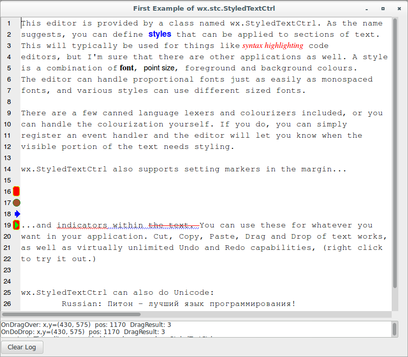

# wxPython

## Working with the basic controls

### Can I have styled text if my platform doesn't support rich text?

Yes. There is a cross-platform styled text widget in wxPython, 
called `wx.stc.StyledTextCtrl`, that is a Python wrapper around the 
Scintilla rich text component. Since Scintilla is not part of wxWidgets, 
but rather a separate third-party component that has been incorporated 
into wxPython, it does not share the same API. You can find 
documentation [here](https://wxpython.org/Phoenix/docs/html/wx.stc.StyledTextCtrl.html).

Let's see the first sample application that 
uses `wx.stc.StyledTextCtrl`:

```python
#!/usr/bin/env python3
import wx
import wx.stc as stc
import codecs

#----------------------------------------------------------------------

debug = 1

demoText = """\
This editor is provided by a class named wx.StyledTextCtrl. As the name 
suggests, you can define styles that can be applied to sections of text. 
This will typically be used for things like syntax highlighting code 
editors, but I'm sure that there are other applications as well. A style 
is a combination of font, point size, foreground and background colours. 
The editor can handle proportional fonts just as easily as monospaced 
fonts, and various styles can use different sized fonts.

There are a few canned language lexers and colourizers included, or you 
can handle the colourization yourself. If you do, you can simply 
register an event handler and the editor will let you know when the 
visible portion of the text needs styling.

wx.StyledTextCtrl also supports setting markers in the margin...


...and indicators within the text. You can use these for whatever you 
want in your application. Cut, Copy, Paste, Drag and Drop of text works, 
as well as virtually unlimited Undo and Redo capabilities, (right click 
to try it out.)
"""

if wx.Platform == '__WXMSW__':
    face1 = 'Arial'
    face2 = 'Times New Roman'
    face3 = 'Courier New'
    pb = 10
else:
    face1 = 'Helvetica'
    face2 = 'Times'
    face3 = 'Courier'
    pb = 12

class StyledTextCtrlFrame(wx.Frame):

    def __init__(self, parent):
        self.title = "First Example of wx.stc.StyledTextCtrl"
        wx.Frame.__init__(self, 
                          parent, 
                          -1, 
                          self.title, 
                          size = (800, 700))
        self.panel = wx.Panel(self, 
                              -1, 
                              style = wx.NO_FULL_REPAINT_ON_RESIZE)
        self.stc1 = stc.StyledTextCtrl(self.panel, 
                                       -1, 
                                       size = (780, 590))
        self.log = wx.TextCtrl(self.panel, 
                               -1, 
                               "Log: \n", 
                               size = (780, -1), 
                               style = wx.TE_MULTILINE | wx.TE_RICH2)
        self.button = wx.Button(self.panel, 
                                -1, 
                                "Clear Log")
        self.stc1.Bind(stc.EVT_STC_START_DRAG, self.OnStartDrag)
        self.stc1.Bind(stc.EVT_STC_DRAG_OVER, self.OnDragOver)
        self.stc1.Bind(stc.EVT_STC_DO_DROP, self.OnDoDrop)
        self.button.Bind(wx.EVT_BUTTON, self.OnClearLog)
        self.stc1.Bind(wx.EVT_WINDOW_DESTROY, self.OnDestroy)
        self.stc1.SetText(demoText)

        decode = codecs.lookup("utf-8")[1]
        self.stc1.GotoPos(self.stc1.GetLength())
        self.stc1.AddText("\n\nwx.StyledTextCtrl can also do "
                          "Unicode:\n")
        uniline = self.stc1.GetCurrentLine()
        unitext, l = decode(b'\xd0\x9f\xd0\xb8\xd1\x82\xd0\xbe\xd0'
                            b'\xbd - '
                            b'\xd0\xbb\xd1\x83\xd1\x87\xd1\x88\xd0\xb8'
                            b'\xd0\xb9 '
                            b'\xd1\x8f\xd0\xb7\xd1\x8b\xd0\xba '
                            b'\xd0\xbf\xd1\x80\xd0\xbe\xd0\xb3\xd1\x80'
                            b'\xd0\xb0\xd0\xbc\xd0\xbc\xd0\xb8\xd1\x80'
                            b'\xd0\xbe\xd0\xb2\xd0\xb0\xd0\xbd\xd0\xb8'
                            b'\xd1\x8f!\n\n')
        self.stc1.AddText('\tRussian: ')
        self.stc1.AddText(unitext)
        self.stc1.GotoPos(0)
        self.stc1.EmptyUndoBuffer()

        sizer = wx.FlexGridSizer(cols=1, hgap=6, vgap=6)
        sizer.AddMany([self.stc1, 
                       self.log, 
                       self.button])
        self.panel.SetSizer(sizer)
        
        # make some styles
        self.stc1.StyleSetSpec(stc.STC_STYLE_DEFAULT, 
                               "size:{},face:{}".\
                               format(pb, face3))
        self.stc1.StyleClearAll()
        self.stc1.StyleSetSpec(1, 
                               "size:{},bold,face:{},fore:#0000FF".\
                               format(pb, face1))
        self.stc1.StyleSetSpec(2, 
                               "face:{},italic,fore:#FF0000,size:{}".\
                               format(face2, pb))
        self.stc1.StyleSetSpec(3, 
                               "face:{},bold,size:{}".\
                               format(face2, pb))
        self.stc1.StyleSetSpec(4, 
                               "face:{},size:{}".\
                               format(face1, pb-1))

        # Now set some text to those styles...  Normally this would be
        # done in an event handler that happens when text needs 
        # displayed.

        self.stc1.StartStyling(98, 0xff)
        self.stc1.SetStyling(6, 1)  # set style for 6 characters using 
                                    # style 1
        self.stc1.StartStyling(190, 0xff)
        self.stc1.SetStyling(20, 2)
        self.stc1.StartStyling(310, 0xff)
        self.stc1.SetStyling(5, 3)
        self.stc1.SetStyling(2, 0)
        self.stc1.SetStyling(10, 4)

        # line numbers in the margin
        self.stc1.SetMarginType(0, stc.STC_MARGIN_NUMBER)
        self.stc1.SetMarginWidth(0, 22)
        self.stc1.StyleSetSpec(stc.STC_STYLE_LINENUMBER, 
                               "size:{},face:{}".\
                               format(pb-2, face1))
        # setup some markers
        self.stc1.SetMarginType(1, 
                                stc.STC_MARGIN_SYMBOL)
        self.stc1.MarkerDefine(0, 
                               stc.STC_MARK_ROUNDRECT, 
                               "#CCFF00", 
                               "RED")
        self.stc1.MarkerDefine(1, 
                               stc.STC_MARK_CIRCLE, 
                               "FOREST GREEN", 
                               "SIENNA")
        self.stc1.MarkerDefine(2, 
                               stc.STC_MARK_SHORTARROW, 
                               "blue", 
                               "blue")
        self.stc1.MarkerDefine(3, 
                               stc.STC_MARK_ARROW, 
                               "#00FF00", 
                               "#00FF00")

        # put some markers on some lines
        self.stc1.MarkerAdd(15, 0)
        self.stc1.MarkerAdd(16, 1)
        self.stc1.MarkerAdd(17, 2)
        self.stc1.MarkerAdd(18, 3)
        self.stc1.MarkerAdd(18, 0)

        # and finally, an indicator or two
        self.stc1.IndicatorSetStyle(0, stc.STC_INDIC_SQUIGGLE)
        self.stc1.IndicatorSetForeground(0, wx.RED)
        self.stc1.IndicatorSetStyle(1, stc.STC_INDIC_DIAGONAL)
        self.stc1.IndicatorSetForeground(1, wx.BLUE)
        self.stc1.IndicatorSetStyle(2, stc.STC_INDIC_STRIKE)
        self.stc1.IndicatorSetForeground(2, wx.RED)

        self.stc1.StartStyling(822, stc.STC_INDICS_MASK)
        self.stc1.SetStyling(10, stc.STC_INDIC0_MASK)
        self.stc1.SetStyling(8, stc.STC_INDIC1_MASK)
        self.stc1.SetStyling(10, 
                             stc.STC_INDIC2_MASK | stc.STC_INDIC1_MASK)

    def OnStartDrag(self, evt):
        self.log.WriteText("OnStartDrag: {}\n".\
                           format(evt.GetDragText()))
        #self.log.WriteText("OnStartDrag: {}, {}\n".\
                            #format(evt.GetDragAllowMove(), 
                                    #evt.GetDragText()))

        if debug and evt.GetPosition() < 250:
            #evt.SetDragAllowMove(False)     # you can prevent moving of 
                                            # text (only copy)
            evt.SetDragText("DRAGGED TEXT") # you can change what is 
                                            # dragged
            #evt.SetDragText("")            # or prevent the drag with 
                                            # empty text

    def OnDragOver(self, evt):
        self.log.WriteText("OnDragOver: x,y=({}, {})  pos: {}  "
                           "DragResult: {}\n".\
                           format(evt.GetX(), 
                                  evt.GetY(), 
                                  evt.GetPosition(), 
                                  evt.GetDragResult()))

        if debug and evt.GetPosition() < 250:
            evt.SetDragResult(wx.DragNone)   # prevent dropping at the 
                                             # beginning of the buffer

    def OnDoDrop(self, evt):
        self.log.WriteText("OnDoDrop: x,y=({}, {})  pos: {}  "
                           "DragResult: {}\n"
                           "\ttext: {}\n".\
                           format(evt.GetX(), 
                                  evt.GetY(), 
                                  evt.GetPosition(), 
                                  evt.GetDragResult(), 
                                  evt.GetDragText()))

        if debug and evt.GetPosition() < 500:
            evt.SetDragText("DROPPED TEXT")  # Can change text if needed
            #evt.SetDragResult(wx.DragNone)  # Can also change the drag 
                                             # operation, but it
                                             # is probably better to do 
                                             # it in OnDragOver so
                                             # there is visual feedback

            #evt.SetPosition(25)             # Can also change position, 
                                             # but I'm not sure why
                                             # you would want to...

    def OnClearLog(self, evt):
        self.log.Clear()

    def OnDestroy(self, evt):
        # This is how the clipboard contents can be preserved after
        # the app has exited.
        wx.TheClipboard.Flush()
        evt.Skip()

class App(wx.App):
    def OnInit(self):
        frame = StyledTextCtrlFrame(None)
        frame.Show(True)
        self.SetTopWindow(frame)
        return True

def main():
    app = App(False)
    app.MainLoop()


if __name__ == '__main__':
    main()
```


