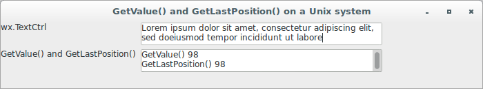
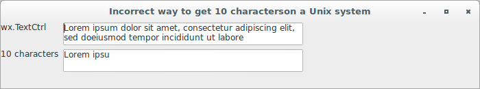
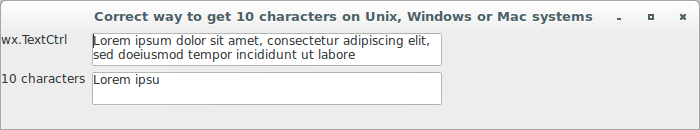

# wxPython

## Working with the basic controls

### What if my text control doesn't match my string?

When using a multi-line `wx.TextCtrl`, be aware of a small gotcha 
involving the way in which the text control stores the string. 
Internally, the multi-line string inside the `wx.TextCtrl` is stored 
using `\n` as the line separator. This is true no matter what the 
underlying operating system is, even though some systems use different 
character combinations as a line separator. When you retrieve the string 
using `GetValue()`, the native system's line separator is restored, so 
you don't have to worry about manual conversion backwards. The advantage 
is the text inside the control isn't dependent on any specific operating 
system.

The disadvantage is the line length and the line indexes inside the text 
control can be different than they are outside the text control. For 
example, if you are on a Windows system, where the line separator 
is `\r\n`, the length of the string as reported by `GetValue()` will be 
longer than the end of the string in the control as reported 
by `GetLastPosition()`.

Let's see and application that shows the execution of `GetValue()` 
and `GetLastPosition()` on a Unix system:

```python
#!/usr/bin/env python3
import wx

class TextCtrlFrame(wx.Frame):

    def __init__(self, parent):
        self.title = "GetValue() and GetLastPosition() on a Unix system"
        self.value = "Lorem ipsum dolor sit amet, "\
                     "consectetur adipiscing elit, sed do"\
                     "eiusmod tempor incididunt ut labore"
        wx.Frame.__init__(self, 
                          parent, 
                          -1, 
                          self.title, 
                          size = (700, 130))
        self.panel = wx.Panel(self, -1)
        self.label1 = wx.StaticText(self.panel, -1, "wx.TextCtrl")
        self.tcl1 = wx.TextCtrl(self.panel, 
                               -1, 
                               self.value, 
                               pos = wx.DefaultPosition, 
                               size = (350, -1), 
                               style = wx.TE_MULTILINE | 
                                       wx.TE_RICH2 | 
                                       wx.TE_READONLY)
        self.label2 = wx.StaticText(self.panel, 
                                    -1, 
                                    "GetValue() and GetLastPosition()")
        self.tcl2 = wx.TextCtrl(self.panel, 
                               -1, 
                               "", 
                               pos = wx.DefaultPosition, 
                               size = (350, -1), 
                               style = wx.TE_MULTILINE | 
                                       wx.TE_RICH2 | 
                                       wx.TE_READONLY)
        self.tcl2.WriteText("GetValue() {}\n".\
                            format(len(self.tcl1.GetValue())))
        self.tcl2.WriteText("GetLastPosition() {}\n".\
                            format(self.tcl1.GetLastPosition()))
        sizer = wx.FlexGridSizer(cols=2, hgap=6, vgap=6)
        sizer.AddMany([self.label1, self.tcl1, 
                       self.label2, self.tcl2])
        self.panel.SetSizer(sizer)

class App(wx.App):
    def OnInit(self):
        frame = TextCtrlFrame(None)
        frame.Show(True)
        self.SetTopWindow(frame)
        return True

def main():
    app = App(False)
    app.MainLoop()


if __name__ == '__main__':
    main()
```



The following are the results from a Windows operating system:

```
GetValue() 100
GetLastPosition() 98
```

The implication is that you should never use the position indexes of a 
multi-line text control to refer back to the original string, rather, 
they should only be used as arguments to other methods of `wx.TextCtrl`. 
For a substring of the text within the control, use `GetRange()` 
or `GetSelectedText()`. Also do not cross the indexes in reverse; don't 
use indexes of the original string to refer back into the text control.

Let's see an application that uses an incorrect way to get 10 characters 
immediately after the insertion point:

```python
#!/usr/bin/env python3
import wx

class TextCtrlFrame(wx.Frame):

    def __init__(self, parent):
        self.title = "Incorrect way to get 10 characters"\
                     "on a Unix system"
        self.value = "Lorem ipsum dolor sit amet, "\
                     "consectetur adipiscing elit, sed do"\
                     "eiusmod tempor incididunt ut labore"
        wx.Frame.__init__(self, 
                          parent, 
                          -1, 
                          self.title, 
                          size = (700, 130))
        self.panel = wx.Panel(self, -1)
        self.label1 = wx.StaticText(self.panel, -1, "wx.TextCtrl")
        self.tcl1 = wx.TextCtrl(self.panel, 
                               -1, 
                               self.value, 
                               pos = wx.DefaultPosition, 
                               size = (350, -1), 
                               style = wx.TE_MULTILINE | 
                                       wx.TE_RICH2 | 
                                       wx.TE_READONLY)
        self.tcl1.SetInsertionPoint(0)
        x = self.tcl1.GetInsertionPoint()
        selection = self.value[x : x + 10] ### THIS WILL BE INCORRECT
        self.label2 = wx.StaticText(self.panel, 
                                    -1, 
                                    "10 characters")
        self.tcl2 = wx.TextCtrl(self.panel, 
                               -1, 
                               "", 
                               pos = wx.DefaultPosition, 
                               size = (350, -1), 
                               style = wx.TE_MULTILINE | 
                                       wx.TE_RICH2 | 
                                       wx.TE_READONLY)
        self.tcl2.WriteText("{}\n".format(selection))
        sizer = wx.FlexGridSizer(cols=2, hgap=6, vgap=6)
        sizer.AddMany([self.label1, self.tcl1, 
                       self.label2, self.tcl2])
        self.panel.SetSizer(sizer)

class App(wx.App):
    def OnInit(self):
        frame = TextCtrlFrame(None)
        frame.Show(True)
        self.SetTopWindow(frame)
        return True

def main():
    app = App(False)
    app.MainLoop()


if __name__ == '__main__':
    main()
```



The line `selection = self.value[x : x + 10]` should be commented out 
for Windows or Mac systems because it uses `x` (the position of the 
insertion point in the text control) as an index for the original 
string. To return the correct characters in Windows or Mac systems,
the line should be written like this:

```python
selection = self.tcl1.GetRange(x, x + 10) ### CORRECT WAY
```

Let's see an application that uses the correct way to get 10 characters 
immediately after the insertion point:

```python
#!/usr/bin/env python3
import wx

class TextCtrlFrame(wx.Frame):

    def __init__(self, parent):
        self.title = "Correct way to get 10 characters "\
                     "on Unix, Windows or Mac systems"
        self.value = "Lorem ipsum dolor sit amet, "\
                     "consectetur adipiscing elit, sed do"\
                     "eiusmod tempor incididunt ut labore"
        wx.Frame.__init__(self, 
                          parent, 
                          -1, 
                          self.title, 
                          size = (700, 130))
        self.panel = wx.Panel(self, -1)
        self.label1 = wx.StaticText(self.panel, -1, "wx.TextCtrl")
        self.tcl1 = wx.TextCtrl(self.panel, 
                               -1, 
                               self.value, 
                               pos = wx.DefaultPosition, 
                               size = (350, -1), 
                               style = wx.TE_MULTILINE | 
                                       wx.TE_RICH2 | 
                                       wx.TE_READONLY)
        self.tcl1.SetInsertionPoint(0)
        x = self.tcl1.GetInsertionPoint()
        selection = self.tcl1.GetRange(x, x + 10) ### CORRECT WAY
        self.label2 = wx.StaticText(self.panel, 
                                    -1, 
                                    "10 characters")
        self.tcl2 = wx.TextCtrl(self.panel, 
                               -1, 
                               "", 
                               pos = wx.DefaultPosition, 
                               size = (350, -1), 
                               style = wx.TE_MULTILINE | 
                                       wx.TE_RICH2 | 
                                       wx.TE_READONLY)
        self.tcl2.WriteText("{}\n".format(selection))
        sizer = wx.FlexGridSizer(cols=2, hgap=6, vgap=6)
        sizer.AddMany([self.label1, self.tcl1, 
                       self.label2, self.tcl2])
        self.panel.SetSizer(sizer)

class App(wx.App):
    def OnInit(self):
        frame = TextCtrlFrame(None)
        frame.Show(True)
        self.SetTopWindow(frame)
        return True

def main():
    app = App(False)
    app.MainLoop()


if __name__ == '__main__':
    main()
```


