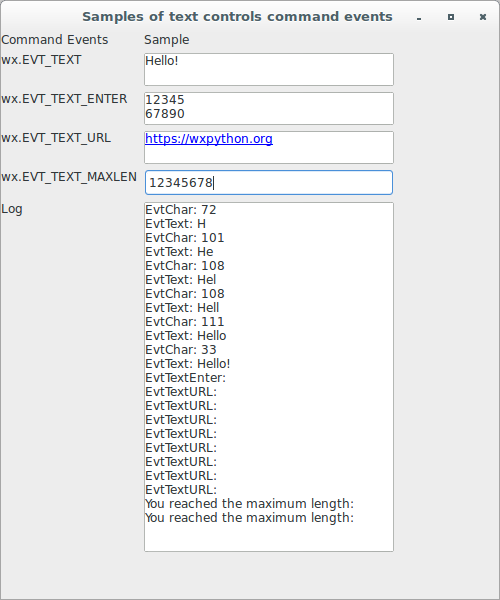

# wxPython

## Working with the basic controls

### How do I respond to text events?

There are a handful of command events generated by `wx.TextCtrl` widgets 
that you may want to use. All of these events are bound to the text 
widget in question, so you need to pass it to the `Bind` method to catch 
the event, as in the following:

```python
frame.Bind(wx.EVT_TEXT, frame.OnText, text)
```

Let's see an application that displays samples of text controls command 
events:

```python
#!/usr/bin/env python3
import wx

styleCol = {0: wx.TE_MULTILINE | wx.TE_RICH2, 
            1: wx.TE_MULTILINE | wx.TE_RICH2 | wx.TE_PROCESS_ENTER, 
            2: wx.TE_MULTILINE | wx.TE_RICH2 | wx.TE_AUTO_URL, 
            3: wx.TE_RICH2}

sizeCol = {0: (250, -1), 
           1: (250, 350)}

class EventsTextCtrlFrame(wx.Frame):

    def __init__(self, parent):
        self.title = "Samples of text controls command events"
        wx.Frame.__init__(self, 
                          parent, 
                          -1, 
                          self.title, 
                          size = (500, 600))
        self.panel = wx.Panel(self, -1)
        self.initHeaders()
        self.initCols()
        sizer = wx.FlexGridSizer(cols=2, hgap=6, vgap=6)
        sizer.AddMany([self.header1, self.header2, 
                       self.col11, self.col21, 
                       self.col12, self.col22, 
                       self.col13, self.col23, 
                       self.col14, self.col24, 
                       self.col15, self.log])
        self.panel.SetSizer(sizer)

    def initHeaders(self):
        self.header1 = self.createTag("Command Events")
        self.header2 = self.createTag("Sample")

    def initCols(self):
        self.col11 = self.createTag("wx.EVT_TEXT")
        self.col21 = self.createSample("", 0, 0)
        self.Bind(wx.EVT_TEXT, self.OnEvtText, self.col21)
        self.col21.Bind(wx.EVT_CHAR, self.OnEvtChar)
        self.col12 = self.createTag("wx.EVT_TEXT_ENTER")
        self.col22 = self.createSample("", 1, 0)
        self.Bind(wx.EVT_TEXT_ENTER, self.OnEvtTextEnter, self.col22)
        self.col13 = self.createTag("wx.EVT_TEXT_URL")
        self.col23 = self.createSample("", 2, 0)
        self.Bind(wx.EVT_TEXT_URL, self.OnEvtTextURL, self.col23)
        self.col14 = self.createTag("wx.EVT_TEXT_MAXLEN")
        self.col24 = self.createSample("", 3, 0)
        self.col24.SetMaxLength(8)
        self.Bind(wx.EVT_TEXT_MAXLEN, self.OnEvtTextMaxLen, self.col24)
        self.col15 = self.createTag("Log")
        self.log = self.createSample("", 0, 1)

    def createTag(self, label):
        return wx.StaticText(self.panel, -1, label)

    def createSample(self, value, i, j):
        selStyle = styleCol[i]
        selSize = sizeCol[j]
        return wx.TextCtrl(self.panel, 
                           -1, 
                           value, 
                           pos = wx.DefaultPosition, 
                           size = selSize, 
                           style = selStyle)

    def OnEvtText(self, evt):
        self.log.WriteText("EvtText: {}\n".\
                             format(evt.GetString()))

    def OnEvtChar(self, evt):
        self.log.WriteText("EvtChar: {}\n".\
                             format(evt.GetKeyCode()))
        evt.Skip()

    def OnEvtTextEnter(self, evt):
        self.log.WriteText("EvtTextEnter: \n")
        evt.Skip()

    def OnEvtTextURL(self, evt):
        self.log.WriteText("EvtTextURL: \n")
        evt.Skip()

    def OnEvtTextMaxLen(self, evt):
        self.log.WriteText("You reached the maximum length: \n")
        evt.Skip()

class App(wx.App):
    def OnInit(self):
        frame = EventsTextCtrlFrame(None)
        frame.Show(True)
        self.SetTopWindow(frame)
        return True

def main():
    app = App(False)
    app.MainLoop()


if __name__ == '__main__':
    main()
```



Next, let's discuss controls that are designed primarily to take mouse 
input. The simplest of these is a button.
