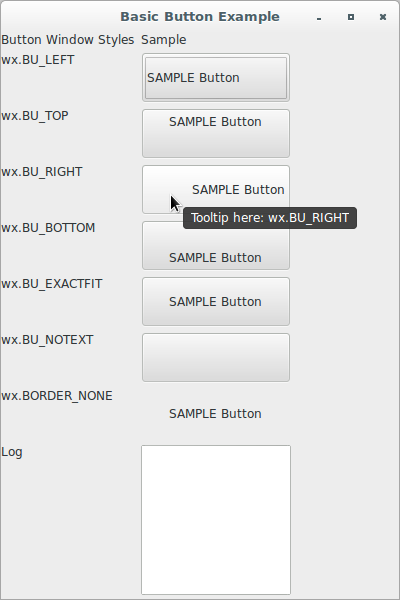
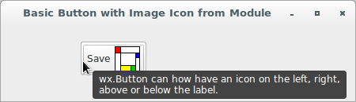

# wxPython

## Working with the basic controls

### How do I make a button?

There are numerous different types of buttons in wxPython. In this part, 
we'll cover text buttons, bitmap buttons, toggle buttons, and generic 
buttons.

Using a button is very straightforward. Let's see an application that 
displays the code for a simple button example:

```python
#!/usr/bin/env python3
import wx

class ButtonFrame(wx.Frame):

    def __init__(self, parent):
        self.title = "Basic Button Example"
        wx.Frame.__init__(self, 
                          parent, 
                          -1, 
                          self.title, 
                          size = (300, 100))
        self.panel = wx.Panel(self, -1)
        self.button = wx.Button(self.panel, 
                                -1, 
                                "Hello", 
                                pos = (100, 20))
        self.Bind(wx.EVT_BUTTON, self.OnClick, self.button)
        self.button.SetDefault()
        self.button.SetSize(self.button.GetBestSize())
        self.button.SetToolTip("This is a Hello button...")

    def OnClick(self, evt):
        self.button.SetLabel("Clicked!")

class App(wx.App):
    def OnInit(self):
        frame = ButtonFrame(None)
        frame.Show(True)
        self.SetTopWindow(frame)
        return True

def main():
    app = App(False)
    app.MainLoop()


if __name__ == '__main__':
    main()
```


Now, let's see a different application that uses some unique window 
styles:

```python
#!/usr/bin/env python3
import wx

styleCol = {0: wx.BU_LEFT, 
            1: wx.BU_TOP, 
            2: wx.BU_RIGHT, 
            3: wx.BU_BOTTOM, 
            4: wx.BU_EXACTFIT, 
            5: wx.BU_NOTEXT, 
            6: wx.BORDER_NONE}

class ButtonStylesFrame(wx.Frame):

    def __init__(self, parent):
        self.title = "Basic Button Example"
        wx.Frame.__init__(self, 
                          parent, 
                          -1, 
                          self.title, 
                          size = (400, 600))
        self.panel = wx.Panel(self, -1)
        self.initHeaders()
        self.initCols()
        sizer = wx.FlexGridSizer(cols=2, hgap=6, vgap=6)
        sizer.AddMany([self.header1, self.header2, 
                       self.col11, self.col21, 
                       self.col12, self.col22, 
                       self.col13, self.col23, 
                       self.col14, self.col24, 
                       self.col15, self.col25, 
                       self.col16, self.col26, 
                       self.col17, self.col27, 
                       self.col18, self.log])
        self.panel.SetSizer(sizer)

    def initHeaders(self):
        self.header1 = self.createTag("Button Window Styles")
        self.header2 = self.createTag("Sample")

    def initCols(self):
        self.col11 = self.createTag("wx.BU_LEFT")
        self.col21 = self.createSample(0)
        self.Bind(wx.EVT_BUTTON, self.OnClick, self.col21)
        self.col21.SetToolTip("Tooltip here: wx.BU_LEFT")

        self.col12 = self.createTag("wx.BU_TOP")
        self.col22 = self.createSample(1)
        self.Bind(wx.EVT_BUTTON, self.OnClick, self.col22)
        self.col22.SetToolTip("Tooltip here: wx.BU_TOP")

        self.col13 = self.createTag("wx.BU_RIGHT")
        self.col23 = self.createSample(2)
        self.Bind(wx.EVT_BUTTON, self.OnClick, self.col23)
        self.col23.SetToolTip("Tooltip here: wx.BU_RIGHT")

        self.col14 = self.createTag("wx.BU_BOTTOM")
        self.col24 = self.createSample(3)
        self.Bind(wx.EVT_BUTTON, self.OnClick, self.col24)
        self.col24.SetToolTip("Tooltip here: wx.BU_BOTTOM")

        self.col15 = self.createTag("wx.BU_EXACTFIT")
        self.col25 = self.createSample(4)
        self.Bind(wx.EVT_BUTTON, self.OnClick, self.col25)
        self.col25.SetToolTip("Tooltip here: wx.BU_EXACTFIT")

        self.col16 = self.createTag("wx.BU_NOTEXT")
        self.col26 = self.createSample(5)
        self.Bind(wx.EVT_BUTTON, self.OnClick, self.col26)
        self.col26.SetToolTip("Tooltip here: wx.BU_NOTEXT")

        self.col17 = self.createTag("wx.BORDER_NONE")
        self.col27 = self.createSample(6)
        self.Bind(wx.EVT_BUTTON, self.OnClick, self.col27)
        self.col27.SetToolTip("Tooltip here: wx.BORDER_NONE")

        self.col18 = self.createTag("Log")
        self.log = wx.TextCtrl(self.panel, 
                               -1, 
                               "", 
                               pos = wx.DefaultPosition, 
                               size = (150, 150), 
                               style = wx.TE_MULTILINE | wx.TE_RICH2)

    def createTag(self, label):
        return wx.StaticText(self.panel, -1, label)

    def createSample(self, i):
        selStyle = styleCol[i]
        return wx.Button(self.panel, 
                           -1, 
                           "SAMPLE Button", 
                           pos = wx.DefaultPosition, 
                           size = (150, 50), 
                           style = selStyle)

    def OnClick(self, evt):
        self.log.WriteText("OnClick: {}\n".format(evt.GetId()))
        evt.Skip()

class App(wx.App):
    def OnInit(self):
        frame = ButtonStylesFrame(None)
        frame.Show(True)
        self.SetTopWindow(frame)
        return True

def main():
    app = App(False)
    app.MainLoop()


if __name__ == '__main__':
    main()
```




Please also notice that GTK+ uses a global setting 
called `gtk-button-images` to determine if the images should be shown in 
the buttons at all. If it is off (which is the case in e.g. Gnome 2.28 
by default), no images will be shown, consistently with the native 
behaviour.

If you want to change this setting in Debian when using Cinnamon as 
desktop environment, do this:

* Go to **"Menu -> Preferences -> Themes -> Other settings"**.
* Make sure the **"Show icons on buttons"** option is checked.
* Open your entire configuration database editor **(dconf-editor)**.
* Browse to the **org.cinnamon.desktop.interface** schema.
* Make sure the **"buttons-have-icons"** key is checked.
* Make sure the **"menus-have-icons"** key is checked.

Next, let's see an application that displays a button with a stock icon:

```python
#!/usr/bin/env python3
import wx

class ButtonStockIconFrame(wx.Frame):

    def __init__(self, parent):
        self.title = "Basic Button with Stock Icon"
        wx.Frame.__init__(self, 
                          parent, 
                          -1, 
                          self.title, 
                          size = (350, 100))
        self.panel = wx.Panel(self, -1)
        self.button = wx.Button(self.panel, 
                                wx.ID_SAVE, 
                                pos = (130, 20))
        self.Bind(wx.EVT_BUTTON, self.OnClick, self.button)
        self.button.SetDefault()
        self.button.SetSize(self.button.GetBestSize())
        self.button.SetToolTip("This is a SAVE button...")

    def OnClick(self, evt):
        self.button.SetLabel("Clicked!")

class App(wx.App):
    def OnInit(self):
        frame = ButtonStockIconFrame(None)
        frame.Show(True)
        self.SetTopWindow(frame)
        return True

def main():
    app = App(False)
    app.MainLoop()


if __name__ == '__main__':
    main()
```


Also, let's see an application that displays a button with a image file 
icon:

```python
#!/usr/bin/env python3
import wx

class ButtonFileIconFrame(wx.Frame):

    def __init__(self, parent):
        self.title = "Basic Button with File Icon"
        wx.Frame.__init__(self, 
                          parent, 
                          -1, 
                          self.title, 
                          size = (350, 100))
        self.panel = wx.Panel(self, -1)
        self.button = wx.Button(self.panel, 
                                -1, 
                                "Save", 
                                pos = (130, 20))
        self.Bind(wx.EVT_BUTTON, self.OnClick, self.button)
        self.button.SetDefault()
        self.button.SetSize(self.button.GetBestSize())
        self.button.SetToolTip("This is a SAVE button...")
        bitmap = wx.Image("files/save.bmp", 
                          wx.BITMAP_TYPE_BMP).\
                          ConvertToBitmap()
        self.button.SetBitmap(bitmap, wx.RIGHT)
        self.button.SetBitmapMargins((2, 2))
        self.button.SetInitialSize()

    def OnClick(self, evt):
        self.button.SetLabel("Clicked!")

class App(wx.App):
    def OnInit(self):
        frame = ButtonFileIconFrame(None)
        frame.Show(True)
        self.SetTopWindow(frame)
        return True

def main():
    app = App(False)
    app.MainLoop()


if __name__ == '__main__':
    main()
```


Let's see an application that displays a button with a image file from 
module:

```python
#!/usr/bin/env python3
import wx
from files import images2

class ButtonModIconFrame(wx.Frame):

    def __init__(self, parent):
        self.title = "Basic Button with Image Icon from Module"
        wx.Frame.__init__(self, 
                          parent, 
                          -1, 
                          self.title, 
                          size = (450, 130))
        self.panel = wx.Panel(self, -1)
        self.button = wx.Button(self.panel, 
                                -1, 
                                "Save ", 
                                pos = (100, 20))
        self.Bind(wx.EVT_BUTTON, self.OnClick, self.button)
        self.button.SetDefault()
        self.button.SetSize(self.button.GetBestSize())
        self.button.SetToolTip("wx.Button can how have an icon on the "
                               "left, right,\n"
                               "above or below the label.")
        bmp = images2.Mondrian.Bitmap
        self.button.SetBitmap(bmp, wx.RIGHT)    # wx.TOP, wx.LEFT, 
                                                # wx.BOTTOM
        self.button.SetBitmapMargins((2, 2))
        self.button.SetInitialSize()

    def OnClick(self, evt):
        self.button.SetLabel("Clicked!")

class App(wx.App):
    def OnInit(self):
        frame = ButtonModIconFrame(None)
        frame.Show(True)
        self.SetTopWindow(frame)
        return True

def main():
    app = App(False)
    app.MainLoop()


if __name__ == '__main__':
    main()
```



