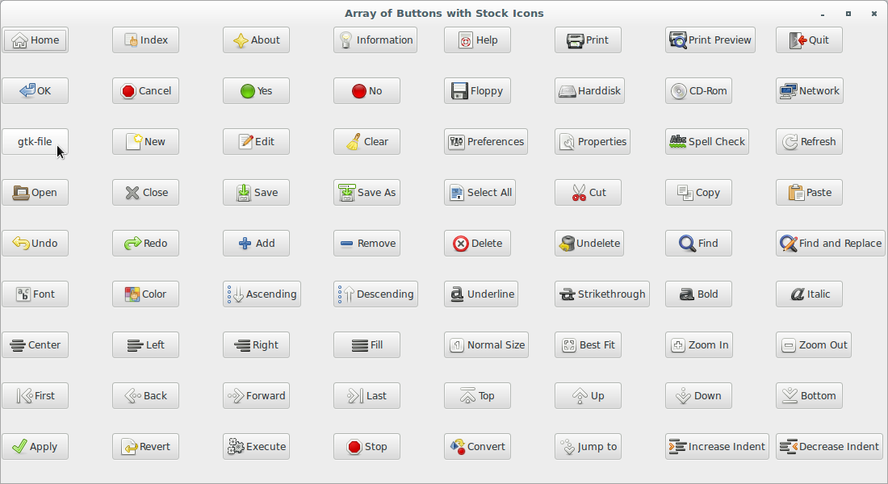

# wxPython

## Working with the basic controls

### What is the preferred way to create standard buttons?

The preferred way to create standard buttons is to use default value 
of `label` (""). If no label is supplied and `id` is one of standard 
IDs, a standard label will be used. In other words, if you use a 
predefined `ID_XXX` constant, just omit the label completely rather than 
specifying it. In particular, help buttons (the ones with `id` 
of `ID_HELP`) under Mac OS X can't display any label at all and 
while `wx.Button` will detect if the standard "Help" label is used and 
ignore it, using any other label will prevent the button from correctly 
appearing as a help button and so should be avoided.

In addition to that, the button will be decorated with stock icons under 
GTK+ 2.

Let's see an application that displays the code for an array of buttons 
with stock icons:

```python
#!/usr/bin/env python3
import wx

class ButtonStockIconFrame(wx.Frame):

    NUM_COLS = 8
    stockList = (
    wx.ID_HOME, wx.ID_INDEX, wx.ID_ABOUT, wx.ID_INFO, 
    wx.ID_HELP, wx.ID_PRINT, wx.ID_PREVIEW, wx.ID_EXIT, 
    wx.ID_OK, wx.ID_CANCEL, wx.ID_YES, wx.ID_NO, 
    wx.ID_FLOPPY, wx.ID_HARDDISK, wx.ID_CDROM, wx.ID_NETWORK, 
    wx.ID_FILE, wx.ID_NEW, wx.ID_EDIT, wx.ID_CLEAR, 
    wx.ID_PREFERENCES, wx.ID_PROPERTIES, wx.ID_SPELL_CHECK, 
    wx.ID_REFRESH, 
    wx.ID_OPEN, wx.ID_CLOSE, wx.ID_SAVE, wx.ID_SAVEAS, 
    wx.ID_SELECTALL, wx.ID_CUT, wx.ID_COPY, wx.ID_PASTE, 
    wx.ID_UNDO, wx.ID_REDO, wx.ID_ADD, wx.ID_REMOVE, 
    wx.ID_DELETE, wx.ID_UNDELETE, wx.ID_FIND, wx.ID_REPLACE, 
    wx.ID_SELECT_FONT, wx.ID_SELECT_COLOR, 
    wx.ID_SORT_ASCENDING, wx.ID_SORT_DESCENDING, 
    wx.ID_UNDERLINE, wx.ID_STRIKETHROUGH, wx.ID_BOLD, wx.ID_ITALIC, 
    wx.ID_JUSTIFY_CENTER, wx.ID_JUSTIFY_LEFT, wx.ID_JUSTIFY_RIGHT, 
    wx.ID_JUSTIFY_FILL, 
    wx.ID_ZOOM_100, wx.ID_ZOOM_FIT, wx.ID_ZOOM_IN, wx.ID_ZOOM_OUT, 
    wx.ID_FIRST, wx.ID_BACKWARD, wx.ID_FORWARD, wx.ID_LAST, 
    wx.ID_TOP, wx.ID_UP, wx.ID_DOWN, wx.ID_BOTTOM, 
    wx.ID_APPLY,  wx.ID_REVERT_TO_SAVED, wx.ID_EXECUTE, wx.ID_STOP, 
    wx.ID_CONVERT, wx.ID_JUMP_TO, wx.ID_INDENT, wx.ID_UNINDENT
    )

    def __init__(self, parent):
        self.title = "Array of Buttons with Stock Icons"
        wx.Frame.__init__(self, 
                          parent, 
                          -1, 
                          self.title, 
                          size = (1100, 600))
        self.panel = wx.Panel(self, -1)
        stockGrid = self.createStockGrid(self.panel)
        self.panel.SetSizer(stockGrid)

    def createStockGrid(self, parent):
        self.stockIdMap = {}
        self.stockButtons = {}
        stockGrid = wx.GridSizer(cols=self.NUM_COLS, hgap=2, vgap=1)
        for eachStock in self.stockList:
            b = wx.Button(self.panel, eachStock)
            stockGrid.Add(b, 0)
        return stockGrid

    def OnClick(self, evt): pass

class App(wx.App):
    def OnInit(self):
        frame = ButtonStockIconFrame(None)
        frame.Show(True)
        self.SetTopWindow(frame)
        return True

def main():
    app = App(False)
    app.MainLoop()


if __name__ == '__main__':
    main()
```



Notice that only the stock icon for the button with the `ID_FILE` is not 
shown. This could be because that shortcut is used only as menu and not 
a button.
