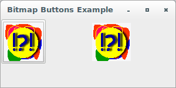
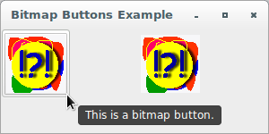
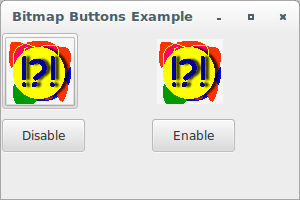
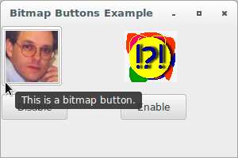
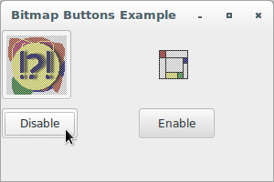

# wxPython

## Working with the basic controls

### How do I make a button with a bitmap?

Occasionally, you'll want a picture on your button, rather than a text 
label. In wxPython, use the class `wx.BitmapButton` to create a button 
with a picture. The code to manage a `wx.BitmapButton` is very similar 
to the general button code.

A `wx.BitmapButton` control displays a bitmap. It can have a separate 
bitmap for each button state: normal, selected, hovered, pressed, 
disabled. The bitmaps to be displayed should have a small number of 
colours, such as 16, to avoid palette problems. 

The primary difference is that for a bitmap button you need to supply a 
bitmap, rather than a label. Otherwise, the constructor and most of the 
code is identical to the text button case. A bitmap button emits the 
same `EVT_BUTTON` event when clicked.

There are a couple of interesting features related to bitmap buttons. 
First, there's a style flag, `wx.BU_AUTODRAW`, which is on by default. 
If the flag is on, the bitmap is surrounded by a 3D border to make it 
look like a text button (left button), and the button is a few pixels 
larger than the original bitmap. If the flag is off, the bitmap is 
simply drawn as a button with no border (flat). The right button shuts 
off the default by setting `style = wx.BORDER_NONE`, and it does not 
have the 3D effect.

Let's see an application that displays a couple of bitmap buttons, both 
with and without a 3D border:

```python
#!/usr/bin/env python3
import wx

class BitmapButtonFrame(wx.Frame):

    def __init__(self, parent):
        self.title = "Bitmap Buttons Example"
        wx.Frame.__init__(self, 
                          parent, 
                          -1, 
                          self.title, 
                          size = (300, 150))
        self.panel = wx.Panel(self, -1)
        bmp = wx.Image("files/bitmap.bmp", wx.BITMAP_TYPE_BMP).\
                       ConvertToBitmap()
        self.b1 = wx.BitmapButton(self.panel, 
                                  -1, 
                                  bmp)
        self.Bind(wx.EVT_BUTTON, self.OnClick, self.b1)
        self.b1.SetToolTip("This is a bitmap button.")
        self.b2 = wx.BitmapButton(self.panel, 
                                  -1, 
                                  bmp, 
                                  style = wx.BORDER_NONE)
        self.Bind(wx.EVT_BUTTON, self.OnClick, self.b2)
        self.b2.SetToolTip("This is a bitmap button "
                           "with \nwx.BORDER_NONE style.")
        sizer = wx.GridSizer(cols=2, hgap=3, vgap=1)
        sizer.AddMany([self.b1, self.b2])
        self.panel.SetSizer(sizer)

    def OnClick(self, evt):
        self.Destroy()

class App(wx.App):
    def OnInit(self):
        frame = BitmapButtonFrame(None)
        frame.Show(True)
        self.SetTopWindow(frame)
        return True

def main():
    app = App(False)
    app.MainLoop()


if __name__ == '__main__':
    main()
```





By default, simply pass wxPython a single bitmap for the main display, 
and wxPython automatically creates standard derivative bitmaps when the 
button is pressed, has the focus, or is disabled. If the normal behavior 
is not what you want, you can explicitly tell wxPython which bitmaps to 
use with the following methods: `SetBitmapPressed()`, `SetBitmapFocus()`
, `SetBitmapDisabled()`, `SetBitmapCurrent()` and `SetBitmapLabel()`. 
Each of these methods takes a `wx.Bitmap` object, and each has an 
associated getter function.

Let's see an application that displays a couple of bitmap buttons with 
different behavior than normal and with disable and enable features:

```python
#!/usr/bin/env python3
import wx
from files import images2

class BitmapButtonFrame(wx.Frame):

    def __init__(self, parent):
        self.title = "Bitmap Buttons Example"
        wx.Frame.__init__(self, 
                          parent, 
                          -1, 
                          self.title, 
                          size = (300, 200))
        self.panel = wx.Panel(self, -1)
        bmp = wx.Image("files/bitmap.bmp", wx.BITMAP_TYPE_BMP).\
                       ConvertToBitmap()
        img = images2.Robin.GetImage()
        imgb = images2.Mondrian.GetImage()
        self.b1 = wx.BitmapButton(self.panel, 
                                  -1, 
                                  bmp)
        self.Bind(wx.EVT_BUTTON, self.OnClick, self.b1)
        self.b1.SetToolTip("This is a bitmap button.")
        self.b1.SetBitmapCurrent(img.ConvertToBitmap())
        self.b1.SetBitmapPressed(imgb.ConvertToBitmap())
        self.b2 = wx.BitmapButton(self.panel, 
                                  -1, 
                                  bmp, 
                                  style = wx.BORDER_NONE)
        self.Bind(wx.EVT_BUTTON, self.OnClick, self.b2)
        self.b2.SetToolTip("This is a bitmap button "
                           "with \nwx.BORDER_NONE style.")
        self.b2.SetBitmapFocus(img.ConvertToBitmap())
        self.b2.SetBitmapDisabled(imgb.ConvertToBitmap())
        self.b3 = wx.Button(self.panel, 
                            -1, 
                            "Disable")
        self.Bind(wx.EVT_BUTTON, self.OnDisable, self.b3)
        self.b4 = wx.Button(self.panel, 
                            -1, 
                            "Enable")
        self.Bind(wx.EVT_BUTTON, self.OnEnable, self.b4)
        sizer = wx.GridSizer(cols=2, hgap=2, vgap=6)
        sizer.AddMany([self.b1, self.b2, 
                       self.b3, self.b4])
        self.panel.SetSizer(sizer)

    def OnClick(self, evt):
        self.Destroy()

    def OnDisable(self, evt):
        self.b1.Disable()
        self.b2.Disable()

    def OnEnable(self, evt):
        self.b1.Enable()
        self.b2.Enable()

class App(wx.App):
    def OnInit(self):
        frame = BitmapButtonFrame(None)
        frame.Show(True)
        self.SetTopWindow(frame)
        return True

def main():
    app = App(False)
    app.MainLoop()


if __name__ == '__main__':
    main()
```






