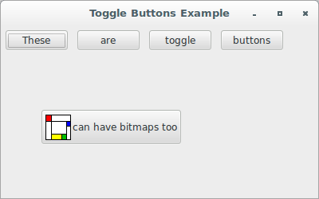
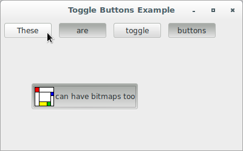

# wxPython

## Working with the basic controls

### How do I create a toggle button?

You can create a toggle button using `wx.ToggleButton`. A toggle button 
looks exactly like a text button, but behaves more like a checkbox in 
that it gives a visual cue to a selected or unselected state. In other 
words, when you press a toggle button, it shows its state by continuing 
to look pressed until you click it again.

There are only two differences between a `wx.ToggleButton` and the 
parent `wx.Button` class:

* A `wx.ToggleButton` sends an `EVT_TOGGLEBUTTON` event when clicked.
* A `wx.ToggleButton` has `GetValue()` and `SetValue()` methods, which 
manipulate the binary state of the button.

Toggle buttons can be a useful and attractive alternative to checkboxes, 
especially in a toolbar. Remember, you cannot combine a toggle button 
with a bitmap button using the wxWidgets provided objects, but wxPython 
has a generic button class that provides this behavior.

Let's see an application that displays several toggle buttons, both with 
and without a bitmap:

```python
#!/usr/bin/env python3
import wx
from files import images2

class ToggleButtonFrame(wx.Frame):

    def __init__(self, parent):
        self.title = "Toggle Buttons Example"
        wx.Frame.__init__(self, 
                          parent, 
                          -1, 
                          self.title, 
                          size = (400, 250))
        self.panel = wx.Panel(self, -1)
        buttons = wx.BoxSizer(wx.HORIZONTAL)

        for word in "These are toggle buttons".split():
            b = wx.ToggleButton(self.panel, 
                                -1, 
                                word)
            self.Bind(wx.EVT_TOGGLEBUTTON, self.OnToggle, b)
            buttons.Add(b, flag=wx.ALL, border=5)

        self.panel.SetAutoLayout(True)
        self.panel.SetSizer(buttons)
        buttons.Fit(self.panel)
        self.panel.Move((50,50))

        b = wx.ToggleButton(self.panel, 
                            -1, 
                            "can have bitmaps too", 
                            pos = (50, 105))
        b.SetBitmap(images2.Mondrian.Bitmap)
        b.SetInitialSize()    # adjust default size for the bitmap
        self.Bind(wx.EVT_TOGGLEBUTTON, self.OnToggle, b)

    def OnToggle(self, evt): pass

class App(wx.App):
    def OnInit(self):
        frame = ToggleButtonFrame(None)
        frame.Show(True)
        self.SetTopWindow(frame)
        return True

def main():
    app = App(False)
    app.MainLoop()


if __name__ == '__main__':
    main()
```




