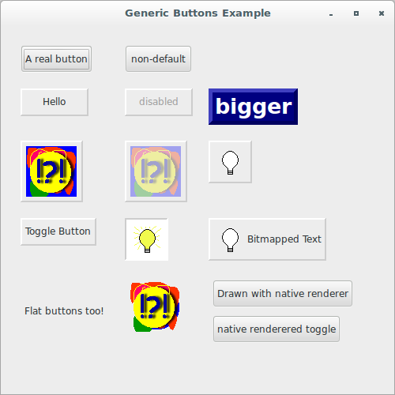
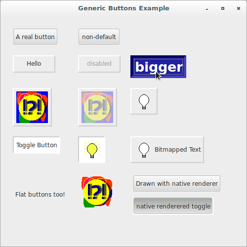

# wxPython

## Working with the basic controls

### What's a generic button, and why should I use one?

A generic button is a button widget that has been completely 
reimplemented in Python, bypassing the use of the native system widget. 
The parent class is `wx.lib.buttons.GenButton`, and there are generic 
bitmap and toggle buttons.

There are several reasons for using generic buttons:

* The generic button look is more similar across platforms than native 
buttons. The flip side is that generic buttons may look slightly 
different from native buttons on a particular system.
* Using a generic button, you have more control over the look, and can 
change attributes, such as the 3D bevel width and color, in ways that 
the native control may not allow.
* The generic button family allows for combinations of features that the 
wxWidgets button does not. There is a `GenBitmapTextButton` which allows 
a text label and a bitmap, and a `GenBitmapToggleButton` which allows a 
toggle bitmap.
* If you are creating a button class, it's easier to use the generic 
buttons as a base class. Since the code and parameters are written in 
Python, they are more accessible for you to inspect and overwrite when 
creating a new subclass.

Let's see an application that displays the generic buttons in action:

```python
#!/usr/bin/env python3
import wx
import wx.lib.buttons as buttons
from files import images2

class GenericButtonFrame(wx.Frame):

    def __init__(self, parent):
        self.title = "Generic Buttons Example"
        wx.Frame.__init__(self, 
                          parent, 
                          -1, 
                          self.title, 
                          size = (500, 500))
        self.panel = wx.Panel(self, -1)
        sizer = wx.FlexGridSizer(cols=3, hgap=20, vgap=20)

        # A regular button, selected as the default button
        b = wx.Button(self.panel, 
                      -1, 
                      "A real button")
        b.SetDefault()
        self.Bind(wx.EVT_BUTTON, self.OnButton, b)
        sizer.Add(b)

        # Same thing, but NOT set as the default button
        b = wx.Button(self.panel, 
                      -1, 
                      "non-default")
        self.Bind(wx.EVT_BUTTON, self.OnButton, b)
        sizer.Add(b)
        sizer.Add((10, 10))

        # Plain old text button based off GenButton()
        b = buttons.GenButton(self.panel, 
                              -1, 
                              'Hello')
        self.Bind(wx.EVT_BUTTON, self.OnButton, b)
        sizer.Add(b)

        # Plain old text button, disabled.
        b = buttons.GenButton(self.panel, 
                              -1, 
                              'disabled')
        self.Bind(wx.EVT_BUTTON, self.OnButton, b)
        b.Enable(False)
        #b.Disable()
        sizer.Add(b)

        # This time, we let the button be as big as it can be.
        # Also, this one is fancier, with custom colors and bezel size.
        b = buttons.GenButton(self.panel, 
                              -1, 
                              'bigger')
        self.Bind(wx.EVT_BUTTON, self.OnButton, b)
        b.SetFont(wx.Font(20, 
                          wx.FONTFAMILY_SWISS, 
                          wx.FONTSTYLE_NORMAL, 
                          wx.FONTWEIGHT_BOLD, 
                          False))
        b.SetBezelWidth(5)
        b.SetMinSize(wx.DefaultSize)
        b.SetBackgroundColour("Navy")
        b.SetForegroundColour(wx.WHITE)
        b.SetToolTip("This is a BIG button...")
        # let the sizer set best size
        sizer.Add(b, flag=wx.ADJUST_MINSIZE)

        # An image button
        bmp = images2.Test2.GetBitmap()
        b = buttons.GenBitmapButton(self.panel, 
                                    -1, 
                                    bmp)
        self.Bind(wx.EVT_BUTTON, self.OnButton, b)
        sizer.Add(b)

        # An image button, disabled.
        bmp = images2.Test2.GetBitmap()
        b = buttons.GenBitmapButton(self.panel, 
                                    -1, 
                                    bmp)
        self.Bind(wx.EVT_BUTTON, self.OnButton, b)
        b.Enable(False)
        #b.Disable()
        sizer.Add(b)

        # An image button, using a mask to get rid of the
        # undesireable part of the image
        b = buttons.GenBitmapButton(self.panel, 
                                   -1, 
                                   None)
        self.Bind(wx.EVT_BUTTON, self.OnButton, b)
        bmp = images2.Bulb1.GetBitmap()
        mask = wx.Mask(bmp, wx.BLUE)
        bmp.SetMask(mask)
        b.SetBitmapLabel(bmp)
        bmp = images2.Bulb2.GetBitmap()
        mask = wx.Mask(bmp, wx.BLUE)
        bmp.SetMask(mask)
        b.SetBitmapSelected(bmp)
        b.SetInitialSize()
        sizer.Add(b)

        # A toggle button
        b = buttons.GenToggleButton(self.panel, 
                                    -1, 
                                    "Toggle Button")
        self.Bind(wx.EVT_BUTTON, self.OnButton, b)
        sizer.Add(b)

        # An image toggle button
        b = buttons.GenBitmapToggleButton(self.panel, 
                                          -1, 
                                          None)
        self.Bind(wx.EVT_BUTTON, self.OnButton, b)
        bmp = images2.Bulb1.GetBitmap()
        mask = wx.Mask(bmp, wx.BLUE)
        bmp.SetMask(mask)
        b.SetBitmapLabel(bmp)
        bmp = images2.Bulb2.GetBitmap()
        mask = wx.Mask(bmp, wx.BLUE)
        bmp.SetMask(mask)
        b.SetBitmapSelected(bmp)
        b.SetToggle(True)
        b.SetInitialSize()
        sizer.Add(b)

        # A bitmap button with text.
        b = buttons.GenBitmapTextButton(self.panel, 
                                        -1, 
                                        None, 
                                        "Bitmapped Text", 
                                        size = (200, 45))
        self.Bind(wx.EVT_BUTTON, self.OnButton, b)
        bmp = images2.Bulb1.GetBitmap()
        mask = wx.Mask(bmp, wx.BLUE)
        bmp.SetMask(mask)
        b.SetBitmapLabel(bmp)
        bmp = images2.Bulb2.GetBitmap()
        mask = wx.Mask(bmp, wx.BLUE)
        bmp.SetMask(mask)
        b.SetBitmapSelected(bmp)
        b.SetUseFocusIndicator(False)
        b.SetInitialSize()
        sizer.Add(b)
        
        # a flat text button
        b = buttons.GenButton(self.panel, 
                              -1, 
                              'Flat buttons too!', 
                              style = wx.BORDER_NONE)
        self.Bind(wx.EVT_BUTTON, self.OnButton, b)
        sizer.Add(b, flag=wx.ALIGN_CENTER_VERTICAL)

        # A flat image button
        bmp = images2.Test2.GetBitmap()
        bmp.SetMaskColour("blue")
        b = buttons.GenBitmapButton(self.panel, 
                                    -1, 
                                    bmp, 
                                    style = wx.BORDER_NONE)
        self.Bind(wx.EVT_BUTTON, self.OnButton, b)
        sizer.Add(b)

        vbox = wx.BoxSizer(wx.VERTICAL)
        sizer.Add(vbox)

        b = buttons.ThemedGenButton(self.panel, 
                                    -1, 
                                    'Drawn with native renderer')
        self.Bind(wx.EVT_BUTTON, self.OnButton, b)
        vbox.Add(b, 0, wx.ALL, 5)

        b = buttons.ThemedGenToggleButton(self.panel, 
                                          -1, 
                                          'native renderered toggle')
        self.Bind(wx.EVT_BUTTON, self.OnButton, b)
        vbox.Add(b, 0, wx.ALL, 5)

        border = wx.BoxSizer(wx.VERTICAL)
        border.Add(sizer, 0, wx.ALL, 25)
        self.panel.SetSizer(border)

    def OnButton(self, evt): pass

class App(wx.App):
    def OnInit(self):
        frame = GenericButtonFrame(None)
        frame.Show(True)
        self.SetTopWindow(frame)
        return True

def main():
    app = App(False)
    app.MainLoop()


if __name__ == '__main__':
    main()
```





Notice that the use of a generic button is very similar to a regular 
button. Generic buttons emit the unified `wx.EVT_BUTTON` event for all 
of them. The generic button includes the `GetBevelWidth()` 
and `SetBevelWidth()` methods to change the amount of the 3D effect 
bevel. These are used in the large button shown above.

The generic bitmap button class `GenBitmapButton` works like the normal 
wxPython version. The `GenBitmapTextButton` takes first the text in the 
constructor and then the bitmap. The generics offer 
the `GenToggleButton` class, the `GenBitmapToggleButton`, and 
the `GenBitmapTextToggleButton`. All three are the same as the 
non-toggle version, and respond to `GetToggle()` and `SetToggle()` to 
manage the toggle state of the button.

Also, be aware that you could use theme generic buttons 
with the `ThemedGenButton` and `ThemedGenToggleButton` classes.

Next, we'll discuss options for allowing your user to enter or view a 
numerical value.
