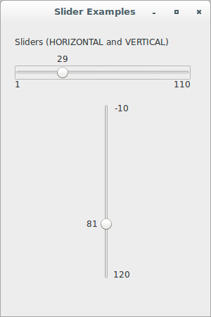

# wxPython

## Working with the basic controls

### How do I make a slider?

A slider is a widget that allows the user to select a number from within 
a range by dragging a marker across the width or height of the control. 
In wxPython, the control class is `wx.Slider`, which includes a 
read-only text display of the current value of the slider.

Let's see an application that displays examples of a vertical and 
horizontal slider:

```python
#!/usr/bin/env python3
import wx

class SliderFrame(wx.Frame):

    def __init__(self, parent):
        self.title = "Slider Examples"
        wx.Frame.__init__(self, 
                          parent, 
                          -1, 
                          self.title, 
                          size = (300, 450))
        self.panel = wx.Panel(self, -1)
        self.count = 0

        label = wx.StaticText(self.panel, 
                              -1, 
                              "Sliders (HORIZONTAL and VERTICAL)")
        slider1 = wx.Slider(self.panel, 
                            100, 
                            25, 
                            1, 
                            100, 
                            size = (250, -1), 
                            style = wx.SL_HORIZONTAL |\
                                    wx.SL_AUTOTICKS |\
                                    wx.SL_LABELS)
        slider1.SetTickFreq(5)
        slider2 = wx.Slider(self.panel, 
                            100, 
                            25, 
                            1, 
                            100, 
                            size = (-1, 250), 
                            style = wx.SL_VERTICAL |\
                                    wx.SL_AUTOTICKS |\
                                    wx.SL_LABELS)
        slider1.SetTickFreq(20)
        sizer = wx.BoxSizer(wx.VERTICAL)
        sizer.Add((1, 20))
        sizer.Add(label, 0, wx.LEFT, 20)
        sizer.Add((1, 10))
        sizer.Add(slider1, 0, wx.LEFT, 20)
        sizer.Add((1, 20))
        sizer.Add(slider2, 0, wx.CENTER, 20)
        self.panel.SetSizer(sizer)

class App(wx.App):
    def OnInit(self):
        frame = SliderFrame(None)
        frame.Show(True)
        self.SetTopWindow(frame)
        return True

def main():
    app = App(False)
    app.MainLoop()


if __name__ == '__main__':
    main()
```


The class `wx.Slider` supports the following styles:

Style | Description
----- | -----------
`wx.SL_HORIZONTAL` | Displays the slider horizontally (this is the default).
`wx.SL_VERTICAL` | Displays the slider vertically.
`wx.SL_AUTOTICKS` | If set, the slider will display tick marks across it. The spacing is governed by the setter method `SetTickFreq` (Windows only).
`wx.SL_MIN_MAX_LABELS` | Displays minimum, maximum labels (new since wxWidgets 2.9.1).
`wx.SL_VALUE_LABEL` | Displays value label (new since wxWidgets 2.9.1).
`wx.SL_LABELS` | Displays minimum, maximum and value labels (same as `wx.SL_VALUE_LABEL` and `wx.SL_MIN_MAX_LABELS` together).
`wx.SL_LEFT` | Displays ticks on the left and forces the slider to be vertical.
`wx.SL_RIGHT` | Displays ticks on the right and forces the slider to be vertical.
`wx.SL_TOP` | Displays ticks on the top.
`wx.SL_BOTTOM` | Displays ticks on the bottom (this is the default).
`wx.SL_SELRANGE` | Allows the user to select a range on the slider (Windows only).
`wx.SL_INVERSE` | Inverses the minimum and maximum endpoints on the slider (not compatible with `wx.SL_SELRANGE`).


Notice that `wx.SL_LEFT`, `wx.SL_TOP`, `wx.SL_RIGHT` and `wx.SL_BOTTOM` 
specify the position of the slider ticks in MSW implementation and that 
the slider labels, if any, are positioned on the opposite side. So, to 
have a label on the left side of a vertical slider, `wx.SL_RIGHT` must 
be used (or none of these styles at all should be specified as left and 
top are default positions for the vertical and horizontal sliders, 
respectively). 

If you want changes in the slider value to affect another part of your 
application, there are several events you can use. These events are 
identical to those emitted by a window scroll bar (the `wx.Slider` 
generates the same events as `wx.ScrollBar` but in practice the most 
convenient way to process `wx.Slider` updates is by handling the 
slider-specific `wx.EVT_SLIDER` event which carries `wx.CommandEvent` 
containing just the latest slider position).

The following table lists the setter properties you can apply to a 
slider. Each setter has an associated `Get` method (the descriptions in 
the table refer to the setter only):

Function | Description
-------- | -----------
`SetMax(maxValue)` and `GetMax` | Sets the maximum slider value.
`SetMin(minValue)` and `GetMin` | Sets the minimum slider value.
`SetRange(minValue, maxValue)` and `GetRange()` | Sets the minimum and maximum slider values.
`SetTickFreq(n)` and `GetTickFreq()` | Sets the tick mark frequency.
`SetLineSize(lineSize)` and `GetLineSize()` | Sets the amount by which the value changes if you adjust the slider by one line by pressing an arrow key.
`SetPageSize(pageSize)` and `GetPageSize()` | Sets the amount by which the value changes if you adjust the slider by one page by pressing page up or page down.
`SetValue(value)` and `GetValue()` | Sets the value of the slider.

Let's see an application that shows how to apply some methods to 
sliders:

```python
#!/usr/bin/env python3
import wx

class SliderFrame(wx.Frame):

    def __init__(self, parent):
        self.title = "Slider Examples"
        wx.Frame.__init__(self, 
                          parent, 
                          -1, 
                          self.title, 
                          size = (300, 450))
        self.panel = wx.Panel(self, -1)
        self.count = 0

        label = wx.StaticText(self.panel, 
                              -1, 
                              "Sliders (HORIZONTAL and VERTICAL)")
        slider1 = wx.Slider(self.panel, 
                            100, 
                            25, 
                            1, 
                            100, 
                            size = (250, -1), 
                            style = wx.SL_HORIZONTAL |\
                                    wx.SL_AUTOTICKS |\
                                    wx.SL_LABELS)
        slider1.SetTickFreq(5)
        slider2 = wx.Slider(self.panel, 
                            100, 
                            25, 
                            1, 
                            100, 
                            size = (-1, 250), 
                            style = wx.SL_VERTICAL |\
                                    wx.SL_AUTOTICKS |\
                                    wx.SL_LABELS)
        slider1.SetTickFreq(20)
        sizer = wx.BoxSizer(wx.VERTICAL)
        sizer.Add((1, 20))
        sizer.Add(label, 0, wx.LEFT, 20)
        sizer.Add((1, 10))
        sizer.Add(slider1, 0, wx.LEFT, 20)
        sizer.Add((1, 20))
        sizer.Add(slider2, 0, wx.CENTER, 20)
        self.panel.SetSizer(sizer)
        slider1.SetMax(110)
        slider1.SetLineSize(10)
        slider1.SetPageSize(15)
        slider1.SetValue(19)
        slider2.SetMin(-10)
        slider2.SetMax(120)
        slider2.SetValue(81)

class App(wx.App):
    def OnInit(self):
        frame = SliderFrame(None)
        frame.Show(True)
        self.SetTopWindow(frame)
        return True

def main():
    app = App(False)
    app.MainLoop()


if __name__ == '__main__':
    main()
```





Although sliders provide a quick visual representation of where the 
value lies along the possible range, they also have a couple of 
weaknesses. They take up a lot of space in their primary dimension, and 
it's difficult to set the slider exactly using a mouse, particularly if 
the range is quite large, or if the user has an accessibility issue. The 
spinner, which we'll discuss in the next part, resolves both of these 
issues.
