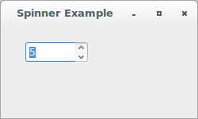
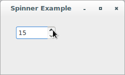
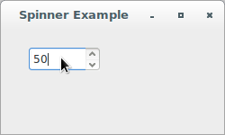
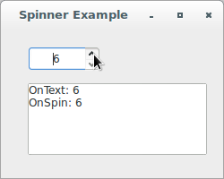
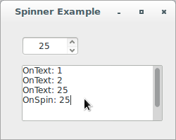
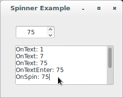

# wxPython

## Working with the basic controls

### How do I make a spinner?

A *spinner* is a combination of a text control ( `wx.TextCtrl` ) and a 
pair of arrow buttons that adjust a numeric value ( `wx.SpinButton` ). 
It's a great alternative to a slider when you have minimal screen space. 
In wxPython, the `wx.SpinCtrl` class manages both the spinner buttons 
and the associated text display.

Use `wx.SpinCtrl` to change the value either by pressing the buttons or 
by typing in the text control. Non-numeric text typed into the control 
is ignored, although the control doesn't change back to the previous 
value until a button is pressed. A numeric value outside the control 
range is treated as the relevant maximum or minimum value, although that 
value doesn't revert to the end of the range until you press a button.

Let's see an application that displays an example of a spinner control:

```python
#!/usr/bin/env python3
import wx

class SpinnerFrame(wx.Frame):

    def __init__(self, parent):
        self.title = "Spinner Example"
        wx.Frame.__init__(self, 
                          parent, 
                          -1, 
                          self.title, 
                          size = (250, 150))
        self.panel = wx.Panel(self, -1)
        self.spinner = wx.SpinCtrl(self.panel, 
                                   -1, 
                                   "", 
                                   (30, 20), 
                                   (80, -1))
        self.spinner.SetRange(1, 100)
        self.spinner.SetValue(5)

class App(wx.App):
    def OnInit(self):
        frame = SpinnerFrame(None)
        frame.Show(True)
        self.SetTopWindow(frame)
        return True

def main():
    app = App(False)
    app.MainLoop()


if __name__ == '__main__':
    main()
```







There are several style flags for `wx.SpinCtrl`. By default
, `wx.SP_ARROW_KEYS` is declared because it allows the user to change 
the value of the control from the keyboard using the up and down arrow 
keys. The `wx.SP_WRAP` style causes the value of the control to wrap, 
meaning that if you go off the edge at one extreme, you wind up at the 
other extreme.

The class `wx.SpinCtrl` also supports other styles:

Style | Description
----- | -----------
`wx.TE_PROCESS_ENTER` | Indicates that the control should generate `wx.EVT_TEXT_ENTER` events. Using this style will prevent the user from using the Enter key for dialog navigation (e.g. activating the default button in the dialog) under MSW.
`wx.ALIGN_LEFT` | Same as `wx.TE_LEFT` for `wx.TextCtrl` (the text is left aligned, default setting).
`wx.ALIGN_CENTRE_HORIZONTAL` | Same as `wx.TE_CENTRE` for `wx.TextCtrl` (the text is centered).
`wx.ALIGN_RIGHT` | Same as `wx.TE_RIGHT` for `wx.TextCtrl` (the text is right aligned).

Also, you can catch the `wx.EVT_SPINCTRL` event, which is generated 
whenever the spin value is changed (even if it is changed via text 
entry). If the text is changed, an `wx.EVT_TEXT` is fired, just as it 
would be if you were using a standalone text control.

Let's see an application that shows how to add styles to a spinner 
control and to handle its main events:

```python
#!/usr/bin/env python3
import wx

class SpinnerFrame(wx.Frame):

    def __init__(self, parent):
        self.title = "Spinner Example"
        wx.Frame.__init__(self, 
                          parent, 
                          -1, 
                          self.title, 
                          size = (250, 200))
        self.panel = wx.Panel(self, -1)
        self.spinner = wx.SpinCtrl(self.panel, 
                                   -1, 
                                   "", 
                                   (30, 20), 
                                   (80, -1), 
                                   style = wx.SP_ARROW_KEYS | 
                                           wx.SP_WRAP | 
                                           wx.ALIGN_CENTRE_HORIZONTAL | 
                                           wx.TE_PROCESS_ENTER)
        self.spinner.SetRange(1, 100)
        self.spinner.SetValue(5)
        self.log = wx.TextCtrl(self.panel, 
                               -1, 
                               "", 
                               pos = (30, 60), 
                               size = (200, 80), 
                               style = wx.TE_MULTILINE | wx.TE_RICH2)

        self.Bind(wx.EVT_SPINCTRL, self.OnSpin, self.spinner)
        self.Bind(wx.EVT_TEXT, self.OnText, self.spinner)
        self.Bind(wx.EVT_TEXT_ENTER, self.OnTextEnter, self.spinner)

    def OnSpin(self, evt):
        self.log.WriteText("OnSpin: {}\n".\
                           format(self.spinner.GetValue()))

    def OnText(self, evt):
        self.log.WriteText("OnText: {}\n".\
                           format(self.spinner.GetValue()))

    def OnTextEnter(self, evt):
        self.log.WriteText("OnTextEnter: {}\n".\
                           format(self.spinner.GetValue()))

class App(wx.App):
    def OnInit(self):
        frame = SpinnerFrame(None)
        frame.Show(True)
        self.SetTopWindow(frame)
        return True

def main():
    app = App(False)
    app.MainLoop()


if __name__ == '__main__':
    main()
```







As displayed above, you can set the range and value using 
the `SetRange(minVal, maxVal)` and `SetValue(value)` methods. 
The `SetValue()` function can take either a string or an integer. To get 
the values, use the methods `GetValue()` (which returns an integer)
, `GetMin()`, and `GetMax()`.

When you need more control over the behavior of the spinner, such as 
spinning through floating point values, or a list of strings, you can 
put a `wx.SpinButton` together with a `wx.TextCtrl`, and build plumbing 
between them. Put the two controls next to each other and 
catch `EVT_SPIN` events from the `wx.SpinButton`, updating the value in 
the `wx.TextCtrl`. However, portable programs should try to 
use the `wx.SpinCtrl` control as `wx.SpinButton` is not implemented for 
all platforms (Win32 and GTK only currently).
