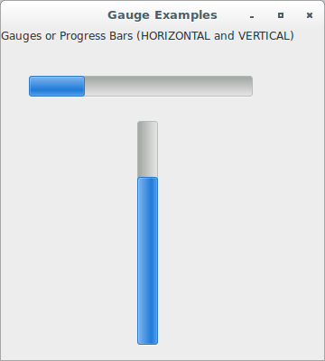
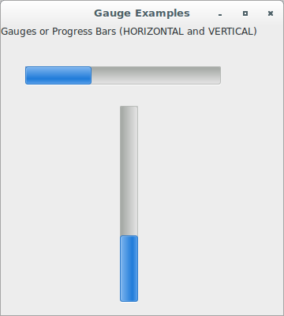
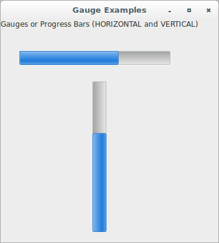
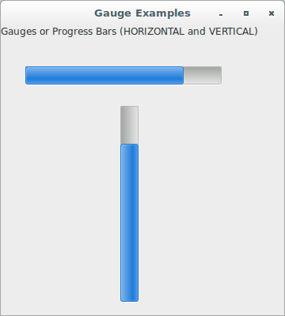
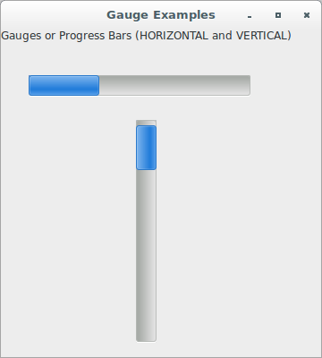
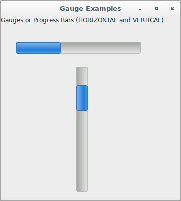

# wxPython

## Working with the basic controls

### How do I make a progress bar?

If you want to graphically display a numeric value without allowing the 
user to change it, use the relevant wxPython widget `wx.Gauge`. An 
example of this numeric value is a progress bar.

A gauge is a horizontal or vertical bar which shows a quantity in a 
graphical fashion. It is often used to indicate progress through lengthy 
tasks, such as file copying or data analysis.

When the gauge is initialized, its "complete" value is usually set; at 
any rate, before using the gauge, the maximum value of the control must 
be set. As the task progresses, the gauge is updated by the program via 
the `SetValue` method.

The class `wx.Gauge` supports two working modes: determinate and 
indeterminate progress. The first is the usual working mode 
(see `SetValue` and `SetRange`) while the second can be used when the 
program is doing some processing but you don't know how much progress is 
being done. In this case, you can periodically call the `Pulse` function 
to make the progress bar switch to indeterminate mode (graphically it's 
usually a set of blocks which move or bounce in the bar control). The 
control `wx.Gauge` supports dynamic switch between these two work modes.

This control is for use within a GUI; there is a 
separate `ProgressDialog` class to present the same sort of control as a 
dialog to the user.

Let's see an application that displays a pair of gauges with some 
progress:

```python
#!/usr/bin/env python3
import wx

class GaugeFrame(wx.Frame):

    def __init__(self, parent):
        self.title = "Gauge Examples"
        wx.Frame.__init__(self, 
                          parent, 
                          -1, 
                          self.title, 
                          size = (360, 400))
        self.panel = wx.Panel(self, -1)
        self.count = 0
        label = wx.StaticText(self.panel, 
                              -1, 
                              "Gauges or Progress Bars "
                              "(HORIZONTAL and VERTICAL)")
        self.gauge1 = wx.Gauge(self.panel, 
                               -1, 
                               100, 
                               (30, 50), 
                               (250, 25), 
                               style = wx.GA_HORIZONTAL)
        self.gauge1.SetRange(100)
        self.gauge1.SetValue(25)
        self.gauge2 = wx.Gauge(self.panel, 
                               -1, 
                               100, 
                               (150, 100), 
                               (25, 250), 
                               style = wx.GA_VERTICAL)
        self.gauge2.SetRange(100)
        self.gauge2.SetValue(75)

class App(wx.App):
    def OnInit(self):
        frame = GaugeFrame(None)
        frame.Show(True)
        self.SetTopWindow(frame)
        return True

def main():
    app = App(False)
    app.MainLoop()


if __name__ == '__main__':
    main()
```



Now, let's see an application that displays gauge progress working with 
an event handler. There, it adjusts the value of the gauge during idle 
time, causing it to loop from start to finish and back again.

```python
#!/usr/bin/env python3
import wx

class GaugeFrame(wx.Frame):

    def __init__(self, parent):
        self.title = "Gauge Examples"
        wx.Frame.__init__(self, 
                          parent, 
                          -1, 
                          self.title, 
                          size = (360, 400))
        self.panel = wx.Panel(self, -1)
        self.count = 0
        label = wx.StaticText(self.panel, 
                              -1, 
                              "Gauges or Progress Bars "
                              "(HORIZONTAL and VERTICAL)")
        self.gauge1 = wx.Gauge(self.panel, 
                               -1, 
                               100, 
                               (30, 50), 
                               (250, 25), 
                               style = wx.GA_HORIZONTAL)
        self.gauge1.SetRange(100)
        self.gauge1.SetValue(25)
        self.gauge2 = wx.Gauge(self.panel, 
                               -1, 
                               100, 
                               (150, 100), 
                               (25, 250), 
                               style = wx.GA_VERTICAL)
        self.gauge2.SetRange(100)
        self.gauge2.SetValue(85)
        self.Bind(wx.EVT_IDLE, self.OnIdle)

    def OnIdle(self, event):
        self.count += 1
        if self.count >= 90:
            self.count = 0
        self.gauge1.SetValue(self.count)
        self.gauge2.SetValue(self.count)

class App(wx.App):
    def OnInit(self):
        frame = GaugeFrame(None)
        frame.Show(True)
        self.SetTopWindow(frame)
        return True

def main():
    app = App(False)
    app.MainLoop()


if __name__ == '__main__':
    main()
```







Finally, let's see an application that displays gauges working in both 
determinate and indeterminate progress mode:

```python
#!/usr/bin/env python3
import wx

class GaugeFrame(wx.Frame):

    def __init__(self, parent):
        self.title = "Gauge Examples"
        wx.Frame.__init__(self, 
                          parent, 
                          -1, 
                          self.title, 
                          size = (360, 400))
        self.panel = wx.Panel(self, -1)
        self.count = 0
        label = wx.StaticText(self.panel, 
                              -1, 
                              "Gauges or Progress Bars "
                              "(HORIZONTAL and VERTICAL)")
        self.gauge1 = wx.Gauge(self.panel, 
                               -1, 
                               100, 
                               (30, 50), 
                               (250, 25), 
                               style = wx.GA_HORIZONTAL)
        self.gauge1.SetRange(100)
        self.gauge1.SetValue(25)
        self.gauge2 = wx.Gauge(self.panel, 
                               -1, 
                               100, 
                               (150, 100), 
                               (25, 250), 
                               style = wx.GA_VERTICAL)
        self.gauge2.SetRange(100)
        self.gauge2.SetValue(85)

        self.Bind(wx.EVT_TIMER, self.TimerHandler)
        self.timer = wx.Timer(self)
        self.timer.Start(100)

    def __del__(self):
        self.timer.Stop()

    def TimerHandler(self, event):
        self.count += 1
        if self.count >= 95:
            self.count = 0
        self.gauge1.SetValue(self.count)
        self.gauge2.Pulse()

class App(wx.App):
    def OnInit(self):
        frame = GaugeFrame(None)
        frame.Show(True)
        self.SetTopWindow(frame)
        return True

def main():
    app = App(False)
    app.MainLoop()


if __name__ == '__main__':
    main()
```





As a read-only control, `wx.Gauge` has no events. However, it does have 
properties you can set. You can adjust the value and range 
using `GetValue()`, `SetValue(pos)`, `GetRange()`, 
and `SetRange(range)`. If you are on Windows, and are not using the 
native progress bar style, you can use `SetBezelFace(width)` 
and `SetShadowWidth()` to change the width of the 3D effect.
