# wxPython

## Working with the basic controls

### How do I create a checkbox?

A checkbox is a toggle button with a text label. Checkboxes are often 
displayed in groups, but the toggle state of each checkbox is 
independent. Checkboxes are used when you have one or more options that 
have clear on/off states, and the state of one option doesn't affect the 
state of the others.

Checkboxes are easy to use in wxPython. They are instances of the 
class `wx.CheckBox`, and can be displayed together by placing them 
inside the parent container together.

Let's see an application that displays a group of checkboxes with some 
style flags set:

```python
#!/usr/bin/env python3
import wx

class CheckBoxFrame(wx.Frame):

    def __init__(self, parent):
        self.title = "Checkbox Examples"
        wx.Frame.__init__(self, 
                          parent, 
                          -1, 
                          self.title, 
                          size = (300, 200))
        self.panel = wx.Panel(self, -1)
        self.cb1 = wx.CheckBox(self.panel, 
                               -1, 
                               "Alpha", 
                               (105, 40), 
                               (150, 20), 
                               style = wx.CHK_2STATE)
        self.cb2 = wx.CheckBox(self.panel, 
                               -1, 
                               "Beta", 
                               (105, 60), 
                               (150, 20), 
                               style = wx.CHK_3STATE | 
                                       wx.CHK_ALLOW_3RD_STATE_FOR_USER)
        self.cb3 = wx.CheckBox(self.panel, 
                               -1, 
                               "Gamma", 
                               (105, 80), 
                               (150, 20), 
                               style = wx.CHK_2STATE)
        self.cb4 = wx.CheckBox(self.panel, 
                               -1, 
                               "*Other*", 
                               (105, 120), 
                               (150, 20), 
                               style = wx.ALIGN_RIGHT)

class App(wx.App):
    def OnInit(self):
        frame = CheckBoxFrame(None)
        frame.Show(True)
        self.SetTopWindow(frame)
        return True

def main():
    app = App(False)
    app.MainLoop()


if __name__ == '__main__':
    main()
```

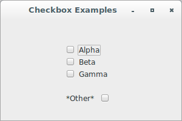

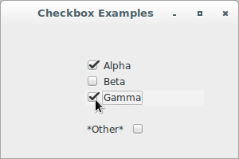

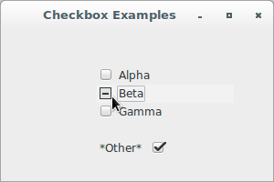

The class `wx.CheckBox` supports the following styles:

Style | Description
----- | -----------
`wx.CHK_2STATE` | Create a 2-state checkbox (default).
`wx.CHK_3STATE` | Create a 3-state checkbox. Called the mixed or undetermined state. Often this is used as a "Does Not Apply" state.
`wx.CHK_ALLOW_3RD_STATE_FOR_USER` | By default a user can't set a 3-state checkbox to the third state. It can only be done from code. Using this flag allows the user to set the checkbox to the third state by clicking.
`wx.ALIGN_RIGHT` | Makes the text appear on the left of the checkbox.

Checkboxes trigger a unique command event, `wx.EVT_CHECKBOX`. The toggle 
state of a `wx.CheckBox` can be retrieved with the methods `GetValue()`
, `Get3StateValue()`, `SetValue(state)` and `Set3StateValue(state)`. The 
method `IsChecked()` is identical to `GetValue()` and is included to 
make the code clearer.

Finally, let's see an application that shows how to handle checkbox 
events:

```python
#!/usr/bin/env python3
import wx

class CheckBoxFrame(wx.Frame):

    def __init__(self, parent):
        self.title = "Checkbox Examples"
        wx.Frame.__init__(self, 
                          parent, 
                          -1, 
                          self.title, 
                          size = (400, 550))
        self.panel = wx.Panel(self, -1)
        self.st = wx.StaticText(self.panel, 
                                -1, 
                                "This example demonstrates "
                                "the wx.CheckBox control.")
        self.cb1 = wx.CheckBox(self.panel, 
                               -1, 
                               "Apples")
        self.cb2 = wx.CheckBox(self.panel, 
                               -1, 
                               "Oranges")
        self.cb2.SetValue(True)
        self.cb3 = wx.CheckBox(self.panel, 
                               -1, 
                               "Pears")
        self.cb4 = wx.CheckBox(self.panel, 
                               -1, 
                               "3-state checkbox", 
                               style = wx.CHK_3STATE | 
                                       wx.CHK_ALLOW_3RD_STATE_FOR_USER)
        self.cb5 = wx.CheckBox(self.panel, 
                               -1, 
                               "Align Right", 
                               style = wx.ALIGN_RIGHT)
        self.log = wx.TextCtrl(self.panel, 
                               -1, 
                               "", 
                               pos = wx.DefaultPosition, 
                               size = (300, 300), 
                               style = wx.TE_MULTILINE | wx.TE_RICH2)

        self.Bind(wx.EVT_CHECKBOX, self.EvtCheckBox, self.cb1)
        self.Bind(wx.EVT_CHECKBOX, self.EvtCheckBox, self.cb2)
        self.Bind(wx.EVT_CHECKBOX, self.EvtCheckBox, self.cb3)
        self.Bind(wx.EVT_CHECKBOX, self.EvtCheckBox, self.cb4)
        self.Bind(wx.EVT_CHECKBOX, self.EvtCheckBox, self.cb5)

        sizer = wx.BoxSizer(wx.VERTICAL)
        sizer.AddMany([self.cb1, 
                       self.cb2, 
                       self.cb3, 
                       (20,20), 
                       self.cb4, 
                       (20,20), 
                       self.cb5, 
                       self.log])

        border = wx.BoxSizer(wx.VERTICAL)
        border.Add(self.st, 0, wx.ALL, 15)
        border.Add(sizer, 0, wx.LEFT, 50)
        self.panel.SetSizer(border)

    def EvtCheckBox(self, evt):
        self.log.WriteText('EvtCheckBox: {}\n'.format(evt.IsChecked()))
        cb = evt.GetEventObject()
        if cb.Is3State():
            self.log.WriteText("\t3StateValue: {}\n".\
                               format(cb.Get3StateValue()))

class App(wx.App):
    def OnInit(self):
        frame = CheckBoxFrame(None)
        frame.Show(True)
        self.SetTopWindow(frame)
        return True

def main():
    app = App(False)
    app.MainLoop()


if __name__ == '__main__':
    main()
```

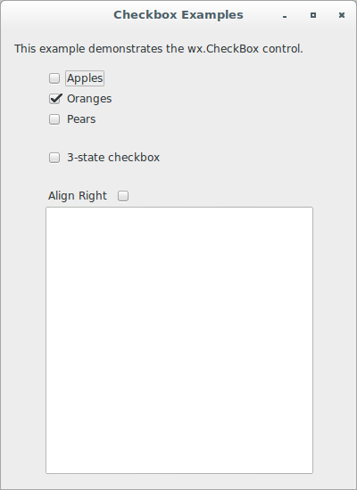

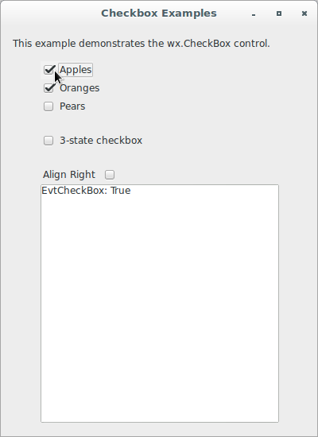

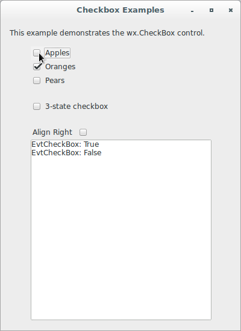

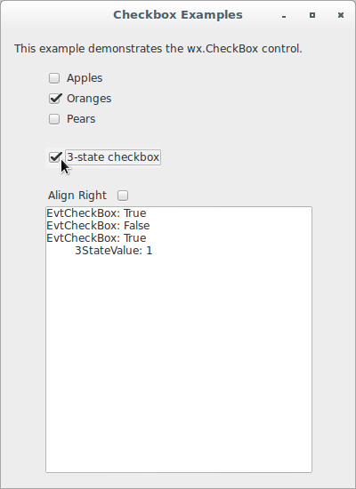

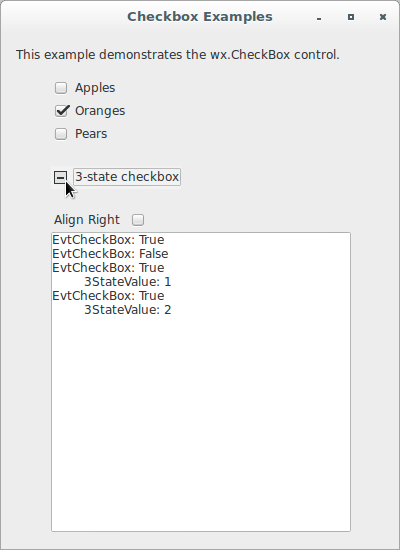

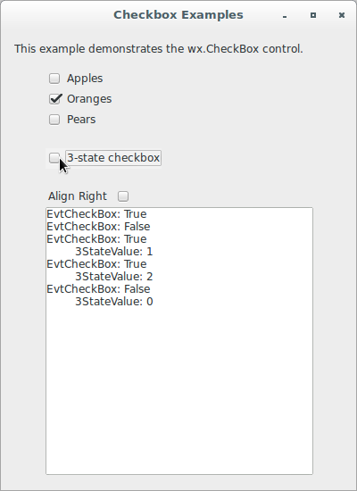

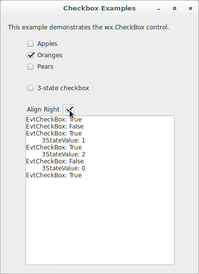

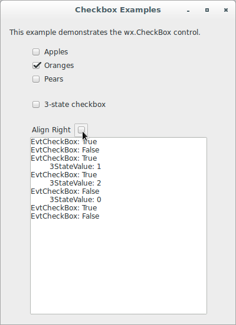
