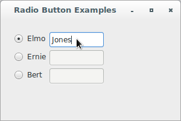

# wxPython

## Working with the basic controls

### How can I create a group of radio buttons?

A radio button is a widget that allows the user to choose from among 
several options. Unlike checkboxes, radio buttons are explicitly 
deployed in groups and only one of the options can be selected at a 
time. When a new option is selected, the existing selection is switched 
off. The name *radio button* comes from the group of selection buttons 
on older car radios that exhibited the same behavior. Radio buttons are 
a bit more complex to use than checkboxes, because they need to be 
organized into a group in order to be useful.

In wxPython, there are two ways to create a group of radio buttons. One 
of them, `wx.RadioButton`, requires you to create the buttons one at a 
time, while `wx.RadioBox` allows you to deploy an entire group of 
buttons with a single object, displaying the buttons in a rectangle.

The `wx.RadioButton` class is simpler, and is preferred in the case 
where the radio buttons have a direct influence on other widgets, or 
where the layout of the radio buttons is not in a simple rectangle.

Let's see an application that displays an example of a 
few `wx.RadioButton` objects in a group, where radio buttons enable text 
control:

```python
#!/usr/bin/env python3
import wx

class RadioButtonFrame(wx.Frame):

    def __init__(self, parent):
        self.title = "Radio Button Examples"
        wx.Frame.__init__(self, 
                          parent, 
                          -1, 
                          self.title, 
                          size = (300, 200))
        self.panel = wx.Panel(self, -1)
        self.radio1 = wx.RadioButton(self.panel, 
                                     -1, 
                                     "Elmo", 
                                     pos = (20, 20), 
                                     style = wx.RB_GROUP)
        self.radio2 = wx.RadioButton(self.panel, 
                                     -1, 
                                     "Ernie", 
                                     pos = (20, 50))
        self.radio3 = wx.RadioButton(self.panel, 
                                     -1, 
                                     "Bert", 
                                     pos = (20, 80))
        self.text1 = wx.TextCtrl(self.panel, 
                                 -1, 
                                 "", 
                                 pos = (80, 20))
        self.text2 = wx.TextCtrl(self.panel, 
                                 -1, 
                                 "", 
                                 pos = (80, 50))
        self.text3 = wx.TextCtrl(self.panel, 
                                 -1, 
                                 "", 
                                 pos = (80, 80))
        self.texts = {"Elmo": self.text1, 
                      "Ernie": self.text2, 
                      "Bert": self.text3}
        for eachText in [self.text2, self.text3]:
            eachText.Enable(False)
        for eachRadio in [self.radio1, self.radio2, self.radio3]:
            self.Bind(wx.EVT_RADIOBUTTON, self.OnRadio, eachRadio)
        self.selectedText = self.text1

    def OnRadio(self, evt):
        if self.selectedText:
            self.selectedText.Enable(False)
        radioSelected = evt.GetEventObject()
        text = self.texts[radioSelected.GetLabel()]
        text.Enable(True)
        self.selectedText = text

class App(wx.App):
    def OnInit(self):
        frame = RadioButtonFrame(None)
        frame.Show(True)
        self.SetTopWindow(frame)
        return True

def main():
    app = App(False)
    app.MainLoop()


if __name__ == '__main__':
    main()
```





We are using `wx.RadioButton` in the example above because each radio 
button controls an associated text control. Since widgets outside the 
radio button group are involved, we can't just use a radio box.

Now, let's see a different application that displays two groups of radio 
buttons:

```python
#!/usr/bin/env python3
import wx

class RadioButtonFrame(wx.Frame):

    def __init__(self, parent):
        self.title = "Radio Button Examples"
        wx.Frame.__init__(self, 
                          parent, 
                          -1, 
                          self.title, 
                          size = (300, 400))
        self.panel = wx.Panel(self, -1)

        # Layout controls on panel:
        vs = wx.BoxSizer(wx.VERTICAL)

        box1Title = wx.StaticBox(self.panel, -1, "Group 1")
        box1 = wx.StaticBoxSizer(box1Title, wx.VERTICAL)
        grid1 = wx.FlexGridSizer(cols=2)

        # 1st group of controls:
        self.group1Ctrls = []
        radio1 = wx.RadioButton(self.panel, 
                                -1, 
                                " Radio1 ", 
                                style = wx.RB_GROUP)
        radio2 = wx.RadioButton(self.panel, 
                                -1, 
                                " Radio2 ")
        radio3 = wx.RadioButton(self.panel, 
                                -1, 
                                " Radio3 ")
        text1 = wx.TextCtrl(self.panel, 
                            -1, 
                            "")
        text2 = wx.TextCtrl(self.panel, 
                            -1, 
                            "")
        text3 = wx.TextCtrl(self.panel, 
                            -1, 
                            "")
        self.group1Ctrls.append((radio1, text1))
        self.group1Ctrls.append((radio2, text2))
        self.group1Ctrls.append((radio3, text3))

        for radio, text in self.group1Ctrls:
            grid1.Add(radio, 
                      0, 
                      wx.ALIGN_CENTRE | wx.LEFT | wx.RIGHT | wx.TOP, 
                      5)
            grid1.Add(text, 
                      0, 
                      wx.ALIGN_CENTRE | wx.LEFT | wx.RIGHT | wx.TOP, 
                      5)

        box1.Add(grid1, 0, wx.ALIGN_CENTRE | wx.ALL, 5)
        vs.Add(box1, 0, wx.ALIGN_CENTRE | wx.ALL, 5)

        box2Title = wx.StaticBox(self.panel, -1, "Group 2")
        box2 = wx.StaticBoxSizer(box2Title, wx.VERTICAL)
        grid2 = wx.FlexGridSizer(cols=2)

        # 2nd group of controls:
        self.group2Ctrls = []
        radio4 = wx.RadioButton(self.panel, 
                                -1, 
                                " Radio1 ", 
                                style = wx.RB_GROUP)
        radio5 = wx.RadioButton(self.panel, 
                                -1, 
                                " Radio2 ")
        radio6 = wx.RadioButton(self.panel, 
                                -1, 
                                " Radio3 ")
        text4 = wx.TextCtrl(self.panel, 
                            -1, 
                            "")
        text5 = wx.TextCtrl(self.panel, 
                            -1, 
                            "")
        text6 = wx.TextCtrl(self.panel, 
                            -1, 
                            "")
        self.group2Ctrls.append((radio4, text4))
        self.group2Ctrls.append((radio5, text5))
        self.group2Ctrls.append((radio6, text6))

        for radio, text in self.group2Ctrls:
            grid2.Add(radio, 
                      0, 
                      wx.ALIGN_CENTRE | wx.LEFT | wx.RIGHT | wx.TOP, 
                      5)
            grid2.Add(text, 
                      0, 
                      wx.ALIGN_CENTRE | wx.LEFT | wx.RIGHT | wx.TOP, 
                      5)

        self.log = wx.TextCtrl(self.panel, 
                               -1, 
                               "", 
                               pos = wx.DefaultPosition, 
                               size = (200, 200), 
                               style = wx.TE_MULTILINE | wx.TE_RICH2)

        box2.Add(grid2, 0, wx.ALIGN_CENTRE | wx.ALL, 5)
        vs.Add(box2, 0, wx.ALIGN_CENTRE | wx.ALL, 5)
        vs.Add(self.log, 0, wx.ALIGN_CENTRE | wx.ALL, 5)

        self.panel.SetSizer(vs)
        vs.Fit(self.panel)
        self.panel.Move((50, 50))
        
        # Setup event handling and initial state for controls:
        for radio, text in self.group1Ctrls:
            self.Bind(wx.EVT_RADIOBUTTON, self.OnGroup1Select, radio)

        for radio, text in self.group2Ctrls:
            self.Bind(wx.EVT_RADIOBUTTON, self.OnGroup2Select, radio)

        for radio, text in self.group1Ctrls + self.group2Ctrls:
            radio.SetValue(0)
            text.Enable(False)

    def OnGroup1Select(self, evt):
        radio_selected = evt.GetEventObject()
        self.log.WriteText('Group1 {} selected\n'.\
                           format(radio_selected.GetLabel()))

        for radio, text in self.group1Ctrls:
            if radio is radio_selected:
                text.Enable(True)
            else:
                text.Enable(False)

    def OnGroup2Select(self, evt):
        radio_selected = evt.GetEventObject()
        self.log.WriteText('Group2 {} selected\n'.\
                           format(radio_selected.GetLabel()))

        for radio, text in self.group2Ctrls:
            if radio is radio_selected:
                text.Enable(True)
            else:
                text.Enable(False)

class App(wx.App):
    def OnInit(self):
        frame = RadioButtonFrame(None)
        frame.Show(True)
        self.SetTopWindow(frame)
        return True

def main():
    app = App(False)
    app.MainLoop()


if __name__ == '__main__':
    main()
```


The `wx.RB_GROUP` style declares the button to be the beginning of a new 
group of radio buttons. The definition of a group of radio buttons is 
important because it governs toggle behavior. When one button in the 
group is selected, the previously selected button in the group is 
toggled to the unchecked state. After a radio button is created 
with `wx.RB_GROUP`, all subsequent radio buttons added to the same 
parent are added to the same group. This continues until another radio 
button is created with `wx.RB_GROUP`, starting the next group. In the 
example code, the first radio button is declared with `wx.RB_GROUP`, and 
subsequent ones are not. The result of this is that all the buttons are 
considered to be in the same group, and clicking on one of them toggles 
off the previously selected button.

Typically, if you want to display a group of buttons, declaring them 
separately is not the best method. Instead, wxPython allows you to 
create a single object that encapsulates the entire group using the 
class `wx.RadioBox`.

A `wx.RadioBox` is used to select one of a number of mutually exclusive 
choices. It is displayed as a vertical column or horizontal row of 
labelled buttons, surrounded by a box that can optionally have a label.

Now, let's see an application that displays two examples 
of `wx.RadioBox` objects in a window, built from the same underlying 
data with different configurations:

```python
#!/usr/bin/env python3
import wx

class RadioBoxFrame(wx.Frame):

    def __init__(self, parent):
        self.title = "Radio Box Examples"
        wx.Frame.__init__(self, 
                          parent, 
                          -1, 
                          self.title, 
                          size = (300, 500))
        self.panel = wx.Panel(self, -1)
        sampleList = ['zero', 
                      'one', 
                      'two', 
                      'three', 
                      'four', 
                      'five', 
                      'six', 
                      'seven', 
                      'eight']
        vs = wx.BoxSizer(wx.VERTICAL)
        rb1 = wx.RadioBox(self.panel, 
                          -1, 
                          "wx.RadioBox", 
                          (10, 10), 
                          wx.DefaultSize, 
                          sampleList, 
                          2, 
                          wx.RA_SPECIFY_COLS)
        self.Bind(wx.EVT_RADIOBOX, self.EvtRadioBox, rb1)
        rb1.SetToolTip(wx.ToolTip("This is a ToolTip!"))
        rb1.SetLabel("wx.RadioBox")
        rb2 = wx.RadioBox(self.panel, 
                          -1, 
                          "", 
                          (150, 10), 
                          wx.DefaultSize, 
                          sampleList, 
                          3, 
                          wx.RA_SPECIFY_COLS | wx.NO_BORDER)
        self.Bind(wx.EVT_RADIOBOX, self.EvtRadioBox, rb2)
        rb2.SetToolTip(wx.ToolTip("This box has no label"))
        self.log = wx.TextCtrl(self.panel, 
                               -1, 
                               "", 
                               pos = wx.DefaultPosition, 
                               size = (200, 200), 
                               style = wx.TE_MULTILINE | wx.TE_RICH2)
        vs.Add(rb1, 0, wx.ALL, 10)
        vs.Add(rb2, 0, wx.LEFT | wx.RIGHT | wx.BOTTOM, 10)
        vs.Add(self.log, 0, wx.ALL, 10)
        self.panel.SetSizer(vs)
        vs.Fit(self.panel)
        self.panel.Move((20, 20))

    def EvtRadioBox(self, evt):
        self.log.WriteText('EvtRadioBox: {}\n'.\
                           format(evt.GetInt()))

class App(wx.App):
    def OnInit(self):
        frame = RadioBoxFrame(None)
        frame.Show(True)
        self.SetTopWindow(frame)
        return True

def main():
    app = App(False)
    app.MainLoop()


if __name__ == '__main__':
    main()
```


There are a few arguments to the constructor that are unfamiliar or 
different. In the constructor, the `label` argument is the static text 
which is displayed on the border of the box. The buttons themselves are 
specified in the `choices` argument, which is a Python sequence of the 
string labels.

Like a grid sizer, you specify the dimensions of a `wx.RadioBox` by 
stating the size in one dimension, and wxPython fills as many slots in 
the other dimension as needed. The major dimension size is specified in 
the `majorDimension` argument. Which dimension is considered major 
depends on the style flag. The default value, which is also used for the 
example above, is `wx.RA_SPECIFY_COLS`. In the example, the number of 
columns is set to `2` (in the top box) or `3` (in the bottom box), and 
the number of rows is determined dynamically by the number of elements 
in the `choices` list. If you want the opposite behavior, set the style 
to `wx.RA_SPECIFY_ROWS`. If you want to respond to the command event 
when a radio box is clicked, the event is `wx.EVT_RADIOBOX`.

The `wx.RadioBox` class has a number of methods to manage the state of 
the various radio buttons inside the box. For the methods that allow you 
to manage a specific internal button, pass the index of the button. The 
indexes start at 0 and proceed in the exact order that was used when the 
button labels were passed to the constructor.

Radio buttons aren't the only way to give the user a choice of a series 
of options. List and combo boxes often take up less space, and can also 
be configured to allow the user to make multiple selections from the 
same group.
