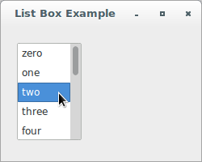
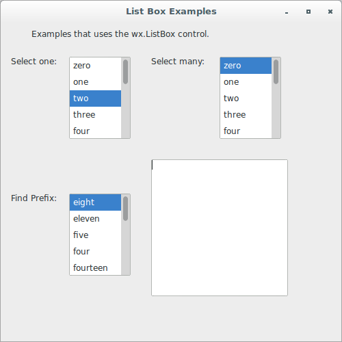
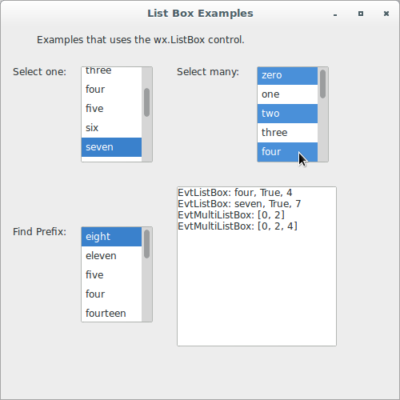
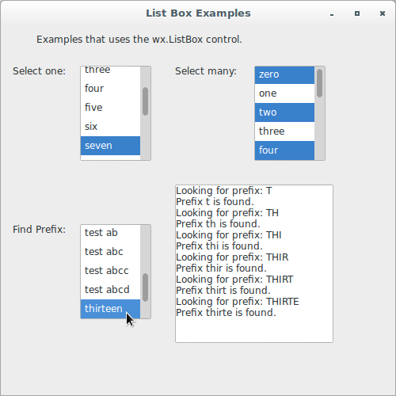

# wxPython

## Working with the basic controls

### How can I create a list box?

A list box is another mechanism for presenting a choice to the user. The 
options are placed in a rectangular window and the user can select one 
or more of them. List boxes take up less space than radio boxes, and are 
good choices when the number of options is relatively small. However, 
their usefulness drops somewhat if the user has to scroll far to see all 
options.

In wxPython, a list box is an element of the class `wx.ListBox`. The 
class has methods that allow you to manipulate the choices in the list.

Let's see an application that displays a simple list of options:

```python
#!/usr/bin/env python3
import wx

class ListBoxFrame(wx.Frame):

    def __init__(self, parent):
        self.title = "List Box Example"
        wx.Frame.__init__(self, 
                          parent, 
                          -1, 
                          self.title, 
                          size = (250, 200))
        self.panel = wx.Panel(self, -1)
        sampleList = ['zero', 
                      'one', 
                      'two', 
                      'three', 
                      'four', 
                      'five', 
                      'six', 
                      'seven', 
                      'eight', 
                      'nine', 
                      'ten', 
                      'eleven', 
                      'twelve', 
                      'thirteen', 
                      'fourteen']
        listBox = wx.ListBox(self.panel, 
                             -1, 
                             (20, 20), 
                             (80, 120), 
                             sampleList, 
                             wx.LB_SINGLE)
        listBox.SetSelection(2)

class App(wx.App):
    def OnInit(self):
        frame = ListBoxFrame(None)
        frame.Show(True)
        self.SetTopWindow(frame)
        return True

def main():
    app = App(False)
    app.MainLoop()


if __name__ == '__main__':
    main()
```



The main difference between a radio box and a list box is that 
a `wx.ListBox` has no label attribute. The elements to be displayed in 
the list are placed in the `choices` argument, which should be a 
sequence of strings. There are three mutually exclusive styles which 
determine how the user can select elements from the list, as described 
here:

Style | Description
----- | -----------
`wx.LB_SINGLE` | The user can have only one item selected at a time. Essentially, in this case, the list box acts like a group of radio buttons.
`wx.LB_MULTIPLE` | The user can have more than one item selected at a time. Essentially, in this case, the list box acts like a group of checkboxes.
`wx.LB_EXTENDED` | The user can select a range of multiple items by using a mouse shift-or-control-click, or the keyboard equivalent.

Users often have problems with multiple and extended selections, because 
they usually expect to see a single selection list, and maintaining the 
multiple selections can be challenging, especially for users with 
accessibility issues. If you do use a multiple or extended list, we 
recommend that you clearly label the list as such.

There are four styles that govern the display of scroll bars in 
a `wx.ListBox`:

Style | Description
----- | -----------
`wx.LB_ALWAYS_SB` | The list box will always display a vertical scroll bar, whether or not it is needed.
`wx.LB_NEEDED_SB` | The list box will only display a vertical scroll bar if needed. This is the default.
`wx.LB_HSCROLL` | If the native widget supports it, the list box will create a horizontal scrollbar if items are too wide to fit.
`wx.LB_NO_SB` | Don't create vertical scrollbar (wxMSW and wxGTK only).

There is also the style `wx.LB_SORT`, which causes the elements of the 
list to be sorted alphabetically.

There are two command events specific to `wx.ListBox`. 
The `wx.EVT_LISTBOX` event is triggered when an element of the list is 
selected (even if it's the currently selected element). If the list is 
double-clicked, the event `wx.EVT_LISTBOX_DCLICK` is fired.

There are several methods specific to list boxes for you to manipulate 
the items in the box. All indexes start at zero, and represent the 
current list of items in the list from top to bottom.

Finally, let's see an application that shows how to work with multiple 
selection lists:

```python
#!/usr/bin/env python3
import wx

# This listbox subclass lets you type the starting letters of what you 
# want to select, and scrolls the list to the match if it is found.

class FindPrefixListBox(wx.ListBox):

    def __init__(self, 
                 parent, 
                 id, 
                 pos = wx.DefaultPosition, 
                 size = wx.DefaultSize, 
                 choices = [], 
                 style = 0, 
                 validator = wx.DefaultValidator):
        wx.ListBox.__init__(self, 
                            parent, 
                            id, 
                            pos, 
                            size, 
                            choices, 
                            style, 
                            validator)
        self.typedText = ''
        self.log = parent.log
        self.Bind(wx.EVT_KEY_DOWN, self.OnKey)

    def FindPrefix(self, prefix):
        self.log.WriteText('Looking for prefix: {}\n'.format(prefix))

        if prefix:
            prefix = prefix.lower()
            length = len(prefix)

            for x in range(self.GetCount()):
                text = self.GetString(x)
                text = text.lower()

                if text[:length] == prefix:
                    self.log.WriteText('Prefix {} is found.\n'.\
                                       format(prefix))
                    return x

        self.log.WriteText('Prefix {} is not found.\n'.\
                           format(prefix))
        return -1

    def OnKey(self, evt):
        key = evt.GetKeyCode()

        if key >= 32 and key <= 127:
            self.typedText = self.typedText + chr(key)
            item = self.FindPrefix(self.typedText)

            if item != -1:
                self.SetSelection(item)

        # backspace removes one character and backs up
        elif key == wx.WXK_BACK:
            self.typedText = self.typedText[:-1]

            if not self.typedText:
                self.SetSelection(0)
            else:
                item = self.FindPrefix(self.typedText)

                if item != -1:
                    self.SetSelection(item)
        else:
            self.typedText = ''
            evt.Skip()

    def OnKeyDown(self, evt):
        pass

class ListBoxFrame(wx.Frame):

    def __init__(self, parent):
        self.title = "List Box Examples"
        wx.Frame.__init__(self, 
                          parent, 
                          -1, 
                          self.title, 
                          size = (500, 500))
        self.panel = wx.Panel(self, -1)
        self.panel.log = wx.TextCtrl(self.panel, 
                                     -1, 
                                     "", 
                                     pos = (220, 200), 
                                     size = (200, 200), 
                                     style = wx.TE_MULTILINE | 
                                             wx.TE_RICH2)
        sampleList = ['zero', 
                      'one', 
                      'two', 
                      'three', 
                      'four', 
                      'five', 
                      'six', 
                      'seven', 
                      'eight', 
                      'nine', 
                      'ten', 
                      'eleven', 
                      'twelve', 
                      'thirteen', 
                      'fourteen']
        st1 = wx.StaticText(self.panel, 
                            -1, 
                            "Examples that uses the "
                            "wx.ListBox control.", 
                            (45, 10))
        st2 = wx.StaticText(self.panel, 
                            -1, 
                            "Select one:", 
                            (15, 50))
        self.lb1 = wx.ListBox(self.panel, 
                              60, 
                             (100, 50), 
                             (90, 120), 
                             sampleList, 
                             wx.LB_SINGLE)
        self.Bind(wx.EVT_LISTBOX, self.EvtListBox, self.lb1)
        self.Bind(wx.EVT_LISTBOX_DCLICK, self.EvtListBoxDClk, self.lb1)
        self.lb1.Bind(wx.EVT_RIGHT_UP, self.EvtRightButton)
        self.lb1.SetSelection(2)
        self.lb1.Append("with data", "This one has data")
        self.lb1.SetClientData(2, "This one has data")

        st3 = wx.StaticText(self.panel, 
                            -1, 
                            "Select many:", 
                            (220, 50))
        self.lb2 = wx.ListBox(self.panel, 
                              70, 
                             (320, 50), 
                             (90, 120), 
                             sampleList, 
                             wx.LB_EXTENDED)
        self.Bind(wx.EVT_LISTBOX, self.EvtMultiListBox, self.lb2)
        self.lb2.Bind(wx.EVT_RIGHT_UP, self.EvtRightButton)
        self.lb2.SetSelection(0)

        sampleList += ['test a', 
                       'test aa', 
                       'test aab', 
                       'test ab', 
                       'test abc', 
                       'test abcc', 
                       'test abcd' ]
        sampleList.sort()
        st4 = wx.StaticText(self.panel, 
                            -1, 
                            "Find Prefix:", 
                            (15, 250))
        fp = FindPrefixListBox(self.panel, 
                               -1, 
                               (100, 250), 
                               (90, 120), 
                               sampleList, wx.LB_SINGLE)
        fp.SetSelection(0)

    def EvtListBox(self, evt):
        self.panel.log.WriteText('EvtListBox: {}, {}, {}\n'.\
                                 format(evt.GetString(), 
                                        evt.IsSelection(), 
                                        evt.GetSelection()))

    def EvtListBoxDClk(self, evt):
        self.panel.log.WriteText('EvtListBoxDClick: {}\n'.\
                                 format(self.lb1.GetSelection()))
        self.lb1.Delete(self.lb1.GetSelection())

    def EvtMultiListBox(self, evt):
        self.panel.log.WriteText('EvtMultiListBox: {}\n'.\
                                 format(str(self.lb2.GetSelections())))

    def EvtRightButton(self, evt):
        self.panel.log.WriteText('EvtRightButton: {}\n'.\
                                 format(evt.GetPosition()))

        if evt.GetEventObject().GetId() == 70:
            selections = list(self.lb2.GetSelections())
            selections.reverse()

            for index in selections:
                self.lb2.Delete(index)
        
class App(wx.App):
    def OnInit(self):
        frame = ListBoxFrame(None)
        frame.Show(True)
        self.SetTopWindow(frame)
        return True

def main():
    app = App(False)
    app.MainLoop()


if __name__ == '__main__':
    main()
```







Once you have a list box, it's only natural to want to combine it with 
other widgets, such as a pull-down menu, or a checkbox.
