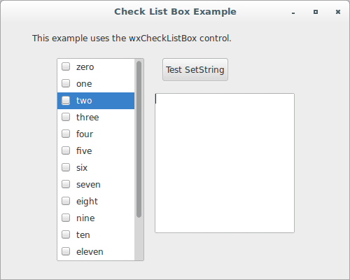
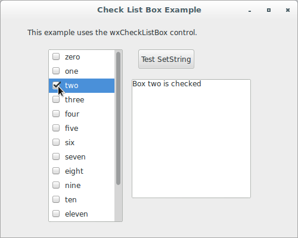
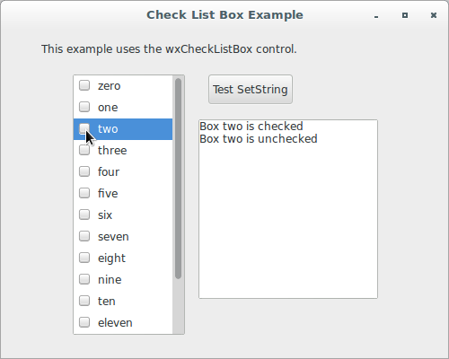
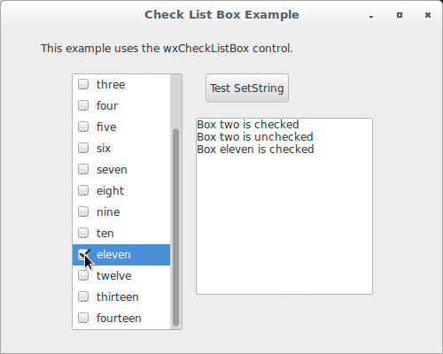
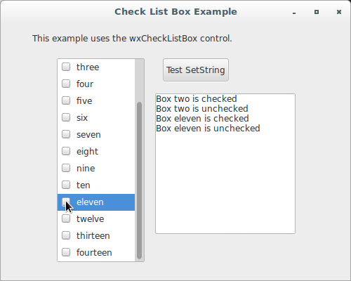
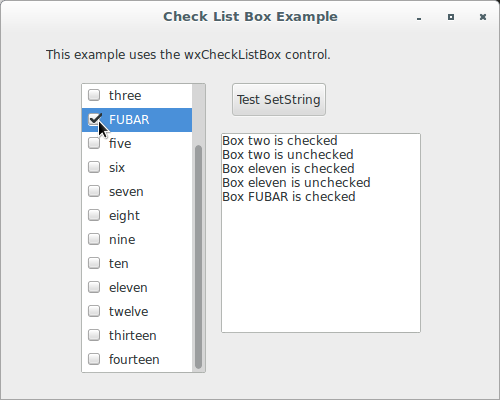
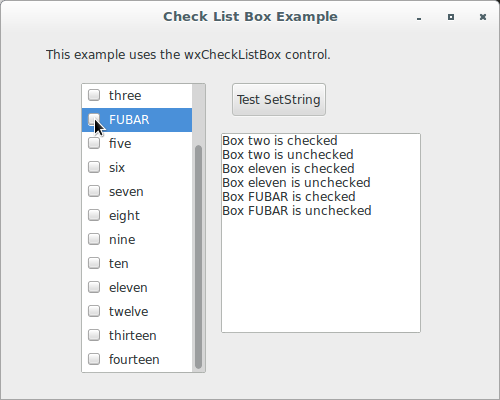
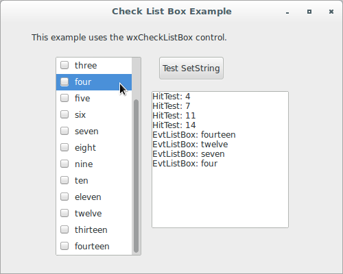

# wxPython

## Working with the basic controls

### Can I combine a checkbox and a list box?

You can combine a checkbox with a list box using the 
class `wx.CheckListBox`. A check list box is like a list box, but allows 
items to be checked or unchecked rather than relying on extended 
selection (e.g. shift-select) to select multiple items in the list. This 
class is currently implemented under Windows and GTK.

Let's see an application that displays a checkbox and a list box 
together:

```python
#!/usr/bin/env python3
import wx

class CheckListBoxFrame(wx.Frame):

    def __init__(self, parent):
        self.title = "Check List Box Example"
        wx.Frame.__init__(self, 
                          parent, 
                          -1, 
                          self.title, 
                          size = (500, 400))
        self.panel = wx.Panel(self, -1)
        self.log = wx.TextCtrl(self.panel, 
                               -1, 
                               "", 
                               pos = (220, 100), 
                               size = (200, 200), 
                               style = wx.TE_MULTILINE | wx.TE_RICH2)
        sampleList = ['zero', 
                      'one', 
                      'two', 
                      'three', 
                      'four', 
                      'five', 
                      'six', 
                      'seven', 
                      'eight', 
                      'nine', 
                      'ten', 
                      'eleven', 
                      'twelve', 
                      'thirteen', 
                      'fourteen']
        st1 = wx.StaticText(self.panel, 
                            -1, 
                            "This example uses the wxCheckListBox "
                            "control.", 
                            (45, 15))
        self.clb = wx.CheckListBox(self.panel, 
                                   -1, 
                                   (80, 50), 
                                   wx.DefaultSize, 
                                   sampleList)
        self.Bind(wx.EVT_LISTBOX, self.EvtListBox, self.clb)
        self.Bind(wx.EVT_CHECKLISTBOX, self.EvtCheckListBox, self.clb)
        self.clb.SetSelection(2)

        self.clb.Bind(wx.EVT_RIGHT_DOWN, self.OnDoHitTest)

        pos = self.clb.GetPosition().x + self.clb.GetSize().width + 25
        btn = wx.Button(self.panel, 
                        -1, 
                        "Test SetString", 
                        (pos, 50))
        self.Bind(wx.EVT_BUTTON, self.OnTestButton, btn)

    def EvtListBox(self, evt):
        self.log.WriteText('EvtListBox: {}\n'.format(evt.GetString()))

    def EvtCheckListBox(self, evt):
        index = evt.GetSelection()
        label = self.clb.GetString(index)
        status = 'un'
        if self.clb.IsChecked(index):
            status = ''
        self.log.WriteText('Box {} is {}checked \n'.\
                           format(label, status))
        # so that (un)checking also selects (moves the highlight)
        self.clb.SetSelection(index)

    def OnTestButton(self, evt):
        self.clb.SetString(4, "FUBAR")

    def OnDoHitTest(self, evt):
        item = self.clb.HitTest(evt.GetPosition())
        self.log.WriteText("HitTest: {}\n".format(item))

class App(wx.App):
    def OnInit(self):
        frame = CheckListBoxFrame(None)
        frame.Show(True)
        self.SetTopWindow(frame)
        return True

def main():
    app = App(False)
    app.MainLoop()


if __name__ == '__main__':
    main()
```


















The event generated for a check list box is `wx.EVT_CHECKLISTBOX`, which 
is triggered when one of the checkboxes in the list is clicked. There 
are two new methods for managing the checkboxes:

* `Check(n, check=True)` sets the check state of the item at index `n`. 
If `check=False`, the item is to be unchecked.
* `IsChecked(item)` returns `True` if the item at the given index is 
checked, `False` otherwise.

Finally, notice how to use the `SetString` method to change labels 
dynamically.
