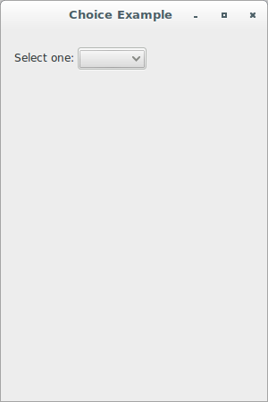
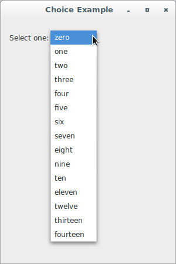
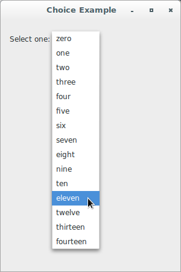
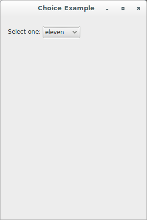
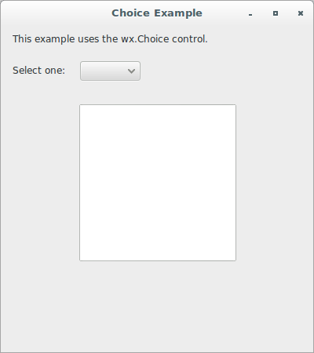
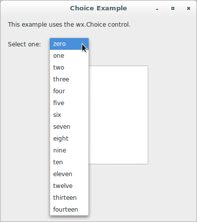
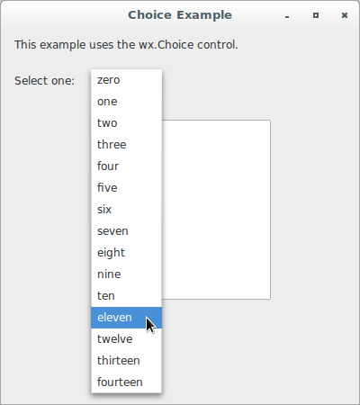
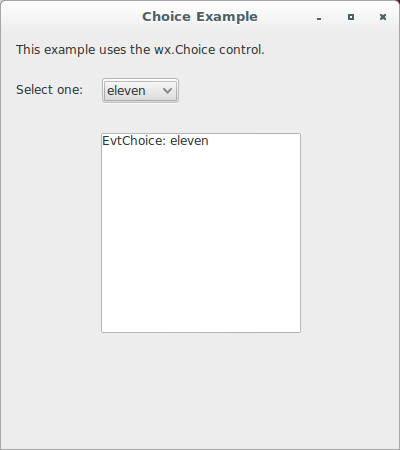
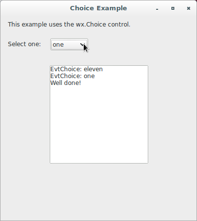

# wxPython

## Working with the basic controls

### What if I want a pull-down choice?

A pull-down choice is a selection mechanism that only shows the choices 
when the pull-down arrow is clicked. A pull-down is the most compact way 
to display a choice of elements, and is most useful when screen space is 
tight. From a user perspective, a choice is most useful for a relatively 
large list of options, although they are also preferred when it's not 
necessary for the user to see all the options at all times.

Let's see an application that displays a simple pull-down choice 
control:

```python
#!/usr/bin/env python3
import wx

class ChoiceFrame(wx.Frame):

    def __init__(self, parent):
        self.title = "Choice Example"
        wx.Frame.__init__(self, 
                          parent, 
                          -1, 
                          self.title, 
                          size = (300, 450))
        self.panel = wx.Panel(self, -1)
        sampleList = ['zero', 
                      'one', 
                      'two', 
                      'three', 
                      'four', 
                      'five', 
                      'six', 
                      'seven', 
                      'eight', 
                      'nine', 
                      'ten', 
                      'eleven', 
                      'twelve', 
                      'thirteen', 
                      'fourteen']
        st1 = wx.StaticText(self.panel, 
                            -1, 
                            "Select one:", 
                            (15, 25))
        self.c = wx.Choice(self.panel, 
                           -1, 
                           (85, 20), 
                           choices = sampleList)

class App(wx.App):
    def OnInit(self):
        frame = ChoiceFrame(None)
        frame.Show(True)
        self.SetTopWindow(frame)
        return True

def main():
    app = App(False)
    app.MainLoop()


if __name__ == '__main__':
    main()
```









The class `wx.Choice` supports the following style:

Style | Description
----- | -----------
`wx.CB_SORT` | Sorts the entries alphabetically.

Also, the class `wx.Choice` have a unique command event
, `wx.EVT_CHOICE`. Almost all of the methods that apply to 
single-selection list boxes also apply to `wx.Choice` objects.

Finally, let's see an application that handles its only generated event:

```python
#!/usr/bin/env python3
import wx

class ChoiceFrame(wx.Frame):

    def __init__(self, parent):
        self.title = "Choice Example"
        wx.Frame.__init__(self, 
                          parent, 
                          -1, 
                          self.title, 
                          size = (400, 450))
        self.panel = wx.Panel(self, -1)
        self.log = wx.TextCtrl(self.panel, 
                               -1, 
                               "", 
                               pos = (100, 100), 
                               size = (200, 200), 
                               style = wx.TE_MULTILINE | wx.TE_RICH2)
        sampleList = ['zero', 
                      'one', 
                      'two', 
                      'three', 
                      'four', 
                      'five', 
                      'six', 
                      'seven', 
                      'eight', 
                      'nine', 
                      'ten', 
                      'eleven', 
                      'twelve', 
                      'thirteen', 
                      'fourteen']
        st1 = wx.StaticText(self.panel, 
                            -1, 
                            "This example uses the wx.Choice control.", 
                            (15, 10))
        st2 = wx.StaticText(self.panel, 
                            -1, 
                            "Select one:", 
                            (15, 50), 
                            (75, -1))
        self.c = wx.Choice(self.panel, 
                           -1, 
                           (100, 45), 
                           choices = sampleList)
        self.Bind(wx.EVT_CHOICE, self.EvtChoice, self.c)

    def EvtChoice(self, evt):
        self.log.WriteText('EvtChoice: {}\n'.format(evt.GetString()))
        self.c.Append("A new item")

        if evt.GetString() == 'one':
            self.log.WriteText('Well done!\n')

class App(wx.App):
    def OnInit(self):
        frame = ChoiceFrame(None)
        frame.Show(True)
        self.SetTopWindow(frame)
        return True

def main():
    app = App(False)
    app.MainLoop()


if __name__ == '__main__':
    main()
```










