# wxPython

## Working with the basic controls

### Can I combine text entry and a list?

The widget that combines text entry and a list is called a combo box, 
and is essentially a text box bolted to a pull-down choice.

On Windows, you can use the basic style, which is a text box bolted to a 
list box.

Let's see an application that displays a basic example of a combo box:

```python
#!/usr/bin/env python3
import wx

class ComboBoxFrame(wx.Frame):

    def __init__(self, parent):
        self.title = "Combo Box Example"
        wx.Frame.__init__(self, 
                          parent, 
                          -1, 
                          self.title, 
                          size = (300, 350))
        self.panel = wx.Panel(self, -1)
        sampleList = ['zero', 
                      'one', 
                      'two', 
                      'three', 
                      'four', 
                      'five', 
                      'six', 
                      'seven', 
                      'eight']
        st1 = wx.StaticText(self.panel, 
                            -1, 
                            "Select one:", 
                            (15, 15))
        cb1 = wx.ComboBox(self.panel, 
                          -1, 
                          "default value", 
                          (15, 30), 
                          (150, -1), 
                          sampleList, 
                          style = wx.CB_DROPDOWN)

class App(wx.App):
    def OnInit(self):
        frame = ComboBoxFrame(None)
        frame.Show(True)
        self.SetTopWindow(frame)
        return True

def main():
    app = App(False)
    app.MainLoop()


if __name__ == '__main__':
    main()
```

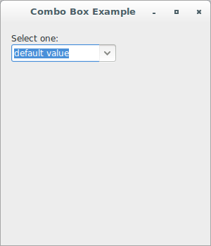

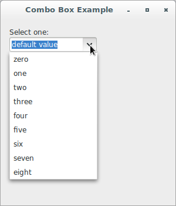

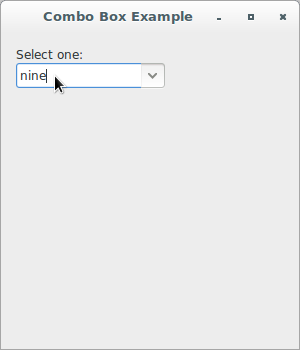

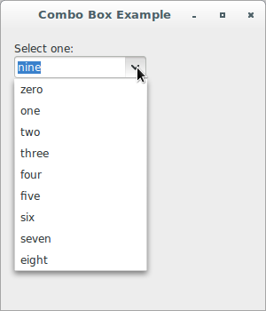

The class `wx.ComboBox` supports the following styles:

Style | Description
----- | -----------
`wx.CB_SIMPLE` | Creates a combo box with a permanently displayed list (Windows only).
`wx.CB_DROPDOWN` | Creates a combo box with a drop-down list (MSW and Motif only).
`wx.CB_READONLY` | A combo box with this style behaves like a `wx.Choice` (and may look in the same way as well, although this is platform-dependent), i.e. it allows the user to choose from the list of options but doesn't allow to enter a value not present in the list.
`wx.CB_SORT` | Sorts the entries in the list alphabetically.
`wx.TE_PROCESS_ENTER` | The control will generate the event `wx.EVT_TEXT_ENTER` (otherwise pressing Enter key is either processed internally by the control or used for navigation between dialog controls).

The class `wx.ComboBox` emits the following events:

Event | Description
----- | -----------
`EVT_COMBOBOX` | Process a `wx.EVT_COMBOBOX` event, when an item on the list is selected. Note that calling `GetValue` returns the new value of selection.
`EVT_COMBOBOX_DROPDOWN` | Process a `wx.EVT_COMBOBOX_DROPDOWN` event, which is generated when the list box part of the combo box is shown (drops down).
`EVT_COMBOBOX_CLOSEUP` | Process a `wx.EVT_COMBOBOX_CLOSEUP` event, which is generated when the list box of the combo box disappears (closes up).
`EVT_TEXT` | Process a `wx.EVT_TEXT` event, when the combo box text changes.
`EVT_TEXT_ENTER` | Process a `wx.EVT_TEXT_ENTER` event, when RETURN is pressed in the combo box (notice that the combo box must have been created with `wx.TE_PROCESS_ENTER` style to receive this event).

Now, let's see an application that shows both a preset combo box and one 
that is dynamically created (that is, it is initially empty but then we 
'grow' it out of program-supplied data). The former is common for 
read-only controls.

Finally, this application shows how event handling can differ. The first 
combo box is set up to handle `wx.EVT_TEXT_ENTER` events, in which text 
is typed in and then ENTER is hit by the user. This allows the user to 
enter a line of text which can then be processed by the program. 
The `wx.EVT_TEXT` event can also be processed, but in that case the 
event is generated every time that the user hits a key in the combo box 
entry field.

```python
#!/usr/bin/env python3
import wx

class ComboBoxFrame(wx.Frame):

    def OnSetFocus(self, evt):
        evt.Skip()

    def OnKillFocus(self, evt):
        evt.Skip()

    def __init__(self, parent):
        self.title = "Combo Box Examples"
        wx.Frame.__init__(self, 
                          parent, 
                          -1, 
                          self.title, 
                          size = (400, 400))
        self.panel = wx.Panel(self, -1)
        self.log = wx.TextCtrl(self.panel, 
                               -1, 
                               "", 
                               pos = (90, 120), 
                               size = (200, 200), 
                               style = wx.TE_MULTILINE | wx.TE_RICH2)
        sampleList = ['zero', 
                      'one', 
                      'two', 
                      'three', 
                      'four', 
                      'five', 
                      'six', 
                      'seven', 
                      'eight']
        st1 = wx.StaticText(self.panel, 
                            -1, 
                            "This example uses the wx.ComboBox "
                            "control.", 
                            (8, 10))
        st2 = wx.StaticText(self.panel, 
                            -1, 
                            "Select one:", 
                            (15, 50), 
                            (75, 18))
        cb1 = wx.ComboBox(self.panel, 
                          -1, 
                          "default value", 
                          (90, 45), 
                          (160, -1), 
                          sampleList, 
                          style = wx.CB_DROPDOWN | 
                                  wx.TE_PROCESS_ENTER)
        self.Bind(wx.EVT_COMBOBOX, self.EvtComboBox, cb1)
        self.Bind(wx.EVT_TEXT, self.EvtText, cb1)
        self.Bind(wx.EVT_TEXT_ENTER, self.EvtTextEnter, cb1)
        cb1.Bind(wx.EVT_SET_FOCUS, self.OnSetFocus)
        cb1.Bind(wx.EVT_KILL_FOCUS, self.OnKillFocus)

        # Once the combobox is set up, we can append some more data to 
        # it.
        cb1.Append("foo", "This is some client data for this item")

        # This combobox is created with no values initially.
        cb2 = wx.ComboBox(self.panel, 
                          -1, 
                          "default value", 
                          (90, 75), 
                          (160, -1), 
                          [], 
                          style = wx.CB_DROPDOWN | 
                                  wx.CB_READONLY | 
                                  wx.CB_SORT)

        # Here, we dynamically add our values to the second combo box.
        for item in sampleList:
            cb2.Append(item, item.upper())

        self.Bind(wx.EVT_COMBOBOX, self.EvtComboBox, cb2)

    # When the user selects something, we go here.
    def EvtComboBox(self, evt):
        cb = evt.GetEventObject()
        data = cb.GetClientData(evt.GetSelection())
        self.log.WriteText('EvtComboBox: {}\nClientData: {}\n'.\
                           format(evt.GetString(), data))

        if evt.GetString() == 'one':
            self.log.WriteText("You follow directions well!\n\n")

    # Capture events every time a user hits a key in the text entry 
    # field.
    def EvtText(self, evt):
        self.log.WriteText('EvtText: {}\n'.format(evt.GetString()))
        evt.Skip()

    # Capture events when the user types something into the control then
    # hits ENTER.
    def EvtTextEnter(self, evt):
        self.log.WriteText('EvtTextEnter: {}'.format(evt.GetString()))
        evt.Skip()

class App(wx.App):
    def OnInit(self):
        frame = ComboBoxFrame(None)
        frame.Show(True)
        self.SetTopWindow(frame)
        return True

def main():
    app = App(False)
    app.MainLoop()


if __name__ == '__main__':
    main()
```

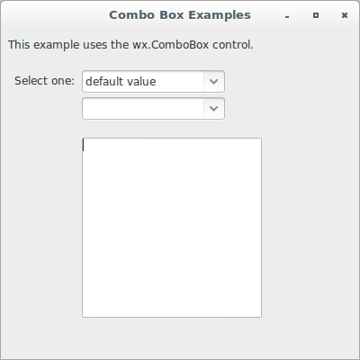

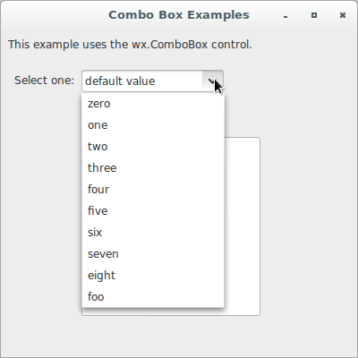

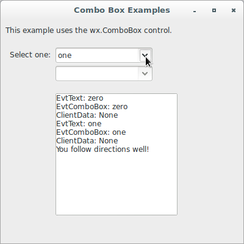

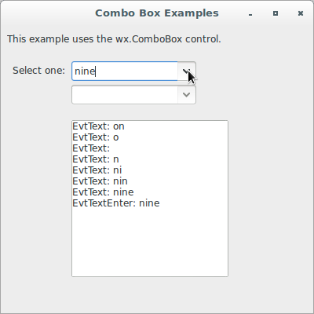

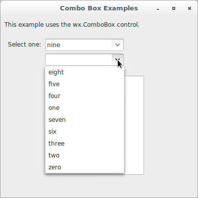

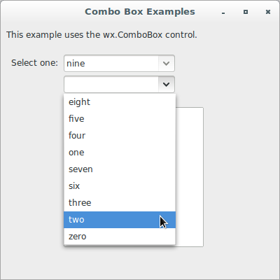

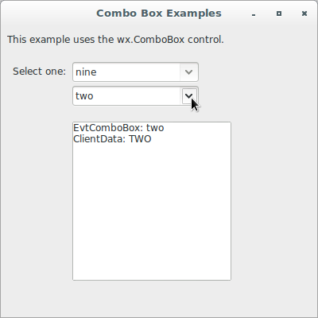
