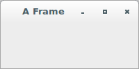
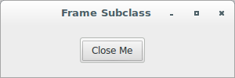

# wxPython

## Putting widgets in frames

### How do I create a frame?

All user interaction in your wxPython program takes place inside a 
widget container, which would commonly be called a window. In wxPython, 
that container is called a *frame*.

A *frame* is a window whose size and position can (usually) be changed 
by the user. It usually has thick borders and a title bar, and can 
optionally contain a menu bar, toolbar and status bar. A frame can 
contain any window that is not a frame or dialog. It is one of the most 
fundamental of the wxWindows components.

A *frame* that has a status bar and toolbar created via 
the `CreateStatusBar` and `CreateToolBar` functions manages these 
windows, and adjusts the value returned by `GetClientSize` to reflect 
the remaining size available to application windows.

By itself, a frame is not too useful, but with the addition of panels 
and other child objects, it encompasses the framework around which most 
user interfaces are constructed.

If you plan on using sizers and auto-layout features, be aware that 
the `wx.Frame` class lacks the ability to handle these features unless 
it contains a panel. The `wx.Panel` class has all the necessary 
functionality to both control the size of child components, and also 
communicate that information in a useful way to the frame itself.

Creating a frame involves knowing about all the style elements that can 
be applied; disposing of frames can be more complex than you might 
initially suppose.

Let's see an application that displays a very simple example of frame 
creation:

```python
#!/usr/bin/env python3
import wx

class App(wx.App):
    def OnInit(self):
        frame = wx.Frame(None, 
                         -1, 
                         "A Frame", 
                         style = wx.DEFAULT_FRAME_STYLE, 
                         size = (200, 100))
        frame.Show(True)
        self.SetTopWindow(frame)
        return True

def main():
    app = App(False)
    app.MainLoop()


if __name__ == '__main__':
    main()
```



The code above creates a frame with the title "A Frame", and a size of 
200 by 100 pixels. The default frame style used there provides the 
standard frame decorations like a close box and minimize and maximize 
boxes.

There are over a dozen style flags specific to `wx.Frame`. The default 
style provides you with minimize and maximize boxes, the system 
pull-down menu, thick resizable borders, and a caption. This is suitable 
for most of your standard application window needs.

There are no event types tied to a `wx.Frame` beyond those that apply to 
any widget. However, since a `wx.Frame` is the one element on your 
screen that the user is most likely to close, you'll usually want to 
define a handler for the close event so that subwindows and data are 
properly managed. To implement this, a frame subclass is needed.

You will rarely create `wx.Frame` instances directly. As we've seen 
before, a typical wxPython application creates subclasses of `wx.Frame` 
and creates instances of those subclasses. This is because of the unique
status of `wx.Frame` (although it defines very little behavior by 
itself, a subclass with a unique initializer is the most logical place 
to put information about the layout and behavior of your frame). Having 
to juggle your application-specific layouts and data without creating 
subclasses is possible, but is awkward in anything but the smallest 
application.

Let's see an application that displays an example of a frame subclass:

```python
#!/usr/bin/env python3
import wx

class SubclassFrame(wx.Frame):

    def __init__(self, parent):
        self.title = "Frame Subclass"
        wx.Frame.__init__(self, 
                          parent, 
                          -1, 
                          self.title, 
                          style = wx.DEFAULT_FRAME_STYLE, 
                          size = (300, 100))
        self.panel = wx.Panel(self, -1)
        button = wx.Button(self.panel, 
                           -1, 
                           "Close Me", 
                           pos = (100, 15))
        self.Bind(wx.EVT_BUTTON, self.OnCloseMe, button)
        self.Bind(wx.EVT_CLOSE, self.OnCloseWindow)

    def OnCloseMe(self, evt):
        self.Close(True)

    def OnCloseWindow(self, evt):
        self.Destroy()

class App(wx.App):
    def OnInit(self):
        frame = SubclassFrame(None)
        frame.Show(True)
        self.SetTopWindow(frame)
        return True

def main():
    app = App(False)
    app.MainLoop()


if __name__ == '__main__':
    main()
```



Note that the subwidgets of the frame are themselves placed inside a 
panel. A panel is an instance of the class `wx.Panel`, and is a simple 
container for other widgets with little functionality of its own. You 
should almost always use a `wx.Panel` as the top-level subwidget of your 
frame. For one thing, the extra level can allow greater code reuse, as 
the same panel and layout could be used in more than one frame. Using 
a `wx.Panel` gives you some of the functionality of a dialog box within 
the frame. This functionality manifests itself in a couple of ways. One 
is simply that `wx.Panel` instances have a different default background 
color under MS Windows operating systems (white, instead of gray). 
Secondly, panels can have a default item that is automatically activated 
when the Enter key is pressed, and panels respond to keyboard events to 
tab through the items or select the default item in much the same way 
that a dialog does.
