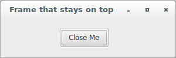

# wxPython

## Putting widgets in frames

### What are some different frame styles?

The `wx.Frame` class has a multitude of possible style flags. Typically, 
the default style is what you want, but there are several useful 
variations. The first set of style flags that are discussed governs the 
general shape and size of the frame. Although not strictly enforced, 
these flags should be considered mutually exclusive (a given frame 
should only use one of them). Using a style flag from this group does 
not imply the existence of any other decorators; you'll need to compose 
the shape flag together with the other desired decorator flags.

The following table describes the shape and size flags of a frame:

Style Flag | Description
---------- | -----------
`wx.FRAME_NO_TASKBAR` | Creates an otherwise normal frame but it does not appear in the taskbar under Windows or GTK+ (note that it will minimize to the desktop window under Windows which may seem strange to the users and thus it might be better to use this style only without `wx.MINIMIZE_BOX` style). In wxGTK, the flag is respected only if the window manager supports `_NET_WM_STATE_SKIP_TASKBAR` hint.
`wx.FRAME_SHAPED` | Windows with this style are allowed to have their shape changed with the `SetShape` method.
`wx.FRAME_TOOL_WINDOW` | The frame has a smaller than normal title bar, typically used for auxiliary frames that contain a variety of tool buttons. Under Windows or GTK+ operating systems, a tool window will not display in the task bar.
`wx.ICONIZE` | The window will initially be shown minimized. This style only has an effect in Windows operating systems.
`wx.MINIMIZE` | Identical to `wx.ICONIZE` (Windows only)
`wx.MAXIMIZE` | The window will initially be shown maximized (full-screen). This style only has an effect in Windows operating systems.

Out of this group, the style most in need of showing 
is `wx.FRAME_TOOL_WINDOW` (with `wx.CAPTION`, `wx.SYSTEM_MENU` 
and `wx.CLOSE_BOX` also declared).

There are two mutually exclusive styles that control whether a frame 
stays on top of other frames, even when the other frames gain the focus. 
This can be useful for small dialogs that don't remain visible for long. 
The following table describes the styles for frame floating behavior:

Style Flag | Description
---------- | -----------
`wx.FRAME_FLOAT_ON_PARENT` | The frame will always be floating on top of its parent, and only its parent (unlike `wx.STAY_ON_TOP`). Obviously, to use this style the frame needs to have a parent. Other frames will overshadow this frame.
`wx.STAY_ON_TOP` | The frame will always be on top of any other frame in the system (if you have more than one frame designated as stay on top, the frames will overlap normally relative to each other, but will still be on top of all the other frames in the system).

Finally, there are several decorations you can place on your window. 
These are not placed automatically if you abandon the default style, so 
you must add them, otherwise it's easy to end up with a window that 
doesn't close or move. The following table gives the list of decoration 
styles for a window:

Style Flag | Description
---------- | -----------
`wx.CAPTION` | Gives the window a title bar. You must include this style to have a place for the other elements that traditionally are placed here (the minimize, maximize and close boxes, the system menu, and context help). Remember that the corresponding buttons cannot be shown if the window has no title bar at all (if `wx.CAPTION` is not specified those styles would be simply ignored).
`wx.FRAME_EX_CONTEXTHELP` | This is for Windows operating systems, and places the question mark Help icon in the right corner of the title bar. This style is mutually exclusive with `wx.MAXIMIZE_BOX` and `WX.MINIMIZE_BOX`. This style is an extended style, and must be added with a two-step creation process.
`wx.FRAME_EX_METAL` | On Mac OS X, frames with this style will have a brushed metal look. This is an extra style which must be set with the `SetExtraStyle` method.
`wx.MAXIMIZE_BOX` | Displays a maximize box in the normal place on the title bar. Notice that under wxGTK `wx.RESIZE_BORDER` must be used as well or this style is ignored.
`wx.MINIMIZE_BOX` | Displays a minimize box in the normal place on the title bar.
`wx.CLOSE_BOX` | Displays a close box in the normal place on the title bar.
`wx.RESIZE_BORDER` | Gives the frame a normal border with handles for resizing.
`wx.SYSTEM_MENU` | Displays a system menu containing the list of various windows commands in the window title bar. The exact contents of the system menu are consistent with the other chosen decorator styles (you have a "minimize" option only if `wx.MINIMIZE_BOX` is declared, for example). Unlike `wx.MINIMIZE_BOX`, `wx.MAXIMIZE_BOX` and `wx.CLOSE_BOX` styles, this style can be used without `wx.CAPTION`, at least under Windows, and makes the system menu available without showing it on screen in this case. However, it is recommended to only use it together with `wx.CAPTION` for consistent behaviour under all platforms.

The default style is `wx.DEFAULT_FRAME_STYLE` and is equivalent 
to `wx.MINIMIZE_BOX | wx.MAXIMIZE_BOX | wx.CLOSE_BOX | wx.RESIZE_BORDER | wx.SYSTEM_MENU | wx.CAPTION | wx.CLIP_CHILDREN`. 
This style creates a typical window that you can minimize, maximize, 
resize, or close. It's a good idea when composing other styles to start 
with the default style to ensure that you have the right set of 
decorators. For example, to create a tool frame, you might 
use `style = wx.DEFAULT_FRAME_STYLE | wx.FRAME_TOOL_WINDOW`. Remember, 
you can use a `^` operator to remove the flag from a bitmask.

### Create a default frame in three different ways

It's always a good idea to look at how the default style works and then 
modify that to see what happens. So, let's start with the frame's 
default style: `wx.DEFAULT_FRAME_STYLE`. You can create a frame that 
uses `wx.DEFAULT_FRAME_STYLE` (or its equivalent) in 3 different ways. 
Let's see the first way:

```python
#!/usr/bin/env python3
import wx

class DefaultFrame(wx.Frame):

    def __init__(self, parent):
        self.title = "Default Frame"
        wx.Frame.__init__(self, 
                          parent, 
                          -1, 
                          self.title, 
                          size = (300, 100))
        self.panel = wx.Panel(self, -1)
        button = wx.Button(self.panel, 
                           -1, 
                           "Close Me", 
                           pos = (100, 15))
        self.Bind(wx.EVT_BUTTON, self.OnCloseMe, button)
        self.Bind(wx.EVT_CLOSE, self.OnCloseWindow)

    def OnCloseMe(self, evt):
        self.Close(True)

    def OnCloseWindow(self, evt):
        self.Destroy()

class App(wx.App):
    def OnInit(self):
        frame = DefaultFrame(None)
        frame.Show(True)
        self.SetTopWindow(frame)
        return True

def main():
    app = App(False)
    app.MainLoop()


if __name__ == '__main__':
    main()
```


This will create a normal frame with all the normal functionality any 
user would expect.

Now, let's see the second way (change the code slightly by passing it 
the `wx.DEFAULT_FRAME_STYLE` flag):

```python
#!/usr/bin/env python3
import wx

class DefaultFrame(wx.Frame):

    def __init__(self, parent):
        self.title = "Default Frame"
        wx.Frame.__init__(self, 
                          parent, 
                          -1, 
                          self.title, 
                          style = wx.DEFAULT_FRAME_STYLE, 
                          size = (300, 100))
        self.panel = wx.Panel(self, -1)
        button = wx.Button(self.panel, 
                           -1, 
                           "Close Me", 
                           pos = (100, 15))
        self.Bind(wx.EVT_BUTTON, self.OnCloseMe, button)
        self.Bind(wx.EVT_CLOSE, self.OnCloseWindow)

    def OnCloseMe(self, evt):
        self.Close(True)

    def OnCloseWindow(self, evt):
        self.Destroy()

class App(wx.App):
    def OnInit(self):
        frame = DefaultFrame(None)
        frame.Show(True)
        self.SetTopWindow(frame)
        return True

def main():
    app = App(False)
    app.MainLoop()


if __name__ == '__main__':
    main()
```

The code presented above does the same thing as the previous one.

Finally, let's see the third way (with flags that are the equivalent 
to `wx.DEFAULT_FRAME_STYLE`):

```python
#!/usr/bin/env python3
import wx

class DefaultFrame(wx.Frame):

    def __init__(self, parent):
        self.title = "Default Frame"
        wx.Frame.__init__(self, 
                          parent, 
                          -1, 
                          self.title, 
                          style = wx.MINIMIZE_BOX | 
                                  wx.MAXIMIZE_BOX | 
                                  wx.CLOSE_BOX | 
                                  wx.RESIZE_BORDER | 
                                  wx.SYSTEM_MENU | 
                                  wx.CAPTION | 
                                  wx.CLIP_CHILDREN, 
                          size = (300, 100))
        self.panel = wx.Panel(self, -1)
        button = wx.Button(self.panel, 
                           -1, 
                           "Close Me", 
                           pos = (100, 15))
        self.Bind(wx.EVT_BUTTON, self.OnCloseMe, button)
        self.Bind(wx.EVT_CLOSE, self.OnCloseWindow)

    def OnCloseMe(self, evt):
        self.Close(True)

    def OnCloseWindow(self, evt):
        self.Destroy()

class App(wx.App):
    def OnInit(self):
        frame = DefaultFrame(None)
        frame.Show(True)
        self.SetTopWindow(frame)
        return True

def main():
    app = App(False)
    app.MainLoop()


if __name__ == '__main__':
    main()
```

### Create a frame without a caption

The caption is what holds the buttons on the top of the frame along with 
the title of the application. Let's create a frame that doesn't have a 
caption:

```python
#!/usr/bin/env python3
import wx

class NoCaptionFrame(wx.Frame):

    def __init__(self, parent):
        self.title = "Frame without a caption"
        wx.Frame.__init__(self, 
                          parent, 
                          -1, 
                          self.title, 
                          style = 0, 
                          size = (300, 100))
        self.panel = wx.Panel(self, -1)
        button = wx.Button(self.panel, 
                           -1, 
                           "Close Me", 
                           pos = (100, 15))
        self.Bind(wx.EVT_BUTTON, self.OnCloseMe, button)
        self.Bind(wx.EVT_CLOSE, self.OnCloseWindow)

    def OnCloseMe(self, evt):
        self.Close(True)

    def OnCloseWindow(self, evt):
        self.Destroy()

class App(wx.App):
    def OnInit(self):
        frame = NoCaptionFrame(None)
        frame.Show(True)
        self.SetTopWindow(frame)
        return True

def main():
    app = App(False)
    app.MainLoop()


if __name__ == '__main__':
    main()
```


### Create a frame without a close box

Some programmers think they need a frame where there's no close box (or 
close menu option). Let's see how to do this:

```python
#!/usr/bin/env python3
import wx

class NoCloseBoxFrame(wx.Frame):

    def __init__(self, parent):
        self.title = "Frame without a close box"
        wx.Frame.__init__(self, 
                          parent, 
                          -1, 
                          self.title, 
                          style = wx.MINIMIZE_BOX | 
                                  wx.MAXIMIZE_BOX | 
                                  wx.RESIZE_BORDER | 
                                  wx.SYSTEM_MENU | 
                                  wx.CAPTION | 
                                  wx.CLIP_CHILDREN, 
                          size = (300, 100))
        self.panel = wx.Panel(self, -1)
        button = wx.Button(self.panel, 
                           -1, 
                           "Close Me", 
                           pos = (100, 15))
        self.Bind(wx.EVT_BUTTON, self.OnCloseMe, button)
        self.Bind(wx.EVT_CLOSE, self.OnCloseWindow)

    def OnCloseMe(self, evt):
        self.Close(True)

    def OnCloseWindow(self, evt):
        self.Destroy()

class App(wx.App):
    def OnInit(self):
        frame = NoCloseBoxFrame(None)
        frame.Show(True)
        self.SetTopWindow(frame)
        return True

def main():
    app = App(False)
    app.MainLoop()


if __name__ == '__main__':
    main()
```


### Create a frame without minimize and maximize boxes

In some situations, you'll want to create an application that you cannot 
minimize or maximize, and also, that doesn't show up in the taskbar. 
Let's see how to do this:

```python
#!/usr/bin/env python3
import wx

class NoMinMaxBoxesFrame(wx.Frame):

    def __init__(self, parent):
        self.title = "Frame without min/max boxes"
        wx.Frame.__init__(self, 
                          parent, 
                          -1, 
                          self.title, 
                          style = wx.RESIZE_BORDER | 
                                  wx.SYSTEM_MENU | 
                                  wx.CAPTION | 
                                  wx.CLOSE_BOX | 
                                  wx.CLIP_CHILDREN | 
                                  wx.FRAME_NO_TASKBAR, 
                          size = (300, 100))
        self.panel = wx.Panel(self, -1)
        button = wx.Button(self.panel, 
                           -1, 
                           "Close Me", 
                           pos = (100, 15))
        self.Bind(wx.EVT_BUTTON, self.OnCloseMe, button)
        self.Bind(wx.EVT_CLOSE, self.OnCloseWindow)

    def OnCloseMe(self, evt):
        self.Close(True)

    def OnCloseWindow(self, evt):
        self.Destroy()

class App(wx.App):
    def OnInit(self):
        frame = NoMinMaxBoxesFrame(None)
        frame.Show(True)
        self.SetTopWindow(frame)
        return True

def main():
    app = App(False)
    app.MainLoop()


if __name__ == '__main__':
    main()
```


### Create a no resizable frame

In some other situations, you'll want to create a frame that cannot be 
resized. You could use `SetSizeHints` or you could just set some frame 
style flags. Let's apply the second option:

```python
#!/usr/bin/env python3
import wx

class NoResizableFrame(wx.Frame):

    def __init__(self, parent):
        self.title = "Frame no resizable"
        wx.Frame.__init__(self, 
                          parent, 
                          -1, 
                          self.title, 
                          style = wx.DEFAULT_FRAME_STYLE ^ 
                                  wx.RESIZE_BORDER,
                          size = (300, 100))
        self.panel = wx.Panel(self, -1)
        button = wx.Button(self.panel, 
                           -1, 
                           "Close Me", 
                           pos = (100, 15))
        self.Bind(wx.EVT_BUTTON, self.OnCloseMe, button)
        self.Bind(wx.EVT_CLOSE, self.OnCloseWindow)

    def OnCloseMe(self, evt):
        self.Close(True)

    def OnCloseWindow(self, evt):
        self.Destroy()

class App(wx.App):
    def OnInit(self):
        frame = NoResizableFrame(None)
        frame.Show(True)
        self.SetTopWindow(frame)
        return True

def main():
    app = App(False)
    app.MainLoop()


if __name__ == '__main__':
    main()
```


Notice that the frame cannot be resized in any way.

### Create a frame without top buttons

Here, we want to remove all the buttons, but leave the title. Let's see 
how to do this:

```python
#!/usr/bin/env python3
import wx

class NoTopButtonsFrame(wx.Frame):

    def __init__(self, parent):
        self.title = "Frame without top buttons"
        wx.Frame.__init__(self, 
                          parent, 
                          -1, 
                          self.title, 
                          style = wx.CAPTION | 
                                  wx.RESIZE_BORDER,
                          size = (300, 100))
        self.panel = wx.Panel(self, -1)
        button = wx.Button(self.panel, 
                           -1, 
                           "Close Me", 
                           pos = (100, 15))
        self.Bind(wx.EVT_BUTTON, self.OnCloseMe, button)
        self.Bind(wx.EVT_CLOSE, self.OnCloseWindow)

    def OnCloseMe(self, evt):
        self.Close(True)

    def OnCloseWindow(self, evt):
        self.Destroy()

class App(wx.App):
    def OnInit(self):
        frame = NoTopButtonsFrame(None)
        frame.Show(True)
        self.SetTopWindow(frame)
        return True

def main():
    app = App(False)
    app.MainLoop()


if __name__ == '__main__':
    main()
```


Notice that there is a title and you can resize the frame, but you 
cannot maximize, minimize or close the application using top buttons.

### Create a frame that stays on top

Suppose you want an application that stays on top of all the others. 
Let's see how to do this:

```python
#!/usr/bin/env python3
import wx

class StayOnTopFrame(wx.Frame):

    def __init__(self, parent):
        self.title = "Frame that stays on top"
        wx.Frame.__init__(self, 
                          parent, 
                          -1, 
                          self.title, 
                          style = wx.DEFAULT_FRAME_STYLE | 
                                  wx.STAY_ON_TOP, 
                          size = (300, 100))
        self.panel = wx.Panel(self, -1)
        button = wx.Button(self.panel, 
                           -1, 
                           "Close Me", 
                           pos = (100, 15))
        self.Bind(wx.EVT_BUTTON, self.OnCloseMe, button)
        self.Bind(wx.EVT_CLOSE, self.OnCloseWindow)

    def OnCloseMe(self, evt):
        self.Close(True)

    def OnCloseWindow(self, evt):
        self.Destroy()

class App(wx.App):
    def OnInit(self):
        frame = StayOnTopFrame(None)
        frame.Show(True)
        self.SetTopWindow(frame)
        return True

def main():
    app = App(False)
    app.MainLoop()


if __name__ == '__main__':
    main()
```



### Create a basic frame tool window

Let's see an application that displays a basic frame tool window:

```python
#!/usr/bin/env python3
import wx

class ToolWindowFrame(wx.Frame):

    def __init__(self, parent):
        self.title = "A Frame Tool Window"
        wx.Frame.__init__(self, 
                          parent, 
                          -1, 
                          self.title, 
                          style = wx.FRAME_TOOL_WINDOW | 
                                  wx.CAPTION | 
                                  wx.SYSTEM_MENU | 
                                  wx.CLOSE_BOX, 
                          size = (300, 100))
        self.panel = wx.Panel(self, -1)
        button = wx.Button(self.panel, 
                           -1, 
                           "Close Me", 
                           pos = (100, 15))
        self.Bind(wx.EVT_BUTTON, self.OnCloseMe, button)
        self.Bind(wx.EVT_CLOSE, self.OnCloseWindow)

    def OnCloseMe(self, evt):
        self.Close(True)

    def OnCloseWindow(self, evt):
        self.Destroy()

class App(wx.App):
    def OnInit(self):
        frame = ToolWindowFrame(None)
        frame.Show(True)
        self.SetTopWindow(frame)
        return True

def main():
    app = App(False)
    app.MainLoop()


if __name__ == '__main__':
    main()
```


Notice that the title bar of the tool frame is narrower than the other 
frame styles presented before.

Let's see an application that displays a different version of a basic 
frame tool window:

```python
#!/usr/bin/env python3
import wx

class ToolWindowFrame(wx.Frame):

    def __init__(self, parent):
        self.title = "A Frame Tool Window"
        wx.Frame.__init__(self, 
                          parent, 
                          -1, 
                          self.title, 
                          style = wx.DEFAULT_FRAME_STYLE | 
                                  wx.FRAME_TOOL_WINDOW, 
                          size = (300, 100))
        self.panel = wx.Panel(self, -1)
        button = wx.Button(self.panel, 
                           -1, 
                           "Close Me", 
                           pos = (100, 15))
        self.Bind(wx.EVT_BUTTON, self.OnCloseMe, button)
        self.Bind(wx.EVT_CLOSE, self.OnCloseWindow)

    def OnCloseMe(self, evt):
        self.Close(True)

    def OnCloseWindow(self, evt):
        self.Destroy()

class App(wx.App):
    def OnInit(self):
        frame = ToolWindowFrame(None)
        frame.Show(True)
        self.SetTopWindow(frame)
        return True

def main():
    app = App(False)
    app.MainLoop()


if __name__ == '__main__':
    main()
```
