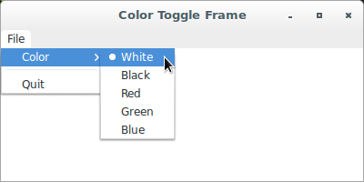
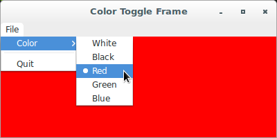
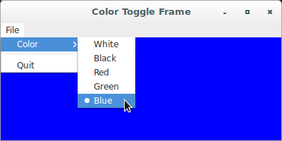

# wxPython

## Putting widgets in frames

### How do I find a subwidget of a frame?

Occasionally, you'll need to find a specific widget on a frame or panel 
without already having a reference to that widget. Let's see where this 
situation may apply:

* Find the actual menu item object associated with a menu selection 
(since the event doesn't hold a reference to it).
* Want an event on one item to change the state of an arbitrary other 
widget in the system. For example, you may have a button and a menu item 
that mutually change each other's toggle state. When the button is 
clicked, you need to get the menu item to toggle it.

In the following block of code, the `FindItemById()` method is used to 
acquire the menu item associated with the ID provided by the event 
object. The label from that item is used to drive the requested color 
change.

Let's see an example of a function that finds an item by ID:

```python
def OnColor(self, evt):
        menubar = self.GetMenuBar()
        itemId = evt.GetId()
        item = menubar.FindItemById(itemId)
        color = item.GetLabel()
        self.sketch.SetColor(color)
```

In wxPython, there are three methods for finding a subwidget, all of 
which act similarly. These methods are applicable to any widget that is 
used as a container, not just frames, but also dialogs and panels. You 
can look up a subwidget by internal wxPython ID, by the name passed to 
the constructor in the `name` argument, or by the text label. The text 
label is defined as the caption for widgets that have a caption, such as 
buttons and frames.

Method | Description
------ | -----------
`FindWindowById(id, parent=None)` | Find the first window with the given `id`. If `parent=None`, the search will start from all top-level frames and dialog boxes; if `not None`, the search will be limited to the given window hierarchy. The search is recursive in both cases.
`FindWindowByLabel(label, parent=None)` | Find a window by its label. Depending on the type of window, the label may be a window title or panel item label. If `parent=None`, the search will start from all top-level frames and dialog boxes; if `not None`, the search will be limited to the given window hierarchy. The search is recursive in both cases.
`FindWindowByName(name, parent=None)` | Find a window by its name (as given in a window constructor or `Create` function call). If `parent=None`, the search will start from all top-level frames and dialog boxes; if `not None`, the search will be limited to the given window hierarchy. The search is recursive in both cases. If no window with such name is found, `wx.FindWindowByLabel(label, parent=None)` is called.

There are also a couple of variations of the finding process:

Method | Description
------ | -----------
`FindWindow(id)` | Find a child of this window, by id. May return `this` if it matches itself. Notice that only real children, not top level windows using this window as parent, are searched by this function.
`FindWindow(name)` | Find a child of this window, by name. May return `this` if it matches itself. Notice that only real children, not top level windows using this window as parent, are searched by this function.

Now, let' see an application that creates a color toggle frame that 
implements the finding mechanism:

```python
#!/usr/bin/env python3
import wx

class ColorToggleFrame(wx.Frame):

    def __init__(self, parent):
        self.title = "Color Toggle Frame"
        wx.Frame.__init__(self, 
                          parent, 
                          -1, 
                          self.title, 
                          size = (400, 200))
        self.panel = wx.Panel(self, -1)
        self.panel.SetBackgroundColour("White")
        self.Bind(wx.EVT_CLOSE, self.OnCloseWindow)
        self.Centre(wx.BOTH)
        self.createMenuBar()

    def createMenuBar(self):
        menuBar = wx.MenuBar()
        for eachMenuData in self.menuData():
            menuLabel = eachMenuData[0]
            menuItems = eachMenuData[1]
            menuBar.Append(self.createMenu(menuItems), menuLabel)
        self.SetMenuBar(menuBar)

    def createMenu(self, menuData):
        menu = wx.Menu()
        for eachItem in menuData:
            if len(eachItem) == 2:
                label = eachItem[0]
                subMenu = self.createMenu(eachItem[1])
                menu.Append(wx.NewId(), label, subMenu)
            else:
                self.createMenuItem(menu, *eachItem)
        return menu

    def createMenuItem(self, 
                       menu, 
                       label, 
                       status, 
                       handler, 
                       kind = wx.ITEM_NORMAL):
        if not label:
            menu.AppendSeparator()
            return
        menuItem = menu.Append(-1, label, status, kind)
        self.Bind(wx.EVT_MENU, handler, menuItem)

    def menuData(self):
        return [("&File", (
                          ("&Color", (
                                     ("&White", 
                                      "", 
                                      self.OnColor, 
                                      wx.ITEM_RADIO), 
                                     ("&Black", 
                                      "", 
                                      self.OnColor, 
                                      wx.ITEM_RADIO), 
                                     ("&Red", 
                                      "", 
                                      self.OnColor, 
                                      wx.ITEM_RADIO), 
                                     ("&Green", 
                                      "", 
                                      self.OnColor, 
                                      wx.ITEM_RADIO), 
                                     ("&Blue", 
                                      "", 
                                      self.OnColor, 
                                      wx.ITEM_RADIO))), 
                          ("", "", ""),
                          ("&Quit", "Quit", self.OnCloseWindow)))]

    def OnColor(self, evt):
        menubar = self.GetMenuBar()
        itemId = evt.GetId()
        item = menubar.FindItemById(itemId)
        color = item.GetLabel()
        self.panel.SetBackgroundColour(color)

    def OnCloseWindow(self, evt):
        self.Destroy()

class App(wx.App):
    def OnInit(self):
        frame = ColorToggleFrame(None)
        frame.Show(True)
        self.SetTopWindow(frame)
        return True

def main():
    app = App(False)
    app.MainLoop()


if __name__ == '__main__':
    main()
```






