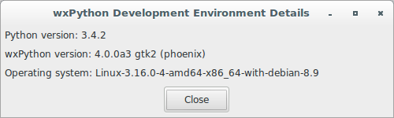

# wxPython Recipes

## Check wxPython development environment details

**Version A**

```python
#!/usr/bin/env python3
import platform
import wx

class DetailsFrame(wx.Frame):

    def __init__(self, parent):
        self.title = "wxPython Development Environment Details"
        wx.Frame.__init__(self, 
                          parent, 
                          -1, 
                          self.title, 
                          size = (500, 150))
        self.panel = wx.Panel(self, -1)
        py_version = "Python version: {}".\
                     format(platform.python_version())
        wx_version = "wxPython version: {}".\
                     format(wx.version())
        os_version = "Operating system: {}".\
                     format(platform.platform())
        sizer = wx.BoxSizer(wx.VERTICAL)
        size = (20, -1)
        sizer.Add(wx.StaticText(self.panel, -1, label=py_version), 
                  0, 
                  wx.ALL, 
                  5)
        sizer.Add(wx.StaticText(self.panel, -1, label=wx_version), 
                  0, 
                  wx.ALL, 
                  5)
        sizer.Add(wx.StaticText(self.panel, -1, label=os_version), 
                  0, 
                  wx.ALL, 
                  5)
        button = wx.Button(self.panel, 
                           -1, 
                           "Close")
        sizer.Add((250, 5))
        sizer.Add(button, 
                  0, 
                  wx.CENTER, 
                  5)
        self.panel.SetSizer(sizer)
        self.Bind(wx.EVT_BUTTON, self.OnCloseMe, button)
        self.Bind(wx.EVT_CLOSE, self.OnCloseWindow)

    def OnCloseMe(self, evt):
        self.Close(True)

    def OnCloseWindow(self, evt):
        self.Destroy()

class App(wx.App):
    def OnInit(self):
        frame = DetailsFrame(None)
        frame.Show(True)
        self.SetTopWindow(frame)
        return True

def main():
    app = App(False)
    app.MainLoop()


if __name__ == '__main__':
    main()
```


