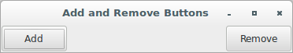
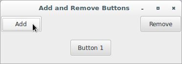
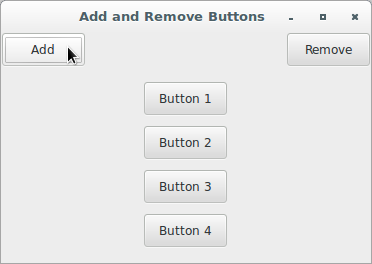
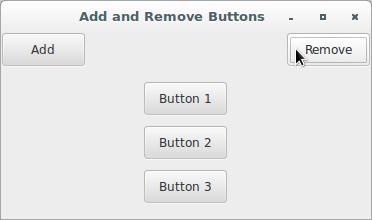
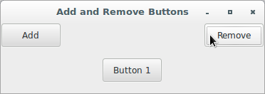

# wxPython Recipes

## Add and remove widgets dynamically

### Concepts

* Being able to create or remove widgets (e.g. buttons) at run-time.
* Necessary depending on what kind of user is accessing the application, 
so it's possible to show different options (for instance, an 
administrator might get additional controls that a normal user wouldn't 
be able to access).

**Version A**

```python
#!/usr/bin/env python3
import wx

class UserPanel(wx.Panel):

    def __init__(self, parent):
        wx.Panel.__init__(self, parent)
        self.numberButtons = 0
        self.frame = parent

        self.mainSizer = wx.BoxSizer(wx.VERTICAL)
        controlSizer = wx.BoxSizer(wx.HORIZONTAL)
        self.widgetSizer = wx.BoxSizer(wx.VERTICAL)

        self.addButton = wx.Button(self, label="Add")
        self.addButton.Bind(wx.EVT_BUTTON, self.onAddWidget)
        controlSizer.Add(self.addButton, 
                         0, 
                         wx.CENTER | wx.RIGHT, 
                         100)

        self.removeButton = wx.Button(self, label="Remove")
        self.removeButton.Bind(wx.EVT_BUTTON, self.onRemoveWidget)
        controlSizer.Add(self.removeButton, 
                         0, 
                         wx.CENTER | wx.LEFT, 
                         100)

        self.mainSizer.Add(controlSizer, 
                           0, 
                           wx.CENTER)
        self.mainSizer.Add(self.widgetSizer, 
                           0, 
                           wx.CENTER | wx.ALL, 
                           10)

        self.SetSizer(self.mainSizer)

    def onAddWidget(self, evt):
        self.numberButtons += 1
        label = "Button {}".format(self.numberButtons)
        name = "button{}".format(self.numberButtons)
        newButton = wx.Button(self, label=label, name=name)
        self.widgetSizer.Add(newButton, 
                             0, 
                             wx.ALL, 
                             5)
        self.frame.fSizer.Layout()
        self.frame.Fit()

    def onRemoveWidget(self, evt):
        if self.widgetSizer.GetChildren():
            self.widgetSizer.Hide(self.numberButtons-1)
            self.widgetSizer.Remove(self.numberButtons-1)
            self.numberButtons -= 1
            self.frame.fSizer.Layout()
            self.frame.Fit()


class UserFrame(wx.Frame):

    def __init__(self, parent):
        self.title = "Add and Remove Buttons"
        wx.Frame.__init__(self, 
                          parent, 
                          -1, 
                          self.title)
        panel = UserPanel(self)
        self.fSizer = wx.BoxSizer(wx.VERTICAL)
        self.fSizer.Add(panel, 
                        1, 
                        wx.EXPAND)
        
        self.fSizer.SetSizeHints(self)
        self.SetSizer(self.fSizer)
        panel.Layout()
        self.Bind(wx.EVT_CLOSE, self.OnCloseWindow)

    def OnCloseWindow(self, evt):
        self.Destroy()

class App(wx.App):
    def OnInit(self):
        frame = UserFrame(None)
        frame.Show(True)
        self.SetTopWindow(frame)
        return True

def main():
    app = App(False)
    app.MainLoop()


if __name__ == '__main__':
    main()
```










