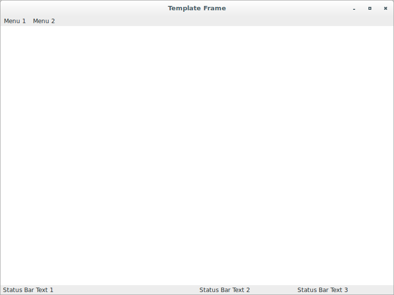
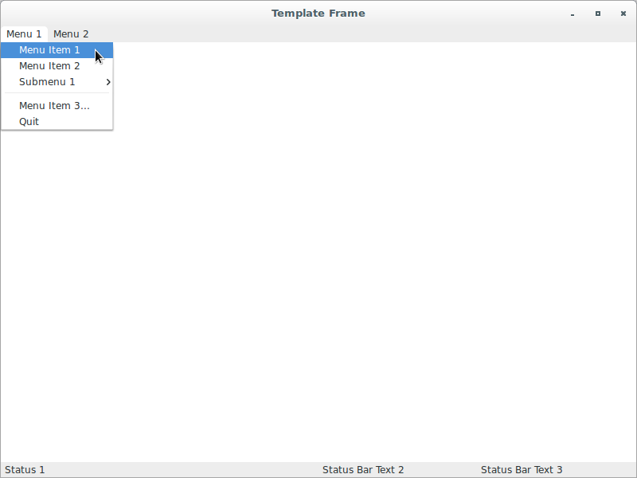
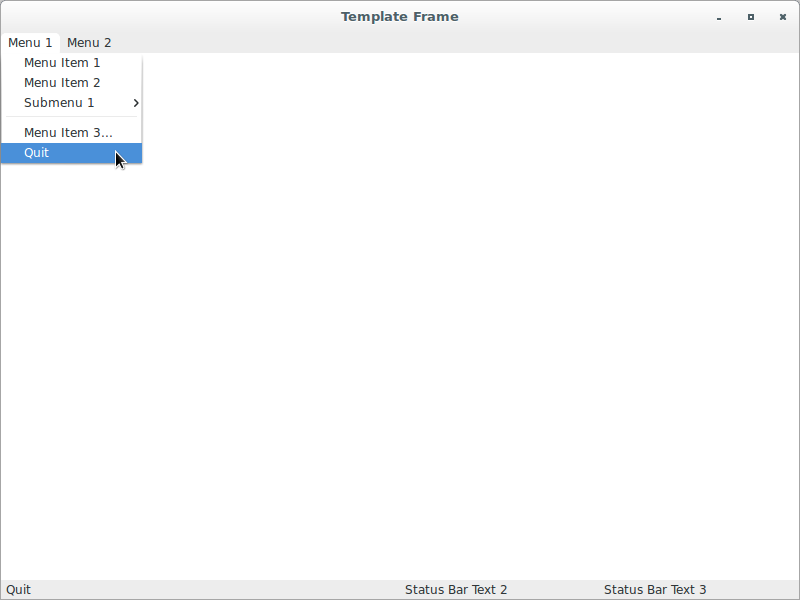
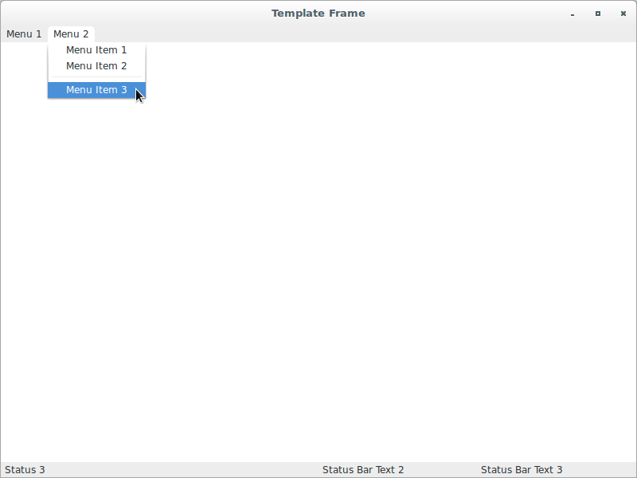

# wxPython Recipes

## Create basic application template (with menu bar and status bar)

### Features

The idea here is to have a basic application template that works with a 
menu bar and status bar:

**Version A**

```python
#!/usr/bin/env python3
import wx

class TemplateFrame(wx.Frame):

    def __init__(self, parent):
        self.title = "Template Frame"
        wx.Frame.__init__(self, 
                          parent, 
                          -1, 
                          self.title, 
                          style = wx.DEFAULT_FRAME_STYLE, 
                          size = (800, 600))
        self.panel = wx.Panel(self, -1)
        self.panel.SetBackgroundColour("White")
        self.Bind(wx.EVT_CLOSE, self.OnCloseWindow)
        self.Centre(wx.BOTH)
        self.createMenuBar()
        self.initStatusBar()

    def createMenuBar(self):
        menuBar = wx.MenuBar()
        for eachMenuData in self.menuData():
            menuLabel = eachMenuData[0]
            menuItems = eachMenuData[1]
            menuBar.Append(self.createMenu(menuItems), menuLabel)
        self.SetMenuBar(menuBar)

    def createMenu(self, menuData):
        menu = wx.Menu()
        for eachItem in menuData:
            if len(eachItem) == 2:
                label = eachItem[0]
                subMenu = self.createMenu(eachItem[1])
                menu.Append(wx.NewId(), label, subMenu)
            else:
                self.createMenuItem(menu, *eachItem)
        return menu

    def createMenuItem(self, 
                       menu, 
                       label, 
                       status, 
                       handler, 
                       kind = wx.ITEM_NORMAL):
        if not label:
            menu.AppendSeparator()
            return
        menuItem = menu.Append(-1, label, status, kind)
        self.Bind(wx.EVT_MENU, handler, menuItem)

    def menuData(self):
        return [("&Menu 1", (
                            ("&Menu Item 1", "Status 1", self.OnPlace), 
                            ("&Menu Item 2", "Status 2", self.OnPlace), 
                            ("&Submenu 1", (
                                           ("&Option 1", 
                                            "Status 1", 
                                            self.OnPlace, 
                                            wx.ITEM_RADIO), 
                                           ("&Option 2", 
                                            "Status 2", 
                                            self.OnPlace, 
                                            wx.ITEM_RADIO), 
                                            ("&Option 3", 
                                            "Status 3", 
                                            self.OnPlace, 
                                            wx.ITEM_RADIO), 
                                            ("&Option 4", 
                                            "Status 4", 
                                            self.OnPlace, 
                                            wx.ITEM_RADIO), 
                                            ("&Option 5", 
                                            "Status 5", 
                                            self.OnPlace, 
                                            wx.ITEM_RADIO))), 
                            ("", "", ""), 
                            ("&Menu Item 3...", "Status 3", self.OnPlace), 
                            ("&Quit", "Quit", self.OnCloseWindow))), 
                ("&Menu 2", (
                            ("&Menu Item 1", "Status 1", self.OnPlace), 
                            ("&Menu Item 2", "Status 2", self.OnPlace), 
                            ("", "", ""), 
                            ("&Menu Item 3", "Status 3", self.OnPlace)))]

    def initStatusBar(self):
        self.statusbar = self.CreateStatusBar()
        self.statusbar.SetFieldsCount(3)
        self.statusbar.SetStatusWidths([-2, -1, -1])
        self.statusbar.SetStatusText("Status Bar Text 1", 0)
        self.statusbar.SetStatusText("Status Bar Text 2", 1)
        self.statusbar.SetStatusText("Status Bar Text 3", 2)

    def OnPlace(self, evt):
        pass

    def OnCloseWindow(self, evt):
        self.Destroy()

class App(wx.App):
    def OnInit(self):
        frame = TemplateFrame(None)
        frame.Show(True)
        self.SetTopWindow(frame)
        return True

def main():
    app = App(False)
    app.MainLoop()


if __name__ == '__main__':
    main()
```








